7.2 I/O接口

定义

I/O接口、I/O控制器、设备控制器

负责协调主机与外部设备之间的数据传输

作用

数据缓冲

错误或状态监测

控制和定时

数据格式转换：串并、并串

与主机和设备通信：主机-I/O接口-I/O设备

基本结构

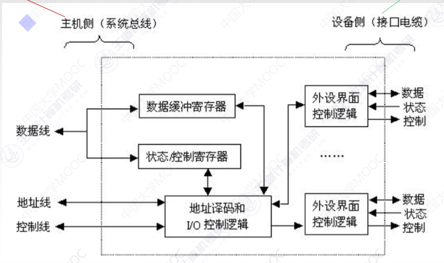

数据端口

读写数据、状态字、控制字、中断类型号

地址端口

指明I/O端口

I/O控制器中的各种寄存器称为I/O端口

控制端口

读写I/O端口的信号、中断请求信号

I/O端口的编址方式

统一编址（存储器映射方式）

把I/O端口当做存储器的单元进行地址分配

用统一的访存指令进行访问

用**不同的地址码区分**内存和I/O

缺点：占用了主存地址空间，寻址时间长

独立编址（I/O映射方式）

I/O端口地址与存储器地址无关

用专门的输入/输出指令访问端口

用**不同的指令区分**内存和I/O

缺点：I/O指令类型少，只能进行传送操作，灵活性差；需要CPU提供存储器读/写、I/O设备读/写两组控制信号，增加了控制电路的复杂性

I/O接口的类型

按数据传送方式分

并行接口

串行接口

按主机访问I/O设备的控制方式

程序查询接口

中断接口

DMA接口

按功能选择的灵活性

可编程接口

不可编程接口

7.3 I/O方式

程序查询方式

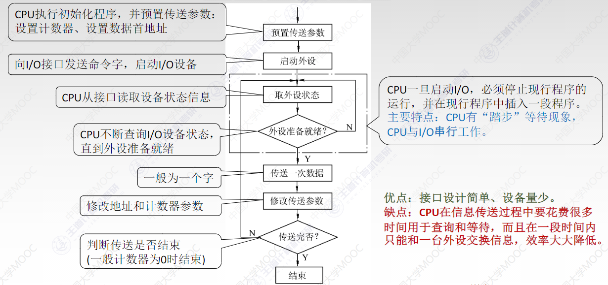

特点：CPU有“踏步”等待现象，CPU和I/O串行

缺点：CPU花费很多时间用于查询和等待

程序中断方式

中断的作用和原理

中断请求

中断响应

响应中断的条件

1.中断源有中断请求

2.CPU允许中断，开中断

3.一条指令执行完毕且没有更紧迫的任务

中断判优

硬件排队器

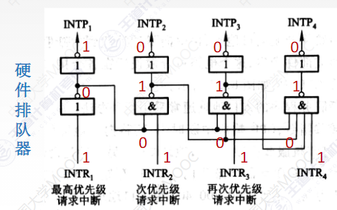

查询程序

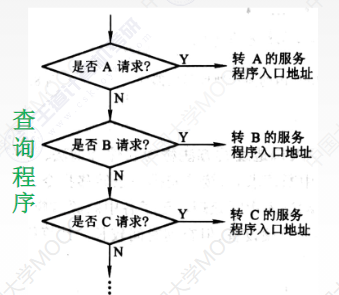

中断处理

中断隐指令

1.关中断：保证不被新的中断所打断

2.保存断点：把原PC保存起来

3.引入中断服务程序：取出入口地址传给PC

软件查询法

硬件向量法

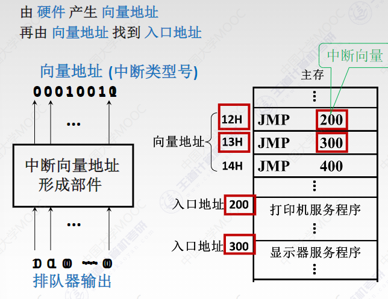

中断服务程序

1.保护现场

2.中断服务

3.恢复现场

4.中断返回

单重中断与多重中断

单重中断

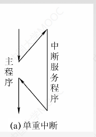

多重中断（中断嵌套）

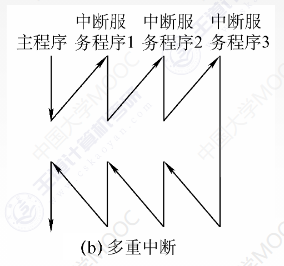

中断屏蔽技术

1.在中断服务程序中要提前开中断指令

2.优先级高的中断源有权中断优先级低的

屏蔽触发器

1表示屏蔽请求，0表示正常申请

屏蔽字寄存器

所有的屏蔽触发器组合在一起

屏蔽字

屏蔽字寄存器的内容

举例

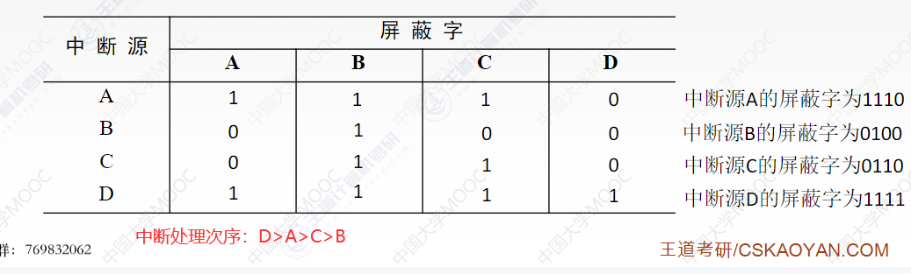

程序中断方式

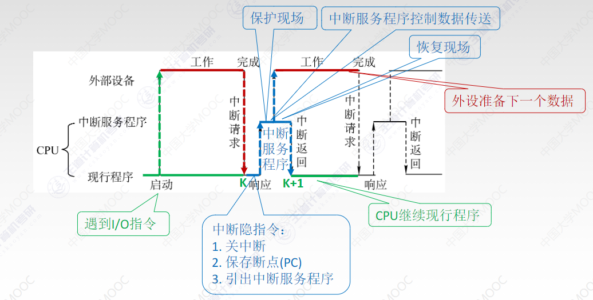

CPU占用情况

中断响应

中断服务程序

DMA方式

DMA控制器

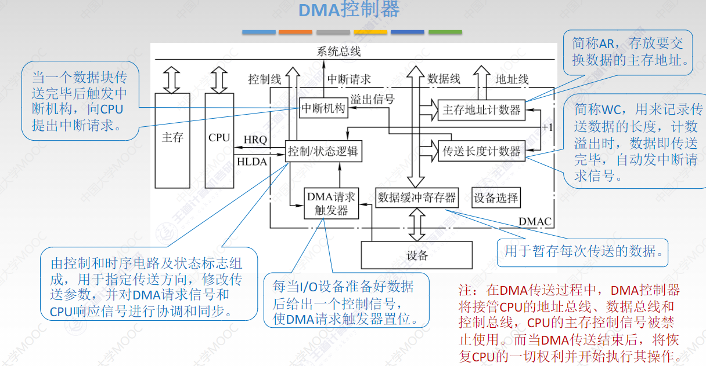

传送前：接收外设的DMA请求，向CPU发出总线请求，接管总线控制权

传送时：确定传送数据的主存单元地址及长度，自动修改地址计数和传送长度计数

传送后：向CPU报告DMA操作结束

组成

主存地址计数器

传送长度计数器

数据缓冲寄存器

DMA请求触发器

控制状态逻辑

中断机构

DMA传送过程

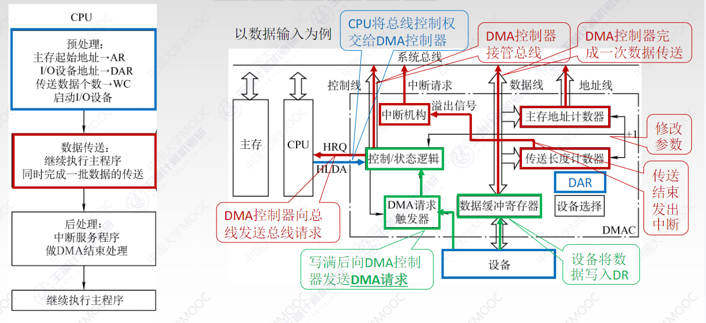

预处理

数据传送

后处理

三总线存在的问题

DMA和CPU访问主存冲突

解决办法

停止CPU访问主存

DMA和CPU交替访存

周期挪用

三总线特点

DMA传送数据不需要经过CPU，所以不需要中断现行程序

I/O与主机并行工作，程序和传送并行工作

