3.1 存储系统概述

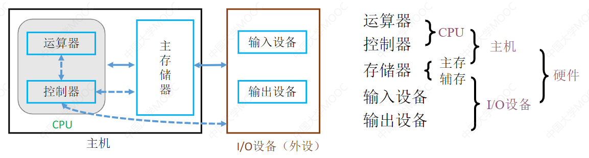

主存→辅存

解决容量不够的问题

Cache→主存

解决主存和CPU速度不匹配的问题

存储器的分类

层次

高速缓存(Cache)

主存储器(主存、内存)

辅存存储器(辅存、外存)

存储介质

半导体

主存、Cache

磁性材料

磁盘、磁带

光介质

光存储器

存取方式

相联存储器(CAM)

按内容访问

随机存取存储器(RAM)

与物理地址无关

串行访问存储器

顺序存储器(SAM)

读写时间取决于物理位置

直接存取存储器(DAM)

直接选取信息所在区域，然后按顺序方式存取

信息的可更改性

读写存储器

eg.磁盘、内存、Cache

只读存储器

eg.CD-ROM

eg.BIOS通常写在ROM中

信息的可保存性

易失性

eg.主存、Cache

非易失性

eg.磁盘、光盘

破坏性读出

DRAM芯片、读出数据后要进行重写

非破坏性读出

SRAM芯片、磁盘、光盘

磁盘的性能指标

存储容量

存储字数×字长

单位成本

每位价格=总成本/总容量

存储速度

数据传输率（主存带宽）=数据的宽度/存储周期

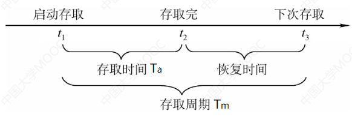

3.2 主存储器

基本组成

基本元件

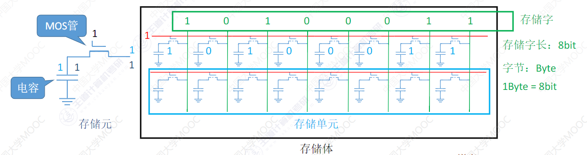

寻址

现代计算机通常按字节编址，每个字节对应一个地址

按字节寻址、按字寻址、按半字寻址、按双字寻址

存储芯片的结构

译码驱动电路

存储矩阵

读写电路

地址线、数据线、片选线、读写控制线

SRAM和DRAM

DRAM

用于主存

存储元：栅极电容

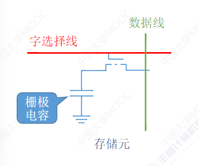

只能维持2ms

需要刷新

分散刷新：每次读写完都刷新一行

集中刷新：2ms内集中安排全部刷新

异步刷新：2ms内每行刷新1次

地址线复用技术

行、列地址分两次送

可使地址线更少、芯片引脚更少

SRAM

用于Cache

存储元：双稳态触发器

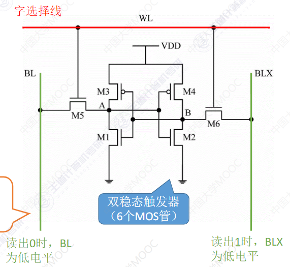

只要不断电，触发器状态就不会改变

对比

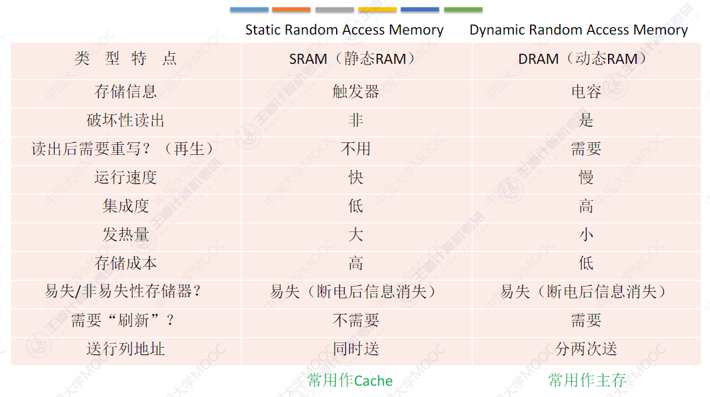

只读存储器ROM

MROM 掩模只读存储器

PROM 可编程只读存储器

RPROM 可擦除可编程只读存储器

UVEPROM UV可擦除只读存储器

EEPROM 电擦除只读存储器

Flash Memory 闪速存储器

SSD 固态硬盘

内存优化技术

多核CPU都要访存怎么办？

双端口RAM

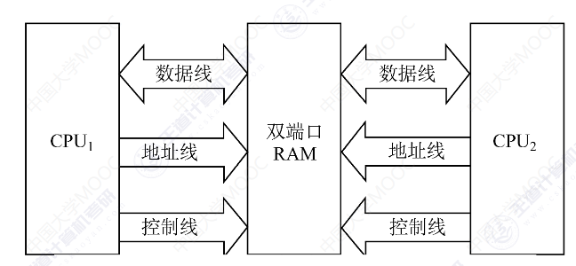

CPU的读写速度比主存快很多，主存恢复太慢怎么办？

多模块存储器

单体多字存储器

多体并行存储器

高位交叉

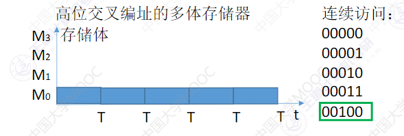

低位交叉

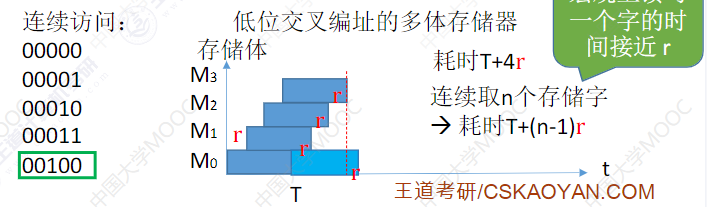

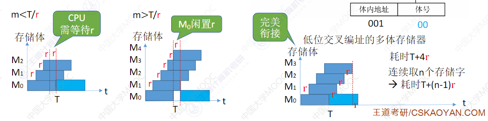

主存储器与CPU的连接

位扩展

增加主存的存储字长

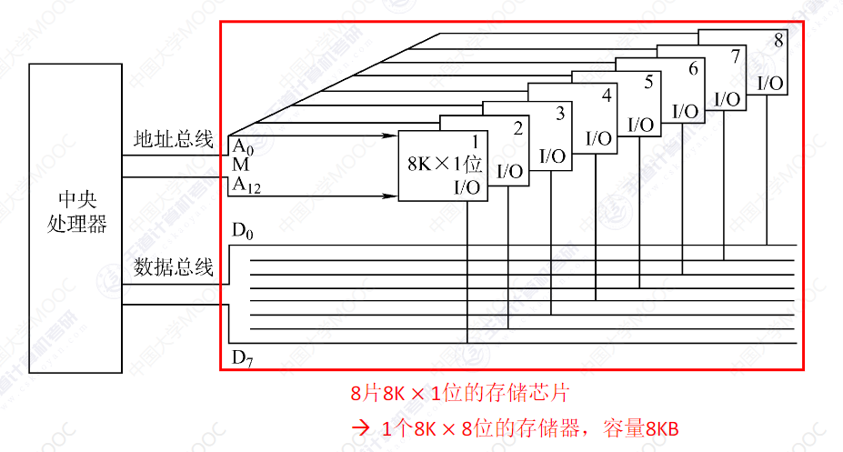

字扩展

增加主存的存储字数

线选法

n条线→n个选片信号

地址空间不连续

译码片选法

n条线→$2^n$个选片信号

地址空间可连续

字位同时扩展

3.4 外部存储器

磁盘存储器

优点

存储容量大，位价格低

记录介质可以重复使用

记录信息长期不丢失

非破坏性读出

缺点

存取速度慢

机械结构复杂

对工作环境要求高

组成

存储区域

磁头数

柱面数

扇区数

磁盘驱动器

磁盘控制器

性能指标

容量

存储的字节总数

非格式化容量

记录面数×柱面数×每条磁道的磁化单元数

格式化容量

记录面数×柱面数×每道扇区数×每个扇区的容量

记录密度

道密度

位密度

位密度×道密度

平均存取时间

寻道时间

旋转时间

传输时间

数据传输率

单位时间内向主机传送数据的字节数

磁盘地址

驱动器号

柱面号（磁道号）

盘面号

扇区号

磁盘阵列RAID

RAID0

无冗余和无校验

RAID1

镜像

RAID2

纠错的海明码

RAID3

位交叉奇偶校验

RAID4

块交叉奇偶校验

RAID5

无独立校验的奇偶校验

固态硬盘

原理：Flash Memory

组成

闪存翻译层

存储介质

多个闪存芯片

读写性能特性

以页为单位读写

相当于磁盘的扇区

以块为单位擦除

支持随机访问

读快、写慢

与机械硬盘相比

SSD读写速度快，随机访问性能高

SSD安静无噪音、耐摔抗震、能耗低、造价更贵

SSD一个块被擦除次数过多可能会坏掉

磨损均衡技术

将擦除平均分布在各个块上

动态磨损均衡

写入时优先选择累计擦除次数少的新闪存块

静态磨损均衡

SSD监测并自动进行数据分配迁移

3.5 高速缓冲存储器

局部性原理

空间局部性

最近要用到的信息，很可能与现在正在使用的信息在存储空间上是相邻的

时间局部性

最近要用到的信息很可能是现在正在使用的

基本工作原理

数据查找

地址映射

替换策略

写入策略

Cache和主存的映射方式

直接映射

主存块号 mod Cache总行数

全相联映射

可以装入任何位置

组相联映射

主存块号 mod Cache组数

Cache替换算法

随机算法RAND

先进先出算法FIFO

近期最少使用LRU

命中时，命中行的计数器清零，比其低的计数器+1，其余不变

未命中还有空闲行，新装入的行计数器置0，其余非空闲行全+1

未命中且无空闲行时，计数值最大的行的信息块被淘汰，新装行的块的计数器置0，其余全部+1

最近不经常使用LFU

新调入的块计数器=0，之后每被访问一次计数器+1。需要替换时，选择计数器最小的一行

曾经经常访问的块，在未来不一定会用到

Cache写策略

写命中

**全写法**

对Cache写命中时，必须把数据同时写入Cache

**回写法**

只修改Cache内容，只有当此块被换出时才写回主存

写不命中

**写分配法**

写不命中时，把主存中的块调入Cache,在Cache中修改

**非写分配法**

写不命中时，只写入主存，不调入Cache

多级Cache

各级之间 全写+非写分配

Cache和主存 写回法+写分配法

