2.1 数制与编码

进位计数制

任意进制→十进制

二进制→八进制、十六进制

十进制→任意进制

整数：除基取余，先取到的“余”是低位

小数：乘基取整，先取到的“整”是高位

真值与机器数

真值：实际的带正负号的数值

机器数：把正负号数字化的数

定点数的表示

定点数：小数点的位置固定

无符号数

有符号数（设机器字长n+1位）

原码

整数范围

$-(2^n-1) \leq x \leq 2^n-1$

小数范围

$-(1-2^{-n}) \leq x \leq (1-2^{-n})$

反码

正数：反码=原码

负数：数值位全部取反

整数范围

$-(2^n-1) \leq x \leq 2^n-1$

小数范围

$-(1-2^{-n}) \leq x \leq (1-2^{-n})$

补码

正数：补码=原码

负数：反码末位+1

整数范围

$-2^n\leq x\leq 2^n-1$

小数范围

$-1 \leq x\leq1-2^{-n}$

技巧：[x]补快速求[-x]补的方式，符号位、数值位全部取反，末位+1

移码

补码的基础上将符号位取反

只能用于表示整数

整数范围

$-2^n\leq x\leq2^n-1$

浮点数：小数点的位置不固定

2.2 运算方法和运算电路

2.1

逻辑门电路

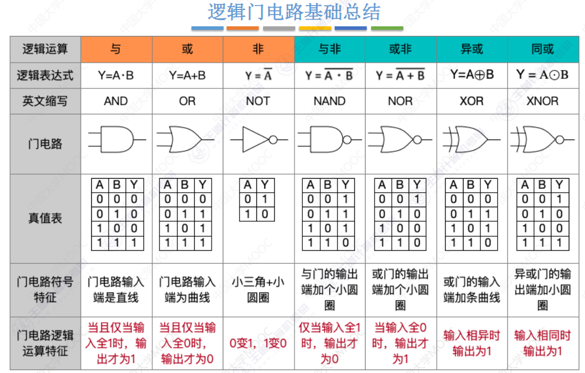

异或：奇数个1为1；偶数个1为0。奇偶校验，二进制加法

加法器

一位全加器

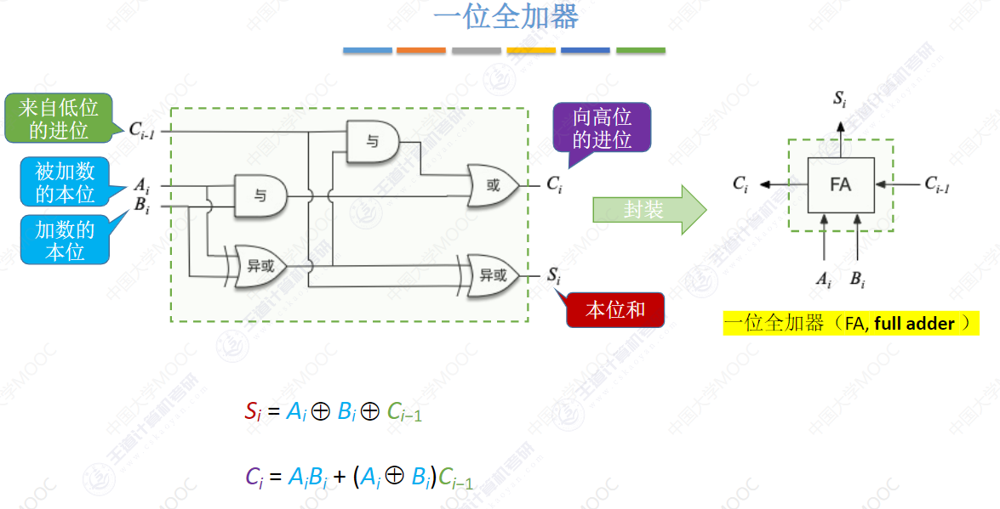

    输入

        被加数的本位$A_i$

        加数的本位$B_i$

        来自低位的进位$C_{i-1}$

    输出

        本位和$S_i$

        $S_i=A_i xor B_i xor C_{i-1}$

        进位$C_i$

        $A_i*B_i+(A_i xor B_i)*C_i-1$

n bit 加法器

串行进位的并行加法器

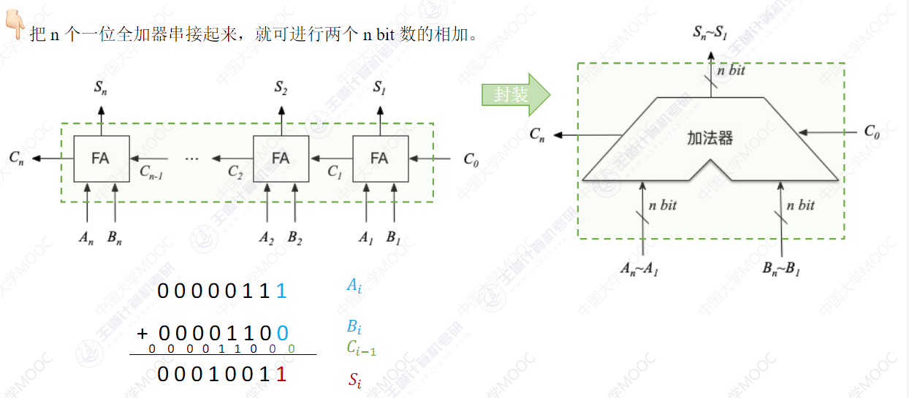

    

不足之处

进位信息是串行产生的，计算速度取决于进位产生和传递的速度。位数越多，运算速度越慢

产生：电信号到达稳态需要一定的时间

传递：每一级进位直接依赖于前一级的进位，即进位信号是逐级形成的

并行进位的并行加法器

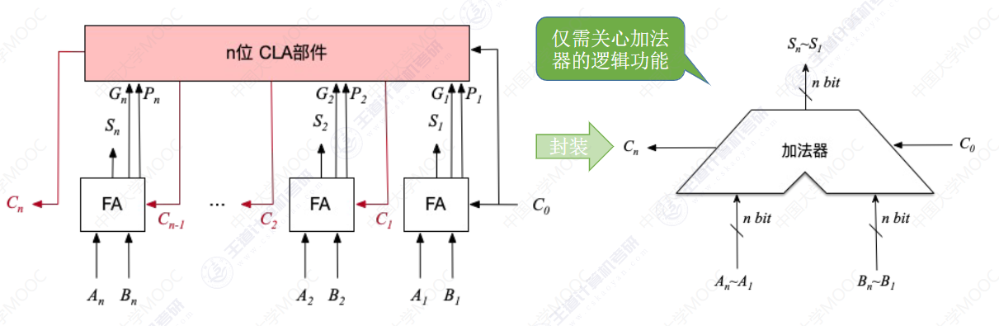

优点

进位信息是并行产生的，运算速度更快

带标志位的加法器

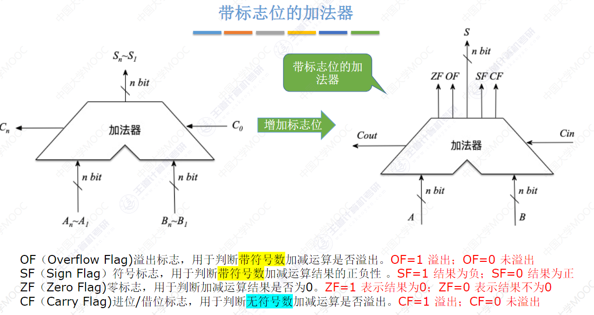

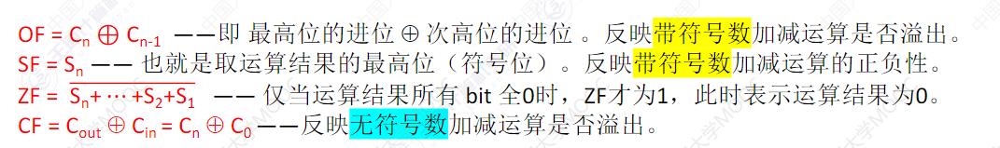

多路选择器

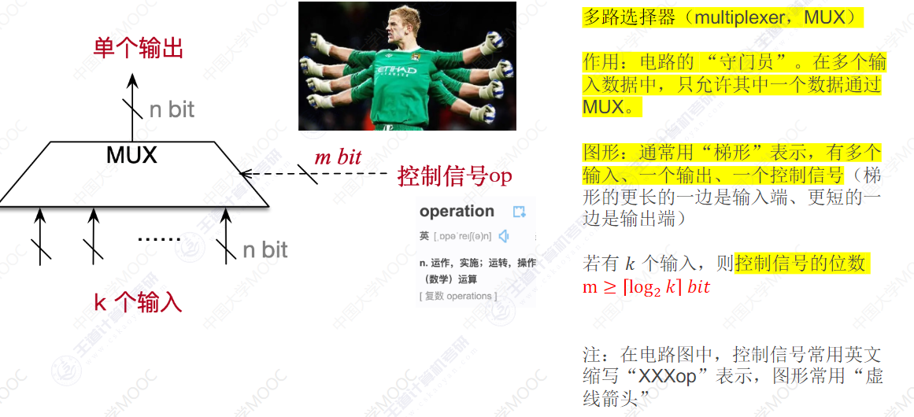

三态门

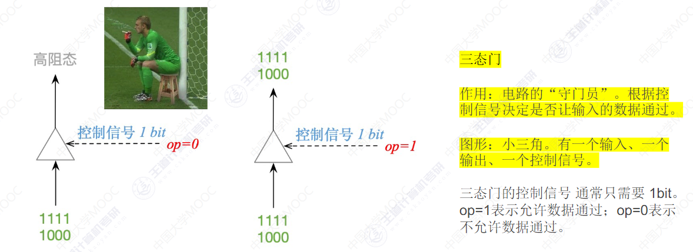

算数逻辑单元ALU

CPU的组成

运算器

各种寄存器

算数逻辑单元（核心：加法器）

PSW寄存器

控制器

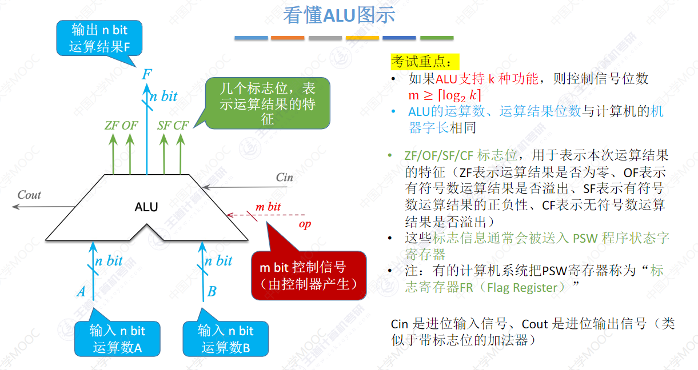

2.2

移位运算

算数移位

原码

符号位不变，仅对数值位移位

右移：高位补0，低位舍弃

左移：低位补0，高位舍弃

反码

正数

右移：高位补0，低位舍弃

左移：低位补0，高位舍弃

负数

右移：高位补1，低位舍弃

左移：低位补1，高位舍弃

补码

正数

右移：高位补0，低位舍弃

左移：低位补0，高位舍弃

负数

右移（同反码）：高位补1，低位舍弃

左移（同原码）：低位补0，高位舍弃

逻辑移位

右移：高位补0，低位舍弃

左移：低位补0，高位舍弃

循环移位

不带进位位

用移出的位补上空缺

带进位位

移出的位放到进位位，原进位位补上空缺

定点数的加减法运算

原码（了解）

补码

符号位参与运算；减法转变成对应的加法

溢出判断

上溢：正+正=负；下溢：负＋负=正

方法一

$V=A_s*B_s*\overline{S_s}+\overline{A_s}*\overline{B_s}*S_s$

方法二

$V=C_s xor C_1$

符号位的进位与最高数值位的进位

方法三

$V=S_{s_1} xor S_{s_2}$

双符号位

V=1溢出；V=0未溢出

无符号数的加减运算

加法

从最低位开始，按位相加，并往更高位进位

最高位进位=1时，溢出；否则未溢出

减法

被减数不变，减数全部按位取反，末位+1，减法变加法

从最低位开始，按位相加，并往更高位进位

最高位进位=0时，溢出；否则未溢出

补码加减运算电路

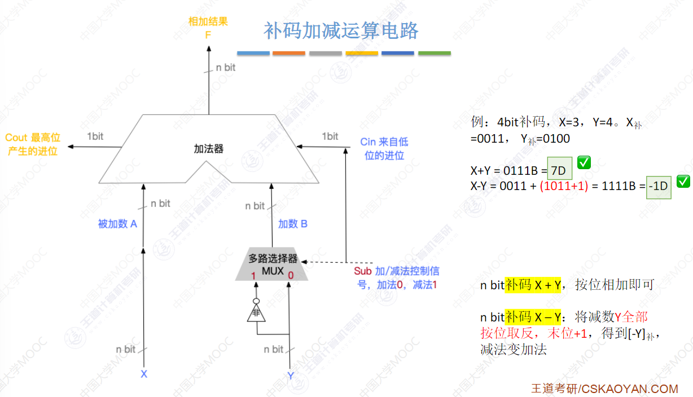

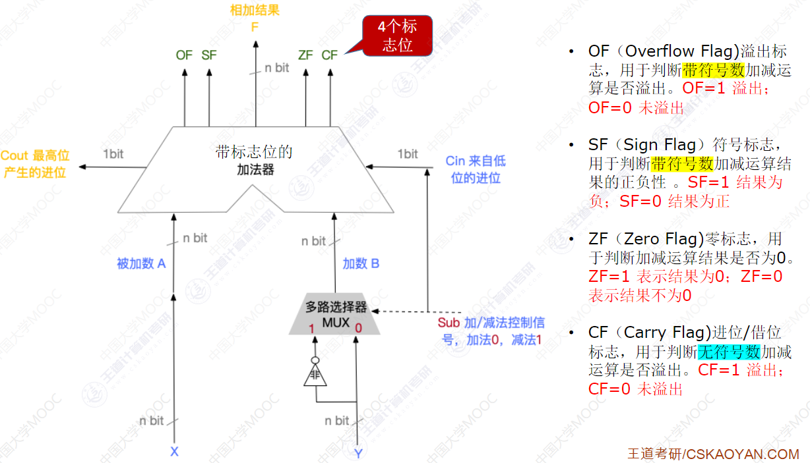

原码的乘法运算

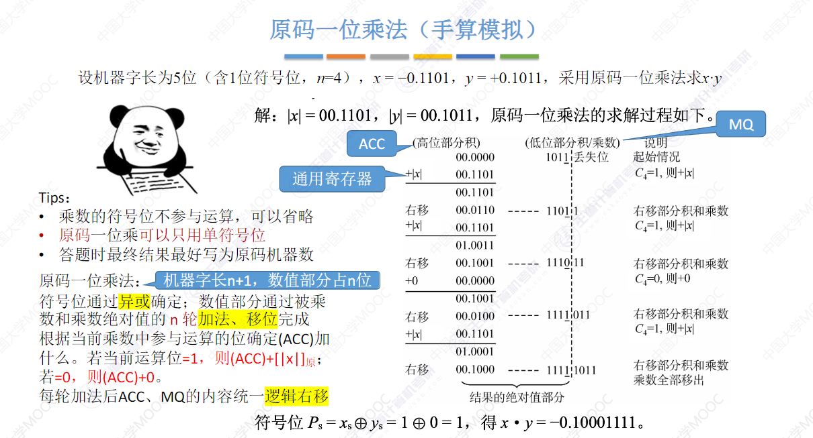

补码乘法运算

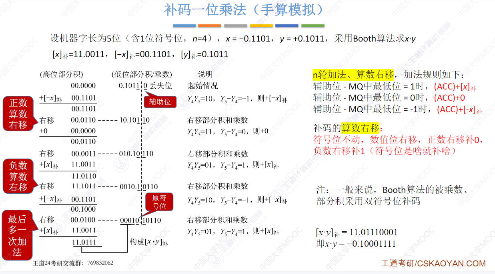

原码的除法运算

恢复余数

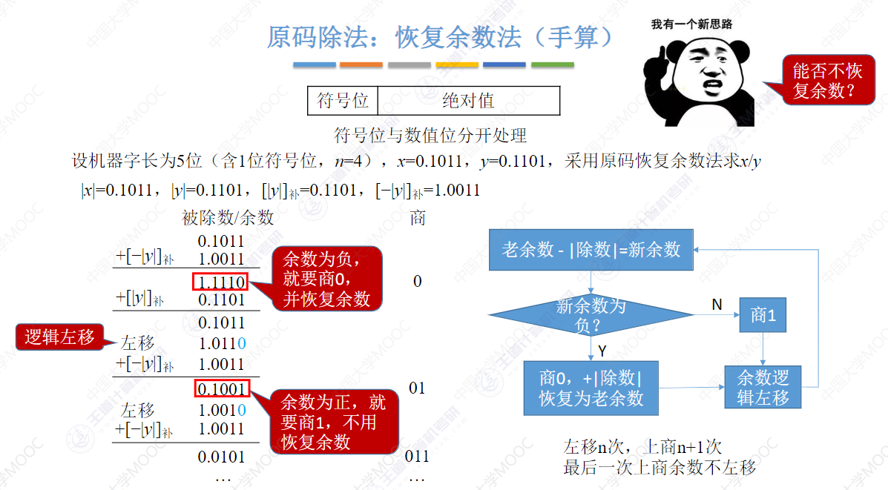

不恢复余数（加减交替法）

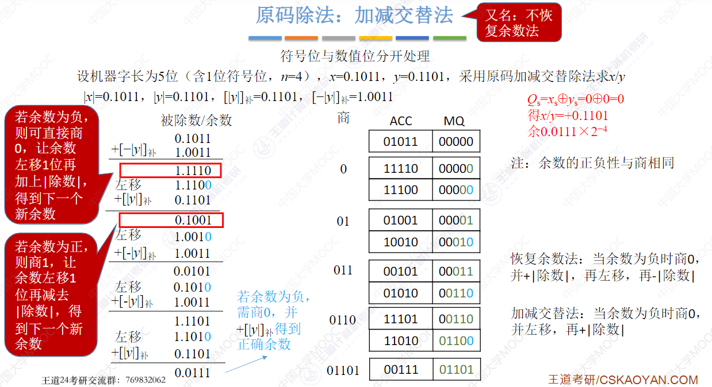

补码除法

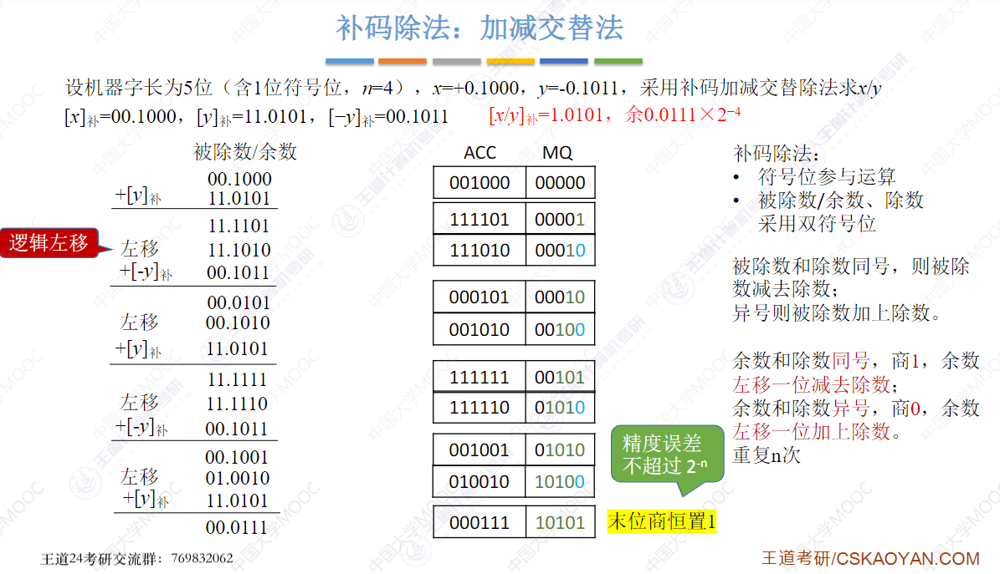

零扩展、符号扩展

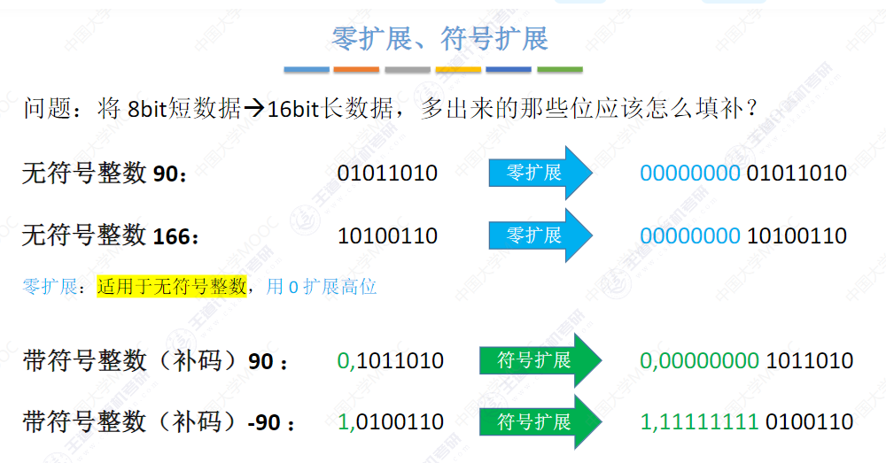

2.3 浮点数的表示和运算

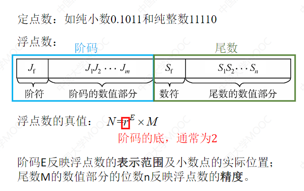

规格化

原码：尾数的最高数值位必须是1

补码：正数最高数值位为1；负数最高数值位为0

右归

尾数出现溢出时，双符号位为01或10

采用双符号位，当溢出发生时，可以挽救。更高的符号位是正确的符号位

尾数算数右移1位，阶码+1

左归

尾数算数左移1位，阶码-1

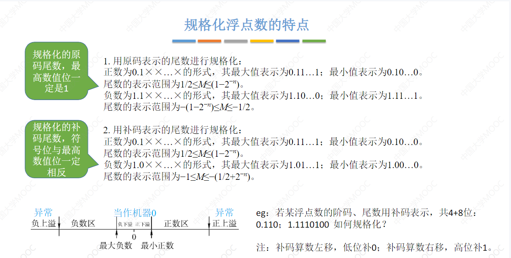

IEEE 754

移码=真值+偏置值

规定：偏置值=$2^{n-1}-1$

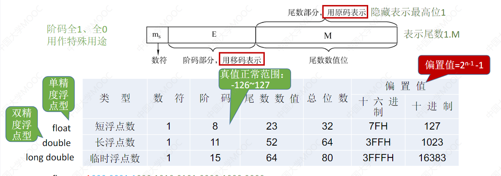

阶码全0

尾数不全为0

非规格化小数

尾数全0

真值+-0

阶码全1

尾数全0

无穷大

尾数不全为0

NaN

浮点数加减运算

对阶

小阶向大阶靠齐

尾数加减

规格化

舍入

直接舍弃

0舍1入

恒置1法

判溢出

尾数溢出未必导致整体溢出

