5.1 CPU的功能和基本结构

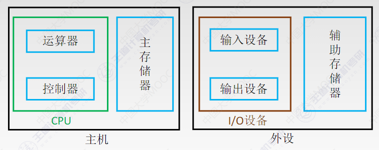

CPU的功能

指令控制

操作控制

时间控制

数据加工

中断处理

CPU的基本结构

运算器

算数逻辑单元ALU

暂存寄存器

累加寄存器ACC

通用寄存器GPRs

程序状态字寄存器PSW

移位寄存器

控制器

程序计数器PC

指令寄存器IR

指令译码器ID

存储器地址寄存器MAR

存储器数据寄存器MDR

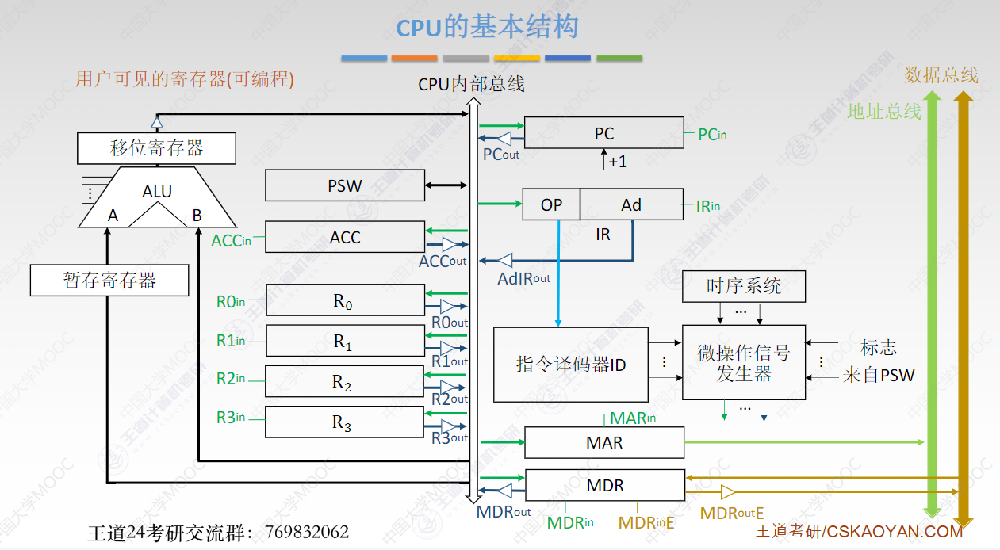

5.2 指令执行过程

指令周期

CPU从主存取出并执行一条指令所需的全部时间

指令周期由若干**机器周期（CPU周期）**组成

机器周期包含若干**时钟周期（节拍、CPU时钟周期）**

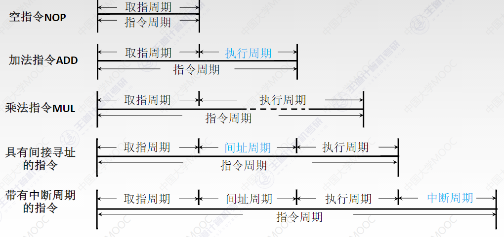

指令周期的数据流

取址周期

(PC)→MAR

1→R

M(MAR)→MDR

MDR→IR

(PC)+1→PC

间址周期

Ad(IR)→MAR

或者Ad(MDR)→MAR

1→R

M(MAR)→MDR

(MDR)→Ad(IR)

把有效地址送到指令的地址码字段

执行周期

中断周期

CU：(SP)-1→SP,(SP)→MAR

保存断点

1→W

(PC)→MDR

向量地址→PC

指令执行方案

单指令周期

所有指令选用相同的执行时间

串行执行

多指令周期

不同类型的指令选用不同的执行步骤完成

串行执行

流水线周期

多条指令同时运行

并行执行

5.3 数据通路的功能和基本功能

异常和中断

异常

内中断：CPU内部产生的意外

中断

外中断：来自CPU外部的设备向CPU发出的中断请求

数据通路的定义

数据在指令执行过程中所经过的路径，包括路径上的部件

数据通路的基本结构

CPU内部单总线方式

区分：内部总线和系统总线

内部总线：CPU内部连接各寄存器及运算部件之间的总线

系统总线：同一台计算机系统的各部件，CPU、内存、通道和各类I/O接口间互相连接的总线

寄存器之间数据传送

主存和CPU之间的数据传送

执行算术或逻辑运算

*ALU需要配合暂存器使用

单周期处理器（CPI=1）不能采用单总线方式，因为单总线将所有寄存器都连接到一根公共总线上，一个时钟内只允许一次操作，无法完成一条指令的所有操作

CPU内部多总线方式

专用数据通路方式

根据指令执行过程中数据和地址的流动方向安排电路，避免使用共享的总线

5.4 控制器的功能和工作原理

硬布线控制器

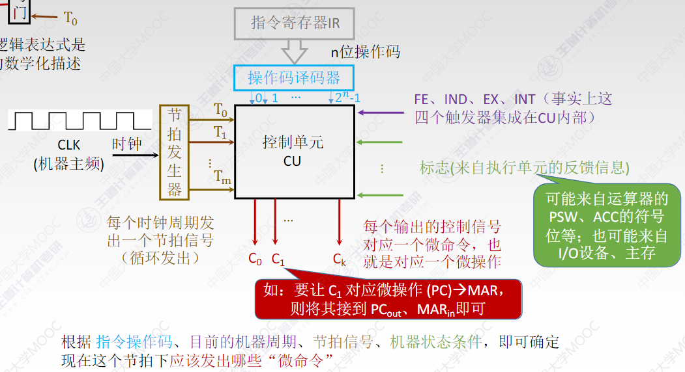

设计步骤

分析每个阶段的微操作序列

选择CPU的控制方式

安排微操作时序

电路设计

取指周期

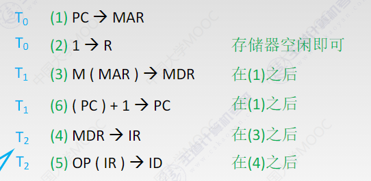

间址周期

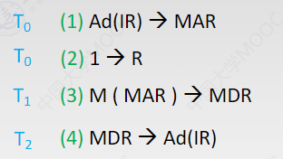

执行周期

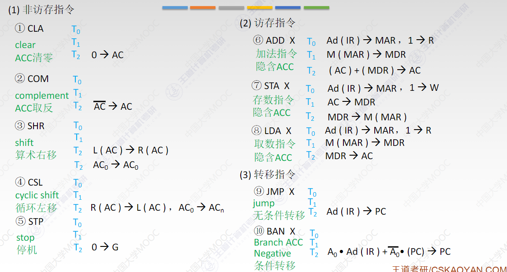

中断周期

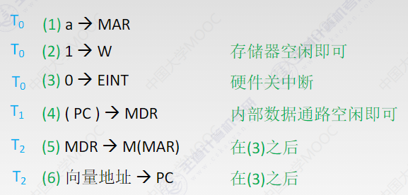

微程序控制器

程序：由指令序列组成

微程序：由微指令序列组成

每一种指令对应一个微程序

指令：对程序执行步骤的描述

微命令与微操作

相容性

不容性

微指令：对指令执行步骤的描述，是若干微命令的集合

微周期：取出并执行一条微指令所需的全部时间

微程序控制器的基本结构

微地址形成部件：产生初始和后继地址

微指令地址寄存器**$\mu$PC或CMAR：**存放待执行的微指令在CU中的微地址

控制存储器CM：微程序控制器的核心部件

微指令寄存器**$\mu$IR或CMDR**：存放读出的微指令

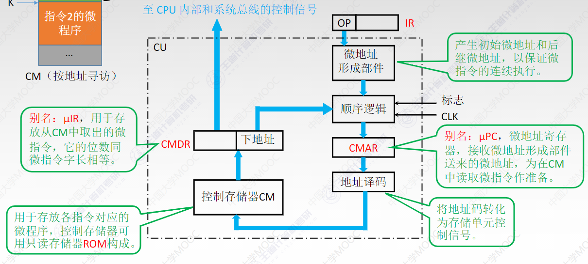

微指令的格式

水平型

一条微指令定义多个可并行的微命令

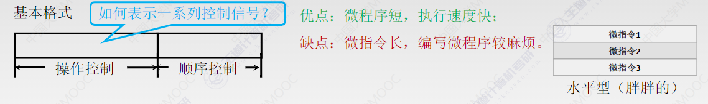

编码方式

直接编码

字段直接编码

字段间接编码

垂直型

一条微指令只能定义一个微命令

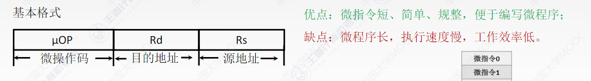

混合型

在垂直型的基础上增加一些不太复杂的并行操作

下一条微指令地址的形成方式

断定法（下地址法）:从当前执行的微指令下地址找到下一条微指令

计数器法：$\mu PC$+1

根据指令操作码确定执行周期微程序首地址

专门的硬件指明取指/中断周期的微程序首地址

微程序控制单元的设计

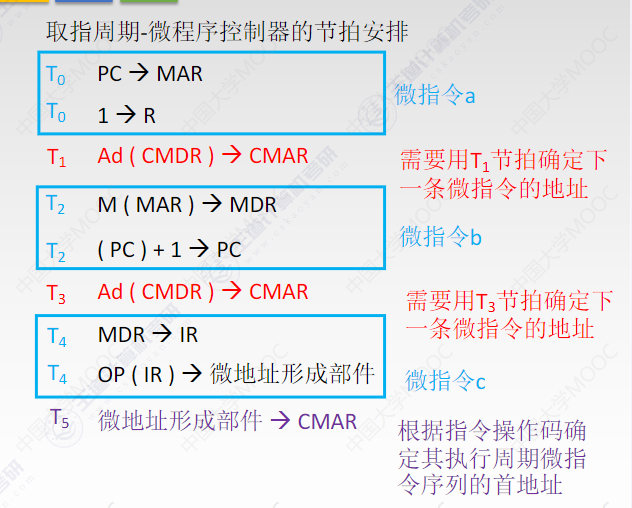

硬布线与微程序的比较

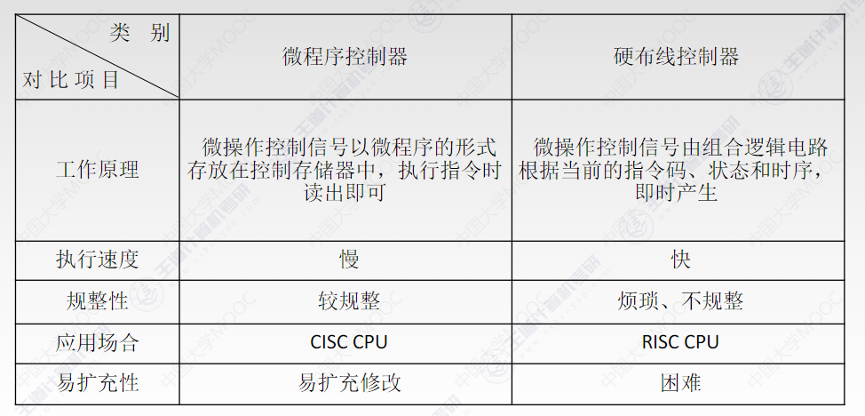

5.5 异常和中断机制**（结合程序中断方式）**

异常和中断

异常

内中断：CPU内部产生的意外

中断

外中断：CPU外部设备向CPU发出的中断请求

异常

故障

引起故障的指令启动后、执行结束前被检测到的异常事件

指令译码时，非法操作码

取数据时，缺段、缺页

执行整除算法时，发现除数为0

自陷

预先安排的一种异常事件

处理完后，返回到下一条指令，或者转移目标指令

系统调用

终止

发生了使计算机无法继续执行的硬件故障

控制器出错

存储器校验错

总线错误

中断

可屏蔽中断

不可屏蔽中断

非常紧急的硬件故障，如电源掉电

异常和中断的响应过程

关中断

禁止响应新的中断

保存断点和程序状态

保存在栈中，为了支持异常或中断的嵌套

识别异常和中断并转到相应的处理程序

软件识别方式

异常状态寄存器

中断查询程序

硬件识别方式（向量中断）

中断向量：异常或中断处理程序的首地址

中断向量表：所有中断向量存放的地方

向量地址：每个中断/异常都被指定的一个中断类型号

5.6 指令流水线

定义

一个指令的执行过程可以分为多个阶段

取指

分析

执行

执行方式

顺序执行方式

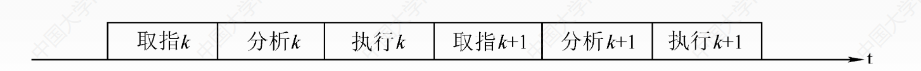

T=n×3t

一次重叠执行方式

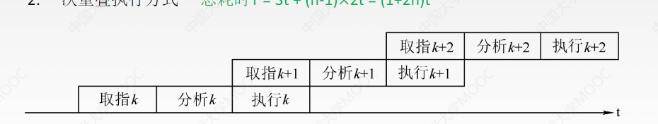

T=3t+(n-1)×2t=(2n+1)t

二次重叠方式

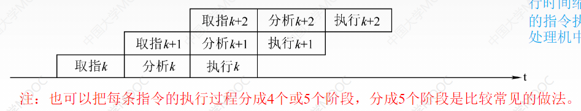

T=3t+(n-1)×t=(n+2)×t

流水线表示方式

指令执行过程图

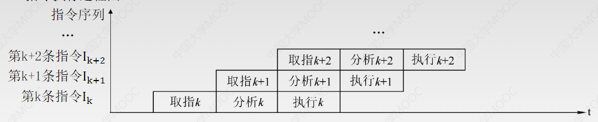

用于分析指令执行过程以及影响流水线的因素

时空图

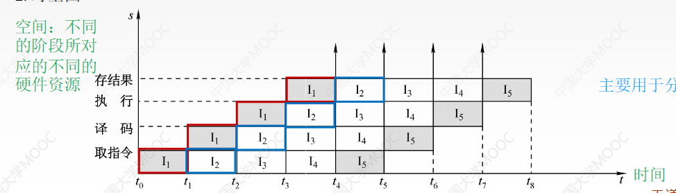

用于分析流水线的性能

流水线的性能指标

吞吐率

单位时间内流水线完成的任务数量

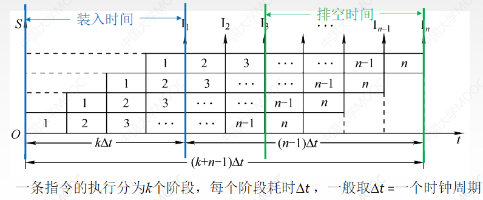

    装入时间

        所有硬件设备逐渐投入使用的时间

    排空时间

        所有硬件设备逐渐排空使用的时间

$TP={n \over (k+n-1) \Delta t}$

加速比

不使用流水线所用的时间与使用流水线所用的时间之比

不使用流水线

$T_0=nk\Delta t$

使用流水线

$T_k=k\Delta t+(n-1)\Delta t=(k+n-1)\Delta t$

加速比

$S={kn\over k+n-1}$

效率

流水线设备的利用率

n个任务占用K时空区有效面积

$T_0=kn\Delta t$

n个任务所用时间与K个流水段所围成的时空区总面积

$kT_k=k(k+n-1)\Delta t$

$E={T_0\over kT_k}$

机器周期的设置

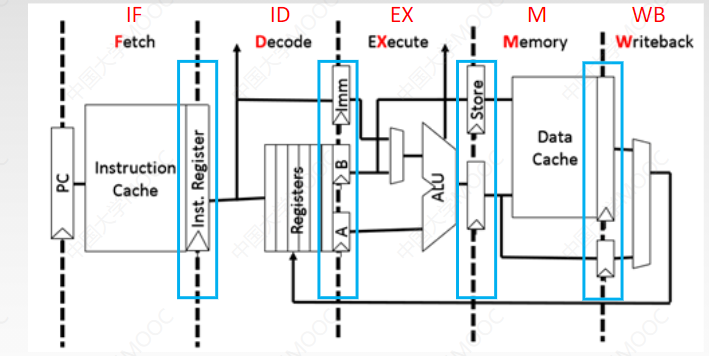

每个功能段后面都有一个缓冲寄存器，称为锁存器

影响流水线的因素

结构相关/资源冲突

原因：多条指令在同一时刻争用同一资源而形成的冲突

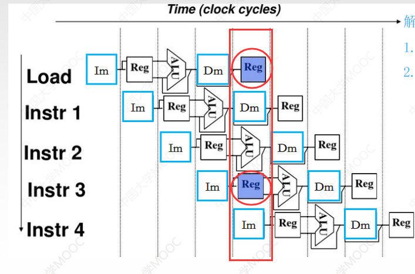

解决办法

后一相关指令暂停一周期

数据存储器+指令存储器

数据相关/数据冲突

原因：必须等前一条指令执行完后才能执行后一条指令

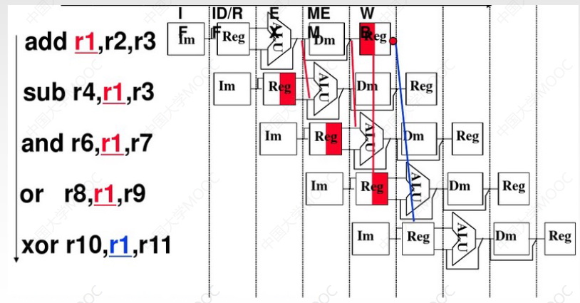

解决办法

把遇到数据相关的指令及后续指令都暂停一至几个时钟周期

硬件阻塞stall

软件阻塞Nop

数据旁路技术：不用等前一条指令把数据写回寄存器，而是直接冲中间数据直接转发到ALU

编译优化：通过编译器调整指令顺序来解决数据相关

控制相关/控制冲突

当流水线遇到**转移指令和其他改变PC值**的命令而造成断流时，会引起相关控制

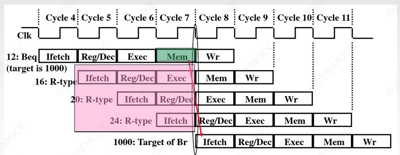

解决办法

转移分支预测

简单预测

动态预测

预取转移成功和不成功两个控制流方向上的目标指令

加快和提前形成条件码

提高转移方向的猜准率

流水线的分类

使用的级别不同

部件功能级

处理机级

一条指令解释过程分为多个子过程

处理机间

每个处理机完成某一专门任务，各个处理机所得到的结果需存放在与下一处理机共享的存储器中

可以完成的功能不同

单功能

只能实现一种固定的专门功能的流水线

多功能

各段间的不同连接方式可以同时或不同时实现多种功能的流水线

同一时间内各段之间的连接方式

静态

同一时间段，同一种功能

动态

同一时间段，不同运算

各功能段之间是否有反馈信号

线性流水线

非线性流水线

流水线的多发技术

超标量技术

每个时钟周期内可并发多条独立指令

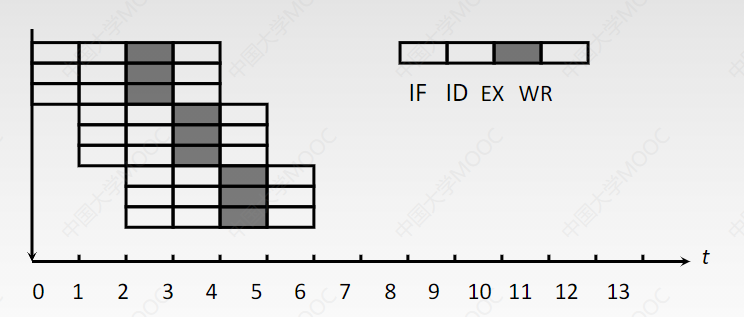

超流水技术

一个时钟周期内再分段

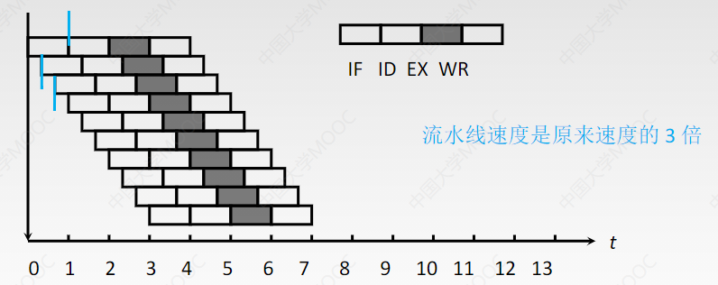

超长指令字

多条能并行操作的指令组合成一条，具有多个操作码字段的超长指令字

五段式指令流水线

运算类指令

LOAD指令

STORE指令

条件转移指令

无条件转移指令

