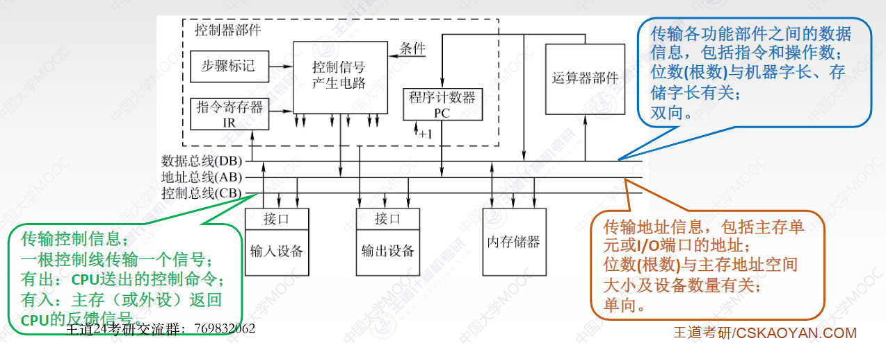
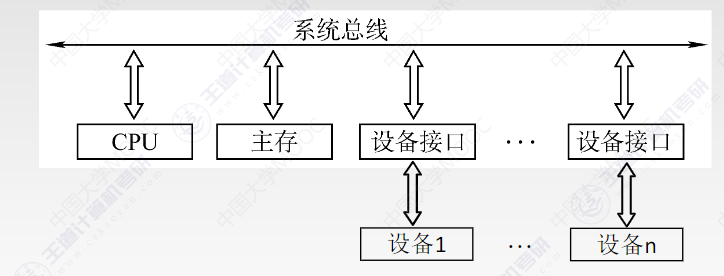
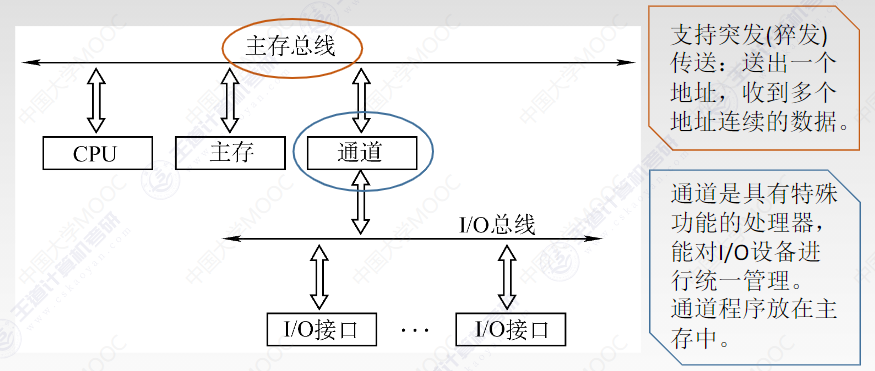
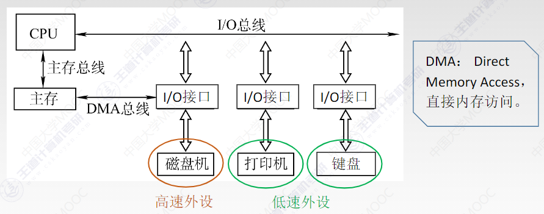
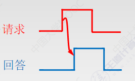
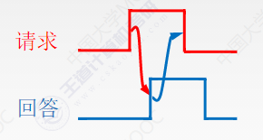
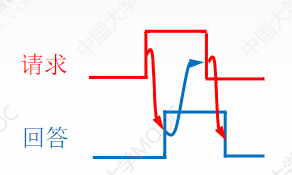

6.1 总线概述

目的：为了更好地解决I/O设备和主机之间连接的灵活性

定义

一组能够为多个部件**分时**和**共享**的公共信息传送线路

特点

分时

同一时刻只允许有一个部件向总线发送信息

共享

总线上可以挂接多个部件

特性

机械特性

电气特性

功能特性

时间特性

分类

按数据传输格式

串行总线

优点：只需1根传输线，适用于长距离

缺点：数据发送和接收的时候要进行拆卸和装配，要考虑串行-并行转换的问题

并行总线

优点：逻辑时序比较简单，电路容易

缺点：信号线数量多，工作频率高时，信号线之间会产生干扰

按功能层次

片内总线

CPU芯片内部寄存器与寄存器、寄存器与ALU之间

系统总线

计算机系统内部各功能部件之间相互连接的总线

数据总线

地址总线

控制总线

按照结构分类

单总线

缺点：带宽低、负载重，不支持并发传送

双总线

优点：将低速的I/O设备从单总线上分离出来，实现存储器总线和I/O总线分离

缺点：需要增加通道等硬件设备

缓和CPU和I/O设备之间速度不匹配的矛盾

三总线

优点：提高了I/O设备的性能，使其更快地响应命令，提高系统吞吐量

缺点：任意时刻只能使用一种总线，系统工作效率较低

缓和CPU和磁盘之间的矛盾

通信总线

计算机系统之间、计算机系统与其他系统之间信息传送的总线

性能指标

总线周期：一次总线操作所需的时间

时钟周期：机器的时钟周期

工作频率：总线周期的倒数

时钟频率：时钟周期的倒数

总线宽度：通常指数据总线的根数，同时能够传输的数据位数

总线带宽：数据传输率，单位时间内总线上可传输数据的位数

总线带宽=总线工作频率×总线宽度（bit/s）

总线带宽=总线宽度（bit/s）/总线周期

总线复用：一种信号线在不同的时间传输不同的信息

信号线数：地址总线、数据总线和控制总线3种总线数的总和称为信号线数

6.2 总线事务和定时

总线事务：从请求总线到完成总线使用的操作序列称为总线事务

总线周期

申请分配阶段

寻址阶段

传输阶段

结束阶段

总线定时

同步通信：统一时钟

异步通信：应答方式

不互锁方式

半互锁方式

全互锁方式

半同步通信：同步、异步结合

分离式通信：充分挖掘系统总线每瞬间的潜力

