4.1 指令系统

指令的定义

指示计算机执行某种操作的命令，计算机运行的最小功能单位

指令系统（指令集）

所有指令的集合

指令集体系统ISA

定义了软件和硬件之间的接口

规定

指令格式、指令寻址方式、操作类型、每种操作对应的操作数的相应规定

操作数的类型、操作数的寻址方式、大端还是小端

寄存器编号、个数、位数，存储空间的大小和编址方式

指令执行过程的控制方式，程序计数器、条件码定义

指令格式

操作码op

地址码（A）

按地址码数量分类

零地址指令

空操作、停机指令、关中断指令

堆栈计算机

一地址指令

只需要单操作数

$OP(A_1)→A_1$

需要双操作数，其中一个隐含在某个寄存器

$（ACC)OP(A_1)→ACC$

二地址指令

$(A_1)OP(A_2)→A_1$

三地址指令

$(A_1)OP(A_2)→A_3$

四地址指令

$(A_1)OP(A_2)→A_3,PC=A_4$

按指令长度分类

区分

指令长度

一条指令的总长度

机器字长

CPU进行一次整数运算能处理的二进制位数（通常和ALU直接相关）

存储字长

一个存储单元中二进制代码位数（通常和MDR位数相同）

半长指令

单字长指令

双字长指令

需要访存2次才能完整取出

按操作码长度分类

定长操作码

可变长操作码

扩展操作码

指令字长固定，设地址长度为n，上一次留出m种状态，下一层可扩展出$m×2^n$钟状态

不允许短码是长码的前缀

不允许重复

按操作类型分类

数据传送

LOAD、STORE

算数逻辑操作

算数

加减乘除、增1减1、求补、浮点运算、十进制运算

逻辑

与或非、异或、位操作、位测试、位清除、位求反

移位操作

算数移位

逻辑移位

循环移位

转移操作

无条件转移、有条件转移

调用CALL、返回RET

陷阱和陷阱指令

输入输出操作

4.2 指令的寻址方式

指令寻址

顺序寻址

(PC)+'1'→PC

跳跃寻址

由转移指令指出

数据寻址

隐含寻址

指令中隐含操作数的地址，如ACC

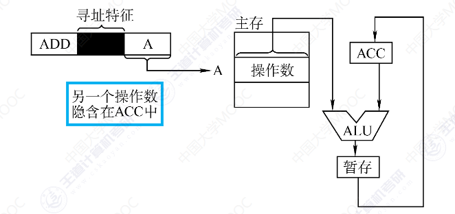

优点：有利于缩短指令字长

缺点：需增加存储操作数或隐含地址的硬件

立即寻址

A就是操作数本身，一般采用补码

优点：指令执行阶段不访问主存

缺点：A的位数限制了立即数的范围

直接寻址

EA=A

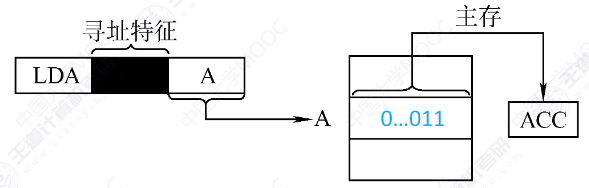

间接寻址

EA=(A）

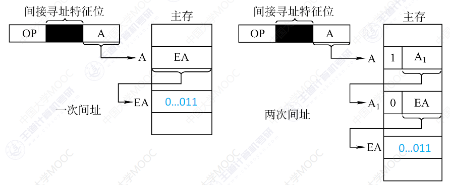

优点：扩大寻址范围；便于编制程序

缺点：指令执行阶段需要多次访存

寄存器寻址

$EA=R_i$

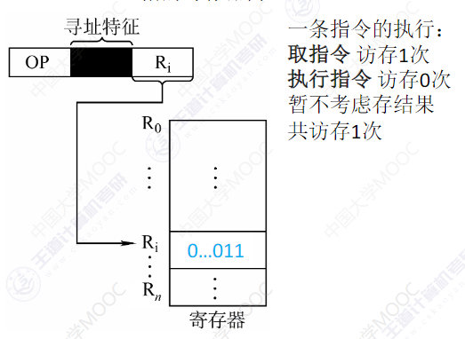

优点：执行阶段不访问主存；指令字短且执行速度快

缺点：寄存器价格昂贵，数量有限

寄存器间接寻址

$EA=(R_i)$

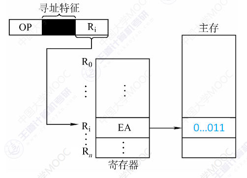

与一般间接寻址相比速度更快

相对寻址

EA=(PC)+A

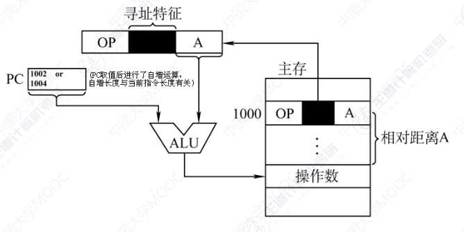

A是相对于PC所指地址的位移量

优点：一段代码在程序内浮动时不用更改跳转指令的地址码，广泛应用于转移指令

基址寻址

EA=(BR)+A

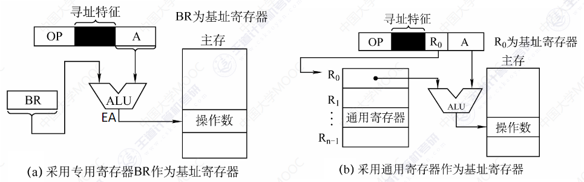

程序运行前，CPU将BR的值修改为该程序的起始地址

BR作为基地址，A为偏移量

优点：便于（整个）程序浮动，方便多道程序并发运行

变址寻址

EA=(IX)+A

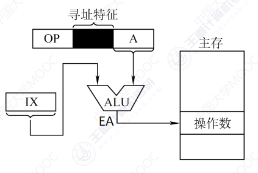

IX的内容可由用户改变

IX作为偏移量，A作为基地址

优点：可以不断改变IX的内容，适合编制循环程序

堆栈寻址

操作数存放在堆栈中，隐含使用SP作为操作数地址

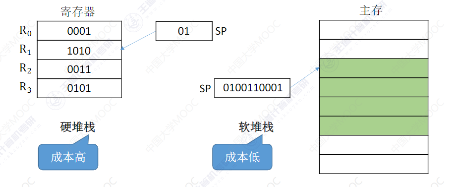

堆栈是寄存器种一块特定的、按后进先出管理的存储区，SP存储在特定的寄存器中

硬堆栈：寄存器堆栈

软堆栈：从内存中划出一段区域做堆栈

4.3 程序的机器级代码表示

高级语言→汇编语言→机器语言

AT&T格式 v.s. Intel格式

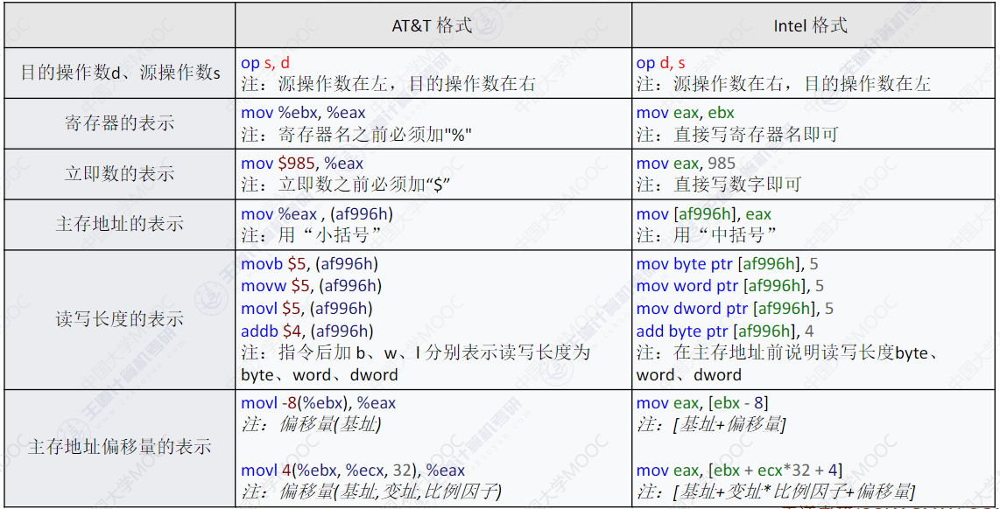

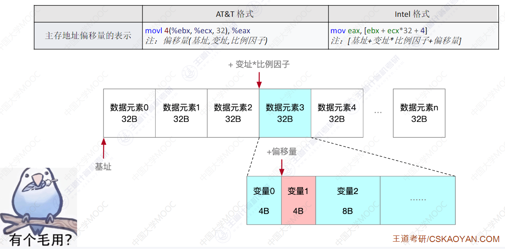

选择语句的机器级表示

无条件转移指令jmp<地址>

常数

寄存器

主存

用"标号"锚定

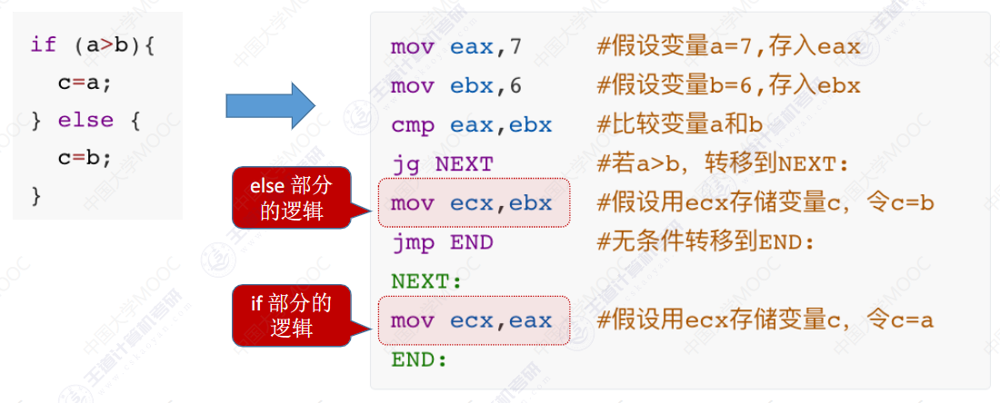

循环语句的机器级表示

条件转移指令

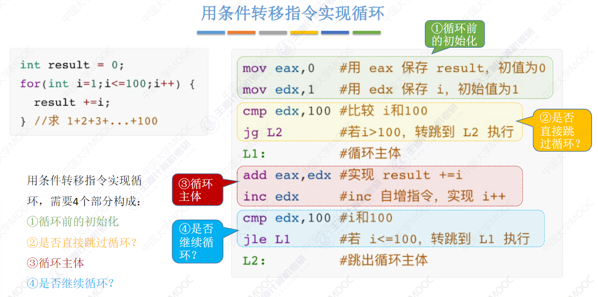

loop指令

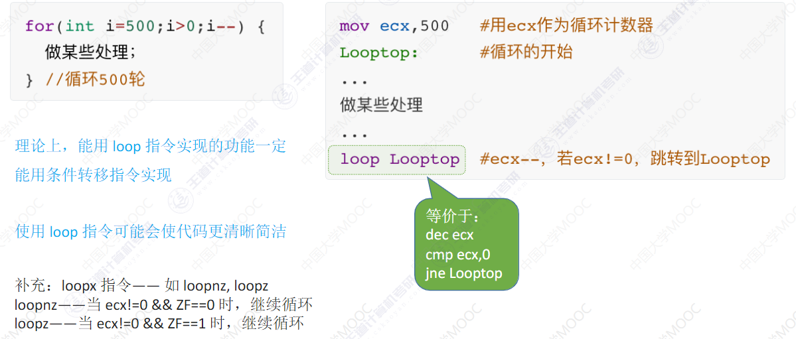

函数调用的机器级表示

函数调用指令call <函数名>

1.将IP旧值压栈保存

2.设置IP新值，无条件转移至被调用函数的第一条指令

函数返回指令ret

从函数的栈帧顶部找到IP旧值，将其出栈并恢复IP寄存器

函数调用栈在内存中的位置

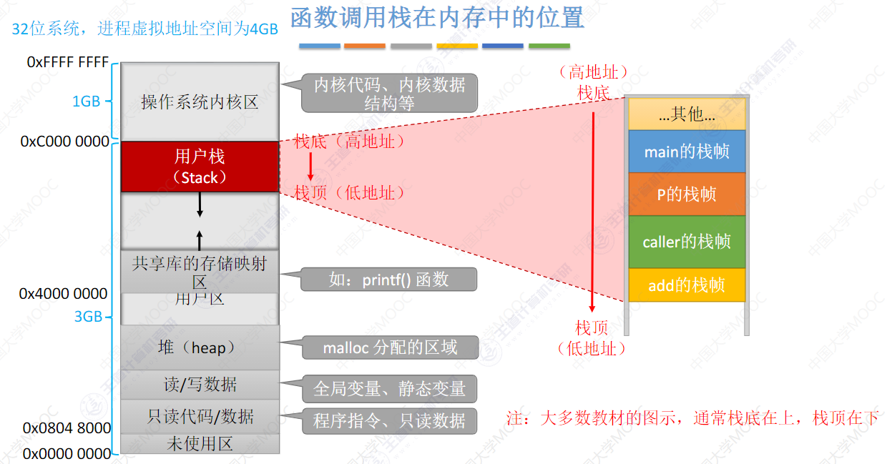

栈底（高地址）

栈顶（低地址）

访问栈帧数据

push、pop指令

push

先让esp-4,再让数据压入

pop

栈顶元素出栈，再让esp+4

mov指令

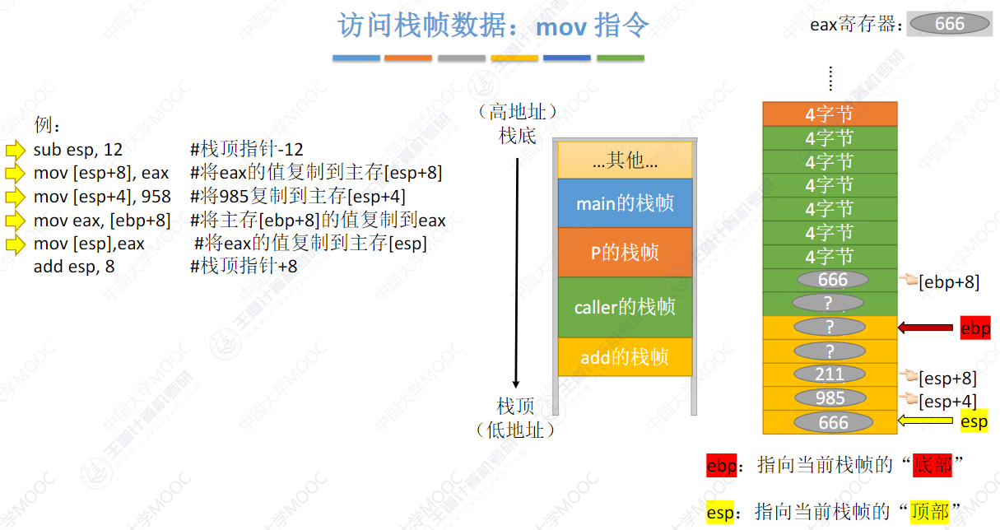

4.4 CISC和RISC

CISC：Complex Instruction Set Computer

复杂、庞大

指令数目：>200

指令字长：不固定

可访存指令：不加限制

微程序控制

RISC：Reduced Instruction Set Computer

简单、精简

指令数目：>100

指令字长：定长

可访存指令：Load/Store指令

组合逻辑控制

计算机的工作过程

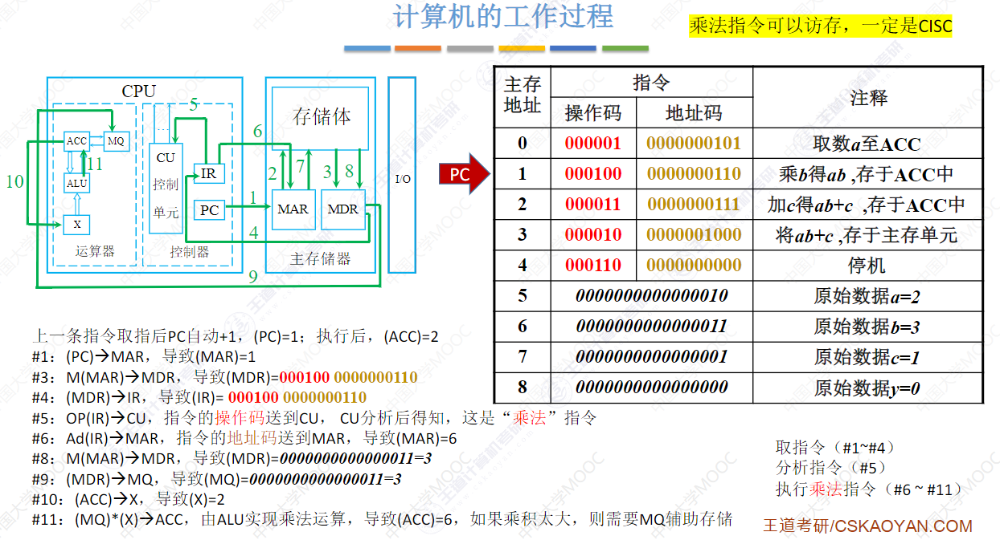

