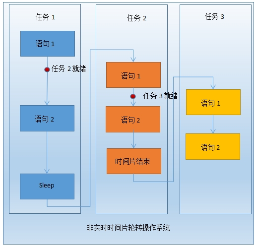
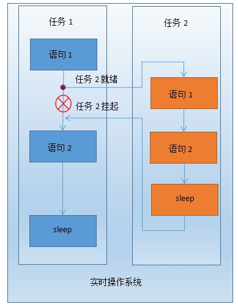

要求理解的内容包括：批处理、分时和实时系统的概念，操作系统结构设计及演化，操作系统发展趋势。

### 批处理、分时和实时系统的概念

    1. 批处理

        在批处理系统中，用户所提交的作业都先存放在外存上并排成一个队列，称为“后备队列”。然后，由作业调度程序按一定的算法从后备队列中选择若干个作业调入内存，使它们共享CPU和系统中的各种资源。

        特点：

        - 多道：在内存中同时存放多个作业，一个时刻只有一个作业运行，这些作业共享CPU和外部设备等资源。

        - 成批：用户和作业之间没有交互性。用户自己不能干预自己的作业的运行，发现作业错误不能及时改正。
批处理系统的目的是提高系统吞吐量和资源的利用率

        （系统吞吐量是指系统在单位时间内所完成的总工作量。能提高系统吞吐量的主要原因是仅当作业完成时或运行不下去时才进行切换，系统开销小）。

    1. 分时

        分时系统一般采用时间片轮转的方式，使每一台计算机为多个终端用户服务。分时系统与多道批处理系统之间有着截然不同的性能差别，它能很好地将一台计算机提供给多个用户同时使用，提高计算机的利用率。

        分时系统是指，在一台主机上连接了多个带有显示器和键盘的终端，同时允许多个用户通过自己的终端，以交互方式使用计算机，共享主机中的资源。（一个系统可以同时为两个或两个以上的账户服务）。

        特点：

        - 同时性：计算机系统能被多个用户同时使用；

        - 独立性：用户和用户之间都是独立操作系统的，在同时操作时并不会发生冲突，破坏，混淆等现象；

        - 及时性：系统能以最快的速度将结果显示给用户；

        - 交互作用性：用户能和电脑进行人机对话。

        

    1. 实时

        所谓“实时”，是表示“及时”，而实时系统是指系统能及时响应外部事件的请求，在规定的时间内完成对该事件的处理，并控制所有实时任务协调一致的运行。其应用需求主要在实时控制和实时信息处理。

        特点：

        - 高精度计时系统：计时精度是影响实时性的一个重要因素。在实时应用系统中，经常需要精确确定实时地操作某个设备或执行某个任务，或精确的计算一个时间函数。这些不仅依赖于一些硬件提供的时钟精度，也依赖于实时操作系统实现的高精度计时功能。

        - 多级中断机制：一个实时应用系统通常需要处理多种外部信息或事件，但处理的紧迫程度有轻重缓急之分。有的必须立即作出反应，有的则可以延后处理。因此，需要建立多级中断嵌套处理机制，以确保对紧迫程度较高的实时事件进行及时响应和处理。

        - 实时调度机制：实时操作系统不仅要及时响应实时事件中断，同时也要及时调度运行实时任务。但是，处理机调度并不能随心所欲的进行，因为涉及到两个进程之间的切换，只能在确保“安全切换”的时间点上进行

        实时调度机制包括两个方面，一是在调度策略和算法上保证优先调度实时任务；二是建立更多“安全切换”时间点，保证及时调度实时任务。

        

