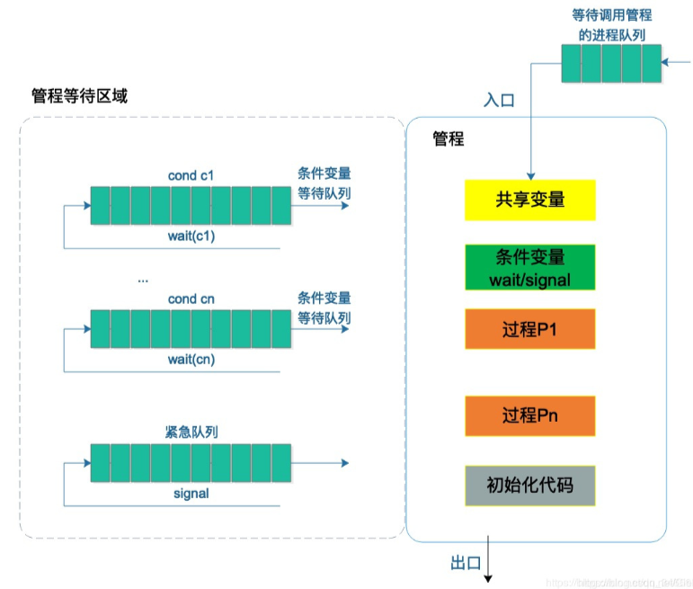
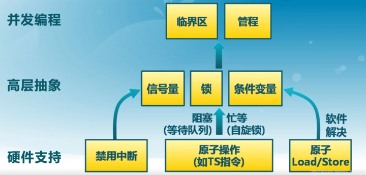

（1）要求理解的内容包括：进程同步基本准则，进程同步软硬件解决方案，整型信号量、记录型信号量、管程，经典同步问题，进程通信机制，线程同步机制，死锁及处理方法；
（2）要求掌握的内容包括：利用记录型信号量解决同步问题，利用银行家算法给出避免死锁的资源分配方案，死锁检测算法及应用。

### 3.1 进程同步基本准则

    1. **空闲让进**：当无进程处于临界区时，表明临界资源处于空闲状态，应允许一个请求进入临界区的进程立即进入自己的临界区，以有效地利用临界资源。

    2. **忙则等待**：当已有进程进入临界区时，表明临界资源正在被访问，因而其他试图进入临界区的进程必须等待，以保证对临界资源的互斥访问。

    3. **有限等待**：对要求访问临界资源的进程，应保证在有限时间内能进入自己的临界区，以免陷入“死等”状态。

    4. **让权等待**：当进程**不能进入自己的临界区**时，应**立即释放处理机**，以免进程陷入“忙等”状态。

    **【2011】名词解释：临界区**
每个进程中访问临界资源的那段代码称为临界区。
临界资源是一次仅允许一个进程使用的共享资源。各进程采取互斥的方式，实现共享的资源称作临界资源。属于临界资源的硬件有，打印机，磁带机等；软件有消息队列，变量，数组，缓冲区等。诸进程间采取互斥方式，实现对这种资源的共享。

    **【2014】正确实现同步原语的四个基本准则是什么？当记录型的信号量的Wait和Signal操作不用原语实现时这四个准则哪些无法正确实现？结合下面并发进程P1、P2的代码给出具体的说明。
信号量：mutex=1;
P1：Wait(mutex)；M=M+1；Signal(mutex);
P2：Wait(mutex)；M=M-1；Signal(mutex);**
（1）四个基本准则：空闲让进、忙则等待、有限等待、让权等待。
（2）不使用原语时，不能实现空闲让进、忙则等待。
（3）wait操作同时修改mutex变量，从而由于执行前mutex都是1，而不会阻塞，所以会直接执行临界区代码，这样M的最终结果会不同，产生错误。

    **【2018】进程同步机制应遵循空闲让进、忙则等待、有限等待、让权等待等准则。整型信号量的wait操作可以描述为：
wait(S):
    while S≤0;
        do no-op;
    S=S-1：
请问整型信号量有无违反以上准则？为什么？在单处理机系统中使用整型信号量有无问题？为什么？**
在wait操作中，只要信号量S≤0，就会不断测试。因此该机制并未遵循“让权等待”的准则，而是使进程处于“忙等”的状态。因此，在单处理机系统中一般不适用整形信号量，因为一旦进程无法申请到资源，进程就会花费大量的时间进行等待，这将使系统效率大大降低。
一般来说，使用记录型信号量能避免“忙等”现象。该机制除了需要一个用于代表资源数目的整形变量value以外，再加一个进程链表L，用于链接所有等待该资源的进程。

### 3.2 进程同步软硬件解决方案

    硬件同步机制

    1. 关中断

    2. 利用Test-and-Set指令实现互斥

    3. 利用Swap指令实现进程互斥 

### 3.3 整型信号量、记录型信号量

    

    

    ```C
    wait(S){
      while(S<=0); /*do no-op*/
      S--;
    }
    
    Signal(S){
      S++;
    }
    
    
    ```

    

    ```C
    typedef struct{
      int value;
      struct process_control_block *list;
    }semaphore;
    /*申请资源*/
    wait(semaphore *S){
      S->value--;
      if(S->value<0) block(S->list);
    }
    /*归还资源*/
    signal(semaphore *S){
      S->value++;
      if(S->value<=0) wakeup(S->list);
    }
    
    ```

    

    

    `这里需要注意**记录型信号量S的整形分量value的值**的物理含义，表示该类资源可用的数目，也可以说是执行P操作而不会被阻塞的进程的数目，一般为<=1，`

    `因为这里是进程互斥(但是也可以大于1),等于1时，表示该资源可用，等于0时，表示该资源正在被使用，而且没有进程被阻塞，`

    `但是当数值小于0时，其绝对值表示信号量S的阻塞队列中的进程数。`

    `L表示进程的阻塞队列。`

    **【2012】如果用于进程同步的信号量P、V操作不用原语实现，会产生什么后果？举例说明**
如下所示，R是寄存器，counter为共享变量而且初始值为1。如果不用原语实现，会有0，1，2三种结果。即没有实现互斥，结果具有不可再现性。

    

    

    ```Plain Text
    R=counter
    R=R+1;
    counter=R
    ```

    

    ```Plain Text
    R=counter
    R=R+1;
    counter=R
    ```

    **【2014】给出记录型信号量数据结构定义以及Wait和Signal操作的伪代码，并简要说明记录型信号量的物理意义**
（1）数据结构定义
（2）伪代码
（3）物理意义
Wait：如果记录值<0，表示目前得不到请求的资源，则放入阻塞队列中。
Signal：对记录值加1，表示释放占有的资源，如果释放资源后，资源计数仍小于等于0，说明有任务在因该资源而阻塞，现在是时候唤醒他们了，对阻塞的进程进行唤醒。

    ```Plain Text
    typedef struct{
    int value;
    struct process *L;
    }semaphore
    ```

### 3.4 管程

    > 在信号量机制中，每个要访问临界资源的进程都必须自备同步的PV操作，大量分散的同步操作会给系统管理带来麻烦，且容易因为同步操作不当而导致系统死锁。于是便产生了一种新的进程同步工具——**管程（Monitors）**。

    - **管程**：代表共享资源的**数据结构以**及由该共享数据结构**实施操作**的一组过程所组成的**资源管理程序**共同构成了一个操作系统的**资源管理模块**，称之为管程。**管程中每次只允许一个进程进入管程。**

    - 管程由四部分组成：

        1. 管程的名称

        2. 局部于管程的共享数据结构说明

        3. 对该数据结构进行操作的一组过程

        4. 对局部于管程的共享数据设置初始值的语句

    - 管程实现方式：

        管程中包含**条件变量**，用于管理进程的阻塞和唤醒。其形式为 condition x；对它的操作仅有wait和signal。

        　　**x.wait**：正在调用管程的进程因 x 条件需要被阻塞或挂起，则调用 x.wait 将自己插入到 x 条件的等待队列上，并释放管程，直到 x 条件变化。此时其它进程可以使用该管程。

        　　**x.signal**：正在调用管程的进程发现 x 条件发生了变化，则调用 x.signal，重新启动一个因 x 条件而阻塞或挂起的进程。（与信号量的signal不同，没有s:=s+1的操作）

        > 管程是一种更为现代的实现**互斥访问**的方法。与临界区相比，管程有更好的封装，如果设计得当，则处理各种问题时，使用将极为便捷。

    
管程的示意图

    
管程和PV

### 3.5 经典同步问题

    ### 3.5.1 生产者-消费者问题

        

    ### 3.5.2 哲学家进餐问题

        1. 限制人数

        2. 奇数号先拿左手，偶数号先拿右手

        3. 限制每次只能一个人进行拿筷子操作

        4. 多个碗的问题

    ### 3.5.3 读者-写者问题

        1. **读者优先**

            

            

            ```Objective-C
            semaphore rmutex=1;
            semaphore mutex=1;
            int rcount=0;
            Reader(){
              while(1){
                wait(rmutex);
                if(rcount==0) wait(mutex);
                rcount++;
                signal(rmutex);
                /*读取内容*/
                wait(rmutex);
                rcount--;
                if(rcount==0) signal(mutex);
                signal(rmutex);
              }
            }
                
            ```

            

            ```Objective-C
            Writer(){
              while(1){
                wait(mutex);
                /*写内容*/
                signal(mutex);
              }
            }
            ```

        1. **读写公平**

            

            

            ```Objective-C
            semaphore rmutex=1;
            semaphore mutex=1;
            semaphore lock=1;
            int rcount=0;
            Reader(){
              while(1){
                wait(lock);
                wait(rmutex);
                if(rcount==0) wait(mutex);
                rcount++;
                signal(rmutex);
                signal(lock);
                /*读取内容*/
                wait(rmutex);
                rcount--;
                if(rcount==0) signal(mutex);
                signal(rmutex);
              }
            }
                
            ```

            

            ```Objective-C
            Writer(){
              while(1){
                wait(lock);
                wait(mutex);
                /*写内容*/
                signal(mutex);
                signal(lock);
              }
            }
            ```

        1. **写者优先**

            

            

            ```Objective-C
            semaphore rmutex=1;
            semaphore wmutex=1;
            semaphore rlock=1;
            semaphore wlock=1;
            int rcount=0,wcount=0;
            Reader(){
              while(1){
                wait(rlock);
                wait(rmutex);
                if(rcount==0) wait(wlock);
                rcount++;
                signal(rmutex);
                signal(rlock);
                /*读取内容*/
                wait(rmutex);
                rcount--;
                if(rcount==0) signal(wmutex);
                signal(rmutex);
              }
            }
                
            ```

            

            ```Objective-C
            Writer(){
              while(1){
                wait(wmutex);
                if(wcount==0) wait(rlock);
                rcount++;
                signal(wmutex);
                wait(wlock);
                /*写内容*/
                signal(wlock);
                wait(wmutex);
                count--;
                if(count==0) siganl(rlock);
                signal(wmutex);
              }
            }
            ```

### 3.6 进程通信机制

    进程通信

        类型

            共享存储器系统

                基于共享数据结构

                基于共享存储区

            管道通信系统

                互斥

                同步

                确定对方是否存在

            消息传递系统

                直接通信方式（原语）

                间接通信方式（邮箱）

            客户机-服务机系统

                套接字socket

                    基于文件型

                    基于网络型

                远程过程调用和远程方法调用

        实现方式

            直接消息传递系统

                直接通信原语

                    对称寻址方式

                        send(receiver,message)

                        receive(sender,message)

                    非对称寻址方式

                        send(P,message)

                        receive(id,message)

            信箱通信

                结构

                    信箱头

                        信箱标识符

                        信箱的拥有者

                        信箱口令

                        信箱的空格数

                    信箱体

                        由若干个可以存放消息的信箱格组成

                信箱通信原语

                    邮箱的创建与撤销

                    消息的发送与接收

                        Send(mailbox,message)

                        Receive(mailbox,message)

                类型

                    私用信箱

                        用户创建

                    公用信箱

                        操作系统创建

                    共享信箱

                        进程创建

### 3.7 线程同步机制

    > 在多线程并发场景下指令执行的先后顺序由内核决定，同一个线程内部指令按照先后顺序执行，但不同线程之间的指 令执行先后顺序是不一定的。

        如果执行结果依赖于不同线程执行的先后顺序，那么就会形成**“竞争条件”**，由于竞争条件下计算结果是非预期的，因此我们应该尽量避免竞争条件的形成。最常解决竞争条件的方式是**原子操作**，其次便是**线程同步**。

    1. 线程同步概念
线程同步的概念和其他“同步”不太一致：

        - 设备同步：在不同的设备之间规定一个共同的参考时间

        - 数据库/文件同步：在不同的数据库之间保持数据一致

        线程同步指的是线程之间“协同”，即线程之间按照规定的先后次序运行。

    1. 线程同步方式

        线程同步主要包括四种方式：

        - 互斥量`pthread_mutex_`

        - 读写锁`pthread_rwlock_`

        - 条件变量`pthread_cond_`

### 3.8 死锁及处理办法

    **【2011】名词解释：死锁**
“死锁”是指两个或两个以上的线程在执行过程中，由于竞争资源或者由于彼此通信而造成的一种阻塞现象，若无外力作用，他们都将无法推进下去。此时称系统处于死锁状态或系统产生了死锁，这些永远在相互等待的进程称为死锁进程。

    1. 起因：源于多个进程对资源的争夺，不仅对不可抢占资源进行争夺时会引起死锁，而且对可消耗资源进行争夺时，也会引起死锁

    2. 类别：

        - 竞争不可抢占资源引起死锁

        - 竞争可消耗资源引起死锁

        - 进程推进顺序不当引起死锁

    1. 定义
如果一组进程中的每个进程都在等待仅由该进程中的其他进程才能引发的事件，那么该组进程是死锁的(Deadlock)。

    2. 必要条件

        **【2014】产生死锁的必要条件是什么？解决死锁问题的办法有哪些？**

        **【2017】有三个进程P1,P2,P3并发工作。进程P1需要资源S3和S1；进程P2需要资源S1和S2；进程P3需要资源S2和S3。请回答如下问题：
（1）若对资源的分配不加限制，可能发生什么情况？为什么？
（2）为保证进程正确地工作，应采用怎样的资源分配策略？为什么？**
（1）可能会发生死锁。满足死锁的四大条件，例：P1占有S1申S3，P2占有S2申请S1，P3占有S3申请S2。
（2）采用静态分配：由于执行前已获得所需的全部资源，故不会出现占有资源等待别的资源的现象（或者不会出现循环等待资源的现象）；
采用按序分配：不会出现循环等待资源的现象；
采用银行家算法：因为分配时，保证了系统处于安全状态。

        - **互斥条件：**在一段时间内，某资源只能被一个进程占用。

        - **请求和保持条件：**进程已经保持了至少一个资源，但又提出了新的资源请求，而该资源已被其他进程占有，此时请求进程被阻塞，但对自己已获得的资源保持不放。

        - **不可抢占条件：**进程已获得的资源在未使用完之前不能被抢占，只能在进程用完时自己释放。

        - **循环等待条件：**发生死锁时，必然存在一个进程-资源的循环链。

    1. 处理死锁的方法（防范程度逐渐减弱）

        > 死锁定理：S为死锁的充分条件是，当且仅当S状态的资源分配图是不可完全简化的。

        
|**方法**|**详情**|**过程**|**主要优点**|**主要缺点**|
|-|-|-|-|-|
|预防死锁|破坏“请求和保持”条件|1.一次性申请完整个运行过程中所需的全部资源
2.获得运行初期所需资源，运行过程中逐渐释放已分配给自己的、且已用毕的全部资源|适用于突发式处理的进程；不必进行剥夺；适用于状态可以保存和恢复的资源；可以在编译时就进行检查|效率低；进程初始化时间延长；剥夺次数过多；多次对资源重新启动后；不便灵活申请资源|
||破坏“不可抢占”条件|已经保持了一些资源的进程，提出新的请求不能满足时，必须释放已经保持的资源|||
||破坏“循环等待”条件|对系统所有资源类型进行线性排序并赋予不同的序号|||
|避免死锁|在资源动态分配过程中，防止系统进入不安全状态|安全状态，指系统能够按某种进程推进顺序（P1,P2,P3...Pn)为每个进程Pi分配其所需资源，直至满足每个进程对资源的最大需求，使每个进程都可以顺利地完成|不必进行剥夺|必须知道将来的资源需求；进程可能会长时间阻塞|
|检测死锁|检测系统状态，以确定系统中是否发生了死锁。允许死锁发生，但是使用死锁检测算法（资源分配图）检测死锁，再使用死锁恢复算法（抢占、回滚、杀死进程）恢复死锁。|1.保存有关资源的请求和分配信息
2.提供一种算法，检测系统是否进入死锁状态（银行家算法）|不延长进程初始化时间；允许对死锁进行现场处理|通过剥夺解除死锁，造成损失|
|解除死锁|当认定系统中已发生了死锁，利用该算法可将系统从死锁状态中解除|1.抢占资源：从一个或多个进程中抢占足够数量的资源，分配给死锁进程，以解除死锁状态。
2.终止（或撤销）进程：终止或撤销系统中的一个或多个死锁进程，直至打破循环环路，使系统从死锁状态解脱出来。|||

    1. 一类常见问题：

        查看每个进程（假设有m个进程）所需要的最大资源数（分别为$N_1$,$N_2$,...,$N_m$），则死锁状态下系统可能已经分配最多的资源满足公式：

        $死锁时系统已分配的最大资源数=\sum_{i=1}^{m} (N_i-1)$

        **在$N_i$相等的条件下**，要解除死锁，只需要额外申请一个资源即可，此时任何一个进程获得该资源即可运行，其他进程在该资源释放后可先后运行完毕。

        **若$N_i$不相等**，比如三个进程所需要的A类资源数分别为2，5，9，则系统分配给P1共1个，P2共4个，P3共8个，此时系统仍然死锁，若系统再有一个额外的资源，该资源分配给了P3，则三个进程都可以执行完毕。

## 3.9 利用记录型信号量解决同步问题

    [pv操作.pdf](第三章+同步通信及死锁管理+16f48a92-0170-4391-a0d6-edb4e6158fc3/pv操作.pdf)

## 3.10 利用银行家算法避免死锁

    1. 数据结构

        |**名称**|**含义**|**解释**|
|-|-|-|
|Available|可利用资源向量|Available[j]=K，系统中尚有Rj类资源K个|
|Max|最大需求矩阵|Max[i,j]=K，进程i需要Rj类资源K个|
|Allocation|分配矩阵|Allocation[i,j]=K，进程i当前已分得Rj类资源K个|
|Need|需求矩阵|Need[i,j]=K，进程i还需要Rj类资源K个方能完成其任务|
|***存在等式：Need[i,j]=Max[i,j]-Allocation[i,j]***|||

    1. 银行家算法

        把操作系统看作银行家，操作系统管理的资源相当于银行家管理的资金，进程向操作系统请求分配资源相当于用户向银行家贷款。

        采用银行家算法，**系统处于不安全状态不一定发生死锁，死锁一定是不安全状态，而处在安全状态的系统一定不发生死锁**。

        设Requesti是进程Pi的请求向量，如果Requesti[j]=K，表示进程Pi需要K个Rj类型的资源。当Pi发出资源请求后，系统按下述步骤进行检查：

        `(1) 若 Requesti[j] ≤ Need[i,j]，转向(2)，否则认为出错（因为它所需的资源数目已超过它所宣布的最大值）。`

        `(2) 若 Requesti[j] ≤ Available[j]，转向(3)，否则须等待（表现为进程Pi受阻）。`

        `(3) 系统尝试把资源分配给进程Pi，并修改下面数据结构中的数值：`

        > `Available[j] = Available[j] – Requesti[j]`
`Allocation[i,j] = Allocation[i,j] + Requesti[j]`
`Need[i,j] = Need[i,j] –Requesti[j]`

        `(4) 试分配后，执行安全性算法，检查此次分配后系统是否处于安全状态。若安全，才正式分配；否则，此次试分配作废，进程Pi等待。`

        **【2018】一个系统是否可以处于既非死锁也不安全的状态？如果可以，请举例；如果不可以，请说明原因。**
可以。进入了不安全状态，仅说明当前情况下的资源分配出现不安全因素，而随着时间推移，资源的分配可能发生变化，原来占有临界资源的进程可能因为某些原因自己阻塞起来，并放弃已拥有的临界资源跑到阻塞队列后排队，这样原来请求这些临界资源的进程就有可能满足其需要而可以执行。从而系统在后续的执行过程中不会发生死锁。

