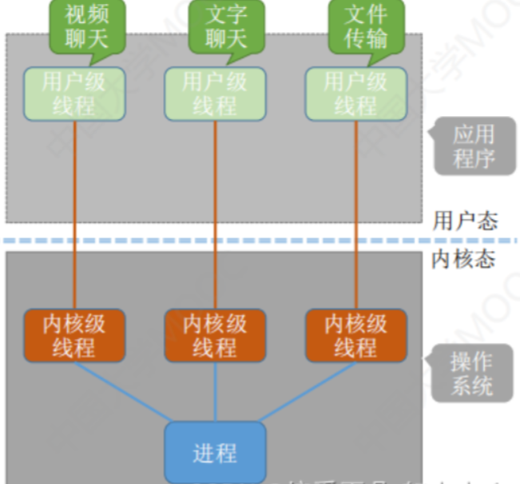
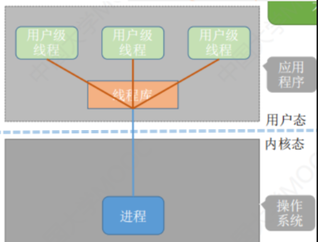
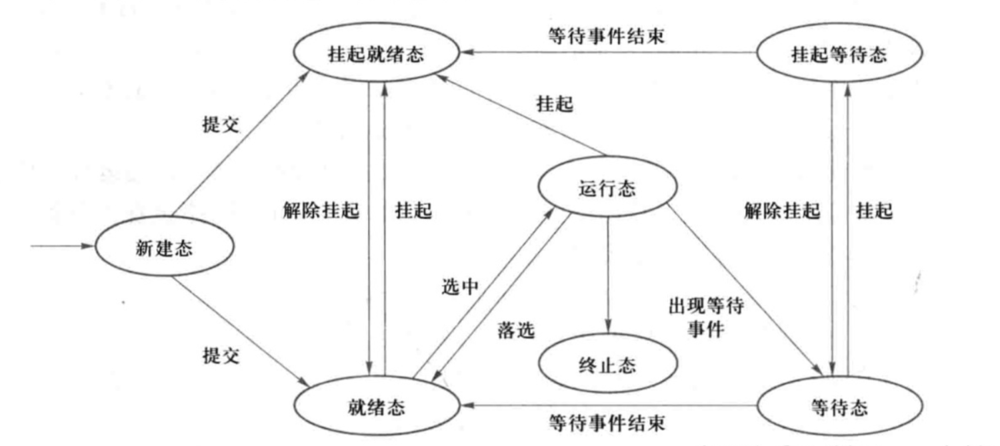

（1）要求理解的内容包括：多道程序设计技术，程序、进程、线程的区别与联系，线程实现方式，进程状态变迁，进程控制，处理机调度类型与模型，处理机调度实现机理，调度算法与评价准则；
（2）要求掌握的内容包括：处理机主要调度算法设计实现及应用。

### 2.1 多道程序设计技术

    **【2011】名词解释：多道程序设计技术**

    **【2015】什么是多道程序设计？其主要优点是什么？**
多道程序是指在计算机内存同时存放几道相互独立的程序，通过硬件的支持，使这些程序在操作系统的控制之下相互穿插运行，这就使得两个或两个以上的进程在计算机系统中同时处于运行状态。
优点：使得单CPU在宏观上并行运行程序，提高了CPU效率，提高了设备资源的利用率，增大了吞吐量。

    允许多个程序(作业)同时进入一个计算机系统内存并启动进行交替计算的方法，也就是，计算机中可以同时有多道程序，从宏观上来看它们是并行的，多道程序都同时处于运行过程中，但都未运行结束，但是微观上是串行的，轮流占用CPU交替执行，引入多道程序设计技术的根本目的是提高CPU的利用率，充分发挥计算机系统部件的并行性。

### 2.2 程序、进程、线程的区别与联系

    1. 程序：程序并发执行时具有间断性、失去封闭性、不可再现性。

    2. 进程（拥有资源的基本单位）：

        - 进程是具有一定独立功能的程序在一个数据集合的一次运行活动。

        - 由程序段、相关的数据段和PCB三部分构成。
PCB通常包含以下信息：

            - 进程标识符：每个进程都有唯一的标识符，以标识一个进程，可以用字符串或编号表示。

            - 说明信息：与进程调度有关的一些信息，包括进程所处的状态、进程优先权、进程等待时间或已执行时间、进程阻塞原因等。

            - 现场信息：主要由处理器的各个寄存器中的内容组成，包括通用寄存器内容、指令计数器的值、程序状态字内容以及用户栈指针。

            - 管理信息：是进程管理和控制所需要的相关信息，包括程序和数据在内存或外存的地址、进程同步和通信机制、资源清单、进程队列的链接指针。

        - 具有以下主要特性：

            - 并发性：可以与其他进程一道在宏观上同时向前推进。

            - 动态性：进程是执行中的程序。

            - 独立性：进程是调度的基本单位，可以获得处理机并参与并发执行。

            - 交往性：进程在运行过程中可能会与其他进程发生直接或间接的相互作用

            - 异步性：每个进程都以相对独立、不可预知的速度向前推进。

            - 结构性：每个进程都有一个控制块PCB。

        - 各进程不要求必须逐个申请资源

    1. 线程（调度的基本单位）：并发性、并不拥有资源、独立性、系统开销较小、支持多处理机

    ||**程序**|**进程**|
|-|-|-|
|**相同点**|程序是构成进程的组成成分之一，一个进程存在的目的就是执行其所对应的程序，如果没有程序，进程就失去了意义||
|**不同点**|①静态
②程序可以写在纸上或某一存储介质上长期保存。
③一个程序可以对应多个进程|①动态
②进程具有生存期，创建后存在，撤销后消亡。
③一个进程只能对应一个程序|

    | |**进程**|**线程**|
|-|-|-|
|**调度**|在传统的操作系统中，独立调度的基本单位是进程|而在引入线程的操作系统中，调度和分派的基本单位时线程|
|**并发性**|只能进程之间并发执行|不仅进程之间，而且一个进程之内的多个线程也可并发执行，有更好的并发性|
|**拥有资源**|进程是拥有资源的独立单位，可以拥有自己的资源|线程自己不拥有系统资源，但可以访问隶属进程的资源|
|**系统开销**|在创建、撤销、切换进程时，系统都要为之分配或回收资源，保存CPU现场|创建、撤销、切换线程的开销远小于进程的|

### 2.3 线程实现方式

    1. 内核支持线程

        内核线程建立和销毁都是**在内核的支持下**运行，由操作系统负责管理，通过系统调用完成的。
线程管理的所有工作由内核完成，应用程序没有进行线程管理的代码，只有一个到内核级线程的编程接口。内核为进程及其内部的每个线程维护上下文信息，调度也是在内核基于线程架构的基础上完成。

        

        > 1. 内核级线程的管理工作由操作系统内核完成。

            2.线程调度、切换等工作都由内核负责，因此 内核级线程的切换必然需要在核心态下才能完成。

            3.操作系统会为每个内核级线程建立相应的TCB（Thread Control Block，线程控制块），

            通过 TCB 对线程进行管理。 “内核级线程” 就是 “从操作系统内核视角看能看到的线程”

            4.优缺点

            优点：当一个线程被阻塞后，别的线程还可以继续执行，并发能力强。多线程可在多核处理机上并行执行。

            缺点：一个用户进程会占用多个内核级线程，线程切换由操作系统内核完成，需要切换到核心态，因此线程管理的成本高，开销大。

    1. 用户级线程
用户级线程仅存在于用户空间中，此类线程的创建、撤销、线程之间的同步与通信功能，都无法利用系统调用来实现。
 

        

        > 1.用户级线程由应用程序通过线程库实现,所有的线程管理工作都由应用程序负责

            2.用户级线程中，线程切换可以在用户态下即可完成,无需操作系统干预。

            3.在用户看来，是有多个线程。但是在操作系统内核看来，并意识不到线程的存在。"用户级线程"就是"从用户视角看能看到的线程"

            4.优缺点

            优点:用户级线程的切换在用户空间即可完成，不需要切换到核心态，线程管理的系统开销小，效率高

            缺点：当一个用户级线程被阻塞后，整个进程都会被阻塞，并发度不高。多个线程不可在多核处理机上并行运行。

    1. 组合方式

        [线程的组合方式实现](%E7%AC%AC%E4%BA%8C%E7%AB%A0+%E5%A4%84%E7%90%86%E6%9C%BA%E7%AE%A1%E7%90%86+29f7bd92-40d4-448b-9820-ee633afaeb3f/%E7%BA%BF%E7%A8%8B%E7%9A%84%E7%BB%84%E5%90%88%E6%96%B9%E5%BC%8F%E5%AE%9E%E7%8E%B0+77154101-65d8-4d15-9c7f-26161243f1aa.csv)

### 2.4 进程状态变迁

    > **三种基本状态：**
1.运行态：进程占用处理机资源。
2.就绪态：进程本身具备运行条件，但由于处理机的个数少于可运行进程的个数，暂未投入运行，即相当于等待处理机资源。
3.等待态：也称阻塞态。进程本身不具备运行条件，即使分配给它处理机也不能运行。进程等待某个时间的发生，如等待某一资源被释放，等待与该进程相关的I/O传输的完成信号等。

    **三种状态之间可以相互转换：**

    **【2013】三种状态之间的转换及相应的转换条件**

    **【2016】什么是进程？它的基本状态及其转换关系有哪些？相应状态转换的典型原因又是什么？**
进程是进程实体的运行过程，是系统进行资源分配和调度的一个独立单位。
有三种基本转化关系，分别是运行状态、就绪状态和阻塞状态。转换关系有：

    就绪→运行：一个就绪进程获得处理机时；

    运行→就绪：一个运行进程被剥夺处理机时（时间片用完、出现更高优先级的其他进程）；

    运行→等待：一个运行进程因某事件受阻时（所申请资源被占用、启动I/O传输未完成）；

    等待→就绪：所等待的事件发生时，得到申请资源、I/O传输完成。

    

    **进程的相关状态队列：**

    - 就绪队列：整个系统只有1个就绪队列；

    - 等待队列：每个等待事件有1个队列，当进程等待某一事件时，进入与该事件相关的等待队列中；

    - 运行队列：在单CPU系统中只有1个，在多CPU中每个CPU各有1个，每个队列只有1个进程。

### 2.5 进程控制

    |功能|引起事件|过程|
|-|-|-|
|进程的创建|1.用户登录
2.作业调度
3.提供服务
4.应用请求|1.申请空白PCB
2.为新进程分配所需资源
3.初始化PCB
4.如果进程就绪队列可以接纳新进程，则插入就绪队列|
|进程的终止|1.正常结束，进程任务已经完成
2.异常结束：越界错、保护错、非法指令、特权指令错、运行超时、等待超时、算数运算错、I/O故障
3.外界干预：
操作员或操作系统干预、
父进程请求、
父进程终止|1.检索被终止进程的PCB，读出状态
2.执行状态，立即终止执行
3.还有子孙，将其全部终止
4.资源归还父进程或系统
5.将被终止进程从所在队列或者链表中移出|
|进程的阻塞与唤醒|阻塞：
1.向系统请求共享资源失败
2.等待某种操作完成
3.新数据尚未到达
4.等待新任务到达
唤醒：
1.启动的I/O操作已完成
2.期待的数据已经到达|阻塞：
1.进程调用block原语将自己阻塞
2.立即停止执行，修改现行状态为阻塞
3.将PCB插入阻塞队列
4.转入调度程序重新调度，将处理机分配给另一就绪进程
唤醒：
1.把被阻塞的进程从等待该事件的阻塞队列中移出
2.将PCB的现行状态改为就绪
3.将该PCB插入就绪队列之中|
|进程的挂起与激活|挂起：
1.**终端用户的需要**：终端用户发现程序运行期间可疑问题
2.**父进程请求**：父进程希望挂起某个子进程
3.**负荷调节的需要**：负荷较重影响到实时任务的控制时
4.**操作系统的需要**：操作系统需要检查运行资源的情况并进行记账|挂起：suspend原语
1.检查被挂起进程的状态，若处于活动就绪态，则改为静止就绪
2.对于活动阻塞状态的进程，则将之改为静止阻塞
3.为了方便用户和父进程考查该进程的运行状况，而把该进程的PCB复制到某指定的内存区域
4.若被挂起的进程正在执行，则转向调度程序重新调度
激活：active原语
1.将进程从外存调入内存，检查该进程的现行状态，若是静止就绪，则改为活动就绪
2.若为静止阻塞，则改为活动阻塞
假如采用的是抢占调度策略，则每当有静止就绪进程被激活而插入就绪队列时，应检查是否需要重新调度。|

### 2.6 处理机调度类型与模型

    一般操作系统中必不可少的调度是进程调度。

    **1.高级调度**(High Level Scheduling)
长程调度或者作业调度，调度对象是作业
多道批处理系统
**2.低级调度**(Low Level Scheduling)
进程调度或短程调度，调度对象是进程(或内核级线程)
多道批处理、分时、实时

    进程处于临界区，正在执行访问临界资源的代码，仍然可能引起处理机调度。比如临界资源为我们常见的打印机等慢速设备。为了提高系统的性能，可进行处理机调度。
**3.中级调度**(Intermediate Scheduling)
内存调度
把暂时不能运行的进程调至外存等待

### 2.7 处理机调度实现机理

    调度的实质是一种资源的分配，处理机调度是对处理机资源进行分配。处理机调度算法是根据处理机分配策略所规定的处理机分配算法。

### 2.8 调度算法与评价准则

    - 周转时间=作业完成时刻-作业到达时刻；

    - 带权周转时间=周转时间/服务时间；

    - 平均周转时间=作业周转总时间/作业个数；

    - 平均带权周转时间=带权周转总时间/作业个数;

    [作业调度](%E7%AC%AC%E4%BA%8C%E7%AB%A0+%E5%A4%84%E7%90%86%E6%9C%BA%E7%AE%A1%E7%90%86+29f7bd92-40d4-448b-9820-ee633afaeb3f/%E4%BD%9C%E4%B8%9A%E8%B0%83%E5%BA%A6+3b1cacdb-5a0a-4de4-9ee2-d9853235602e.csv)

    作业的含义：在一个应用业务处理过程中，从输入开始到输出结束，用户要求计算机所做的有关该次业务处理的全部工作称为一个作业。

    [进程调度](%E7%AC%AC%E4%BA%8C%E7%AB%A0+%E5%A4%84%E7%90%86%E6%9C%BA%E7%AE%A1%E7%90%86+29f7bd92-40d4-448b-9820-ee633afaeb3f/%E8%BF%9B%E7%A8%8B%E8%B0%83%E5%BA%A6+e36979a0-e75d-412c-9119-d99bfd388939.csv)

    **【2016】请简要阐述时间片轮转调度算法的基本思想。操作系统教材指出，时间片的长度一般是在几毫秒到几百毫秒之间。请分析
（1）假设时间片的长度无限延长，这时的时间片轮转调度算法具有什么样的特点？
（2）假设时间片的长度无限缩短，这时的时间片轮转调度算法又具有什么样的特点？**
在时间片轮转调度算法，系统将所有就绪进程按到达时间的先后次序排成一个队列，进程调度程序总是选择就绪队列的第一个程序执行，即先来先服务的原则，但仅能运行一个时间片，如100ms，在使用完一个时间片后，即使进程为完成其运行，它也必须释放出处理机给下一个准备就绪进程的进程，而被剥夺的进程返回到就绪队列的末尾重新排队，等待再次运行。
（1）如果时间片足够大，以至于所有进程能一个时间片内执行完，则时间片轮转调度算法就退化为先来先服务调度算法。
（2）如果时间片很小，那么处理机在进程间过于频繁切换，使处理机开销增大，而真正用于运行进程的时间将减少。

    [实时调度](%E7%AC%AC%E4%BA%8C%E7%AB%A0+%E5%A4%84%E7%90%86%E6%9C%BA%E7%AE%A1%E7%90%86+29f7bd92-40d4-448b-9820-ee633afaeb3f/%E5%AE%9E%E6%97%B6%E8%B0%83%E5%BA%A6+7f8205cc-a132-4d51-a19a-6a44a4ef6b6d.csv)

    > **优先级倒置**
产生原因:
P1>P2>P3,且P1和P3共享着“临界资源”，
高优先级P1因为P3进程被阻塞了，又因为P2进程存在而延长了P1被阻塞的时间，而且被延长的时间是不可预知和无法限定的，这种现象非常有害
解决办法：
1.P3进入临界区之后，P3所占用的处理机就不允许被抢占
2.动态优先级继承：低优先级进程P3正在使用资源，此时，一方面P1被阻塞，另一方面由P3继承P1的优先级，并一直保持到P3退出临界区。

