（1）要求理解的内容包括：I/O 系统组成及 I/O 控制方式，设备管理目标、功能及层次结构，缓冲管理，设备分配及假脱机技术，设备驱动及中断处理，磁盘存储器管理方法与技术；
（2）要求掌握的内容包括：磁盘调度算法设计及应用，磁盘数据访问过程及时间开销。

### 5.1 I/O系统组成及I/O控制方式

    > **I/O设备**即输入/输出设备，是用于计算机系统与人通信或与其他机器通信的所有设备，以及所有外存设备。

        **I/O系统**不仅包括各种I/O设备，还包括与设备相连的设备控制器，有些系统还配备了专门用于输入/输出控制的专用计算机，即通道。此外，I/O系统要通过总线与CPU、内存相连

    #### 5.1.2 I/O软件的层次结构

        用户程序中的输入、输出操作实际上是**操作系统**完成的。

        - **用户层I/O软件**：实现与用户交互的接口，用户可直接调用该层所提供的、与I/O操作有关的库函数对设备进行操作

        - **设备独立性软件**：用于实现用户程序与设备驱动器的统一接口、设备命名、设备的保护以及设备的分配与释放等，同时为设备管理和数据传送提供必要的存储空间

            > ①向上层提供统一的调用接口（如read/write系统调用)
②设备的保护。
设备被看做是一种特殊的文件，不同用户对各个文件的访问权限是不一样的，同理，对设备的访问权限也不一样。
③差错处理
设备独立性软件需要对一些设备的错误进行处理
④设备的分配与回收
⑤数据缓冲区管理
可以通过缓冲技术屏蔽设备之间数据交换单位大小和传输速度的差异。
⑥建立逻辑设备名到物理设备名的映射关系;根据设备类型选择调用相应的驱动程序
用户或用户层软件发出I/O操作相关系统调用的系统调用时，需要指明此次要操作的I/O设备的逻辑设备名（eg:去学校打印店打印时，需要选择打印机1/打印机2/打印机3，其实这些都是逻辑设备名）
设备独立性软件需要通过“逻辑设备表（LUT，Logical UnitTable)”来确定逻辑设备对应的物理设备，并找到该设备对应的设备驱动程序

        - **设备驱动程序**：与硬件直接相关，用于具体实现系统对设备发出的操作指令，驱动I/O设备工作的驱动程序

        - **中断处理程序**：用于保护被中断进程的CPU环境，转入相应的中断处理程序进行处理，处理完毕之后再恢复被中断进程的现场后，返回到被中断的进程

        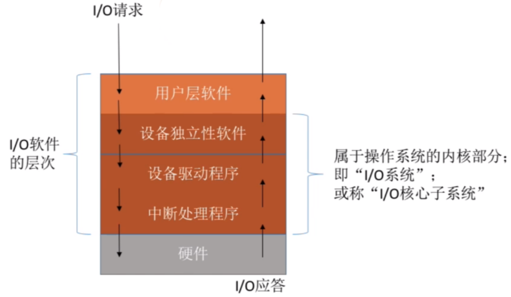

        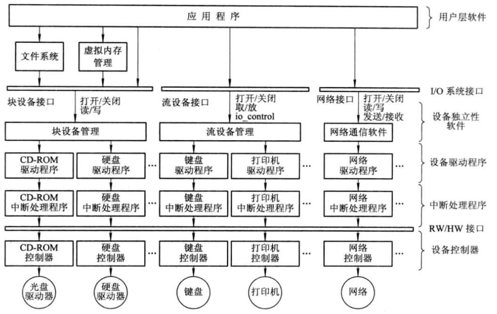
I/O系统中各种模块之间的层次视图

    #### 5.1.3 I/O控制方式

        **需要CPU干预由多到少依次为：程序I/O方式、中断驱动I/O控制方式、DMA方式和通道方式**

        **【2015】设备和存储器之间数据交换可以采用何种方式，处理器在其中起到何种作用？如何能够提高I/O效率？**
（1）①程序查询②程序中断③DMA④通道
（2）①②程序可以直接用处理器传输数据。
①在CPU中不断查询，并在设备准备好的时候传送数据；
②CPU在中断处理程序中传送数据；
③处理器负责DMA控制器的预处理和后处理，数据传输由DMA控制器完成；
④CPU仅仅启动和停止通道控制器，并向通道控制器发送传送传输指令，数据传输由通道控制器完成。
（3）可以通过增加额外的硬件机构（额外的I/O总线和额外的I/O控制器），并尽量使用方法③和④来提高I/O操作的效率。

        1. **程序I/O方式（循环等待方式）**

        2. **中断驱动方式（打印机）**

            中断装置的任务：

            - 检查是否有中断事件发生

            - 如有中断发生，保护好中断进程的断点及现场信息，

            - 启动操作系统的中断处理程序

        1. **DMA直接访问器存储方式（磁盘）Direct Memory Acess**

            **【2010】目前PC机上采用的外化存储设备的速度都相当快，例如刻录一张DVD光盘大概需要几分钟到十几分钟时间，与光盘相比，硬盘的速度更快，请问这样的高速设备采用的是什么样的I/O控制方式？**
DMA方式用于高速外部设备与内存之间批量数据的传输。它使用专门的DMA控制器，采用窃取总线程控制权的方式，由DMA控制器送出内存地址和发出内存读、设备写、或者设备读、内存写的控制信号，完成内存与设备之间的直接数据传送，而不用CPU干预。当本次DMA传送的数据全部完成时才产生中断，请求CPU进行结束处理。

            - 数据传输的基本单位是数据块，即在CPU与I/O设备之间，每次传送至少一个数据块。

            - 所传送的数据是从设备直接送入内存的，或者相反。

            - 仅在传送一个或多个数据块的开始和结束时，才需CPU干预，整块数据的传送是在控制器的控制下完成的，不需要CPU干预。

        1. **通道控制方式(直接传输）**
I/O通道是一种特殊的处理机，它具有执行I/O指令的能力，并通过执行通道（I/O）程序来控制I/O操作。但I/O通道又与一般的处理机不同，主要表现在以下两个方面：

            - 指令类型单一。通道硬件简单，所能执行的命令主要局限于与I/O操作有关的指令；

            - 通道没有自己的内存。通道所执行的通道程序是放在主机的内存中的，换言之，是通道与CPU共享内存。

            通道类型：

            - 字节多路通道：多台设备，依次服务

            - 数组选择通道：一台设备，独占通道

            - 数组多路通道：多台设备，批量服务

### 5.2 设备管理目标、功能及层次结构

    #### 5.2.1 I/O设备的类型

        |**分类标准**|**类型**|**特点**|**例**|
|-|-|-|-|
|**基于设备的工作特性**|外部存储设备|长期保存信息，可随时访问|磁盘、磁带|
||输入/输出设备|字符设备，以单个字符为单位存储、传输信息|显示器、键盘、打印机|
|**基于设备的分配特性**|独享设备|使用具有排它性|低速I/O设备|
||共享设备|可由多个用户程序交替使用|硬盘|
||虚拟设备|将独占设备模拟为共享设备，即将慢速的独占设备经软件设计技术改造为多个进程可以共享的设备|SPOOLing|
|**基于信息组织和处理的方式**|字符设备（速度慢，也称慢速设备）|信息是以字符为单位来组织和分配的|打印机、显示器、键盘|
||块设备（速度快，也称快速设备）|信息是以块为单位来组织分配的|磁盘、磁带等|

    #### 5.2.2 I/O设备管理的目标

        - 实现数据传输与交换；

        - 提高效率；

        - 提供接口；

        - 统一管理。

    #### 5.2.3 I/O设备管理的功能

        - 实现设备并行性和缓冲区的有效管理；

        - 提供与进程管理系统的接口；

        - 进行设备分配；

        - 监视设备状态。

    #### 5.2.4 I/O设备管理的层次结构

        

### 5.3 缓冲管理

    > 引入缓冲区的原因：

        - 缓和 CPU 与 I/O 设备间速度不匹配的矛盾

        - 减少对 CPU 的中断频率，放宽对 CPU 中断响应时间的限制

        - 解决数据粒度不匹配的问题

        - 提高 CPU 和 I/O 设备之间的并行性

    #### 5.3.1 单缓冲区和双缓冲区

        - 单缓冲区

            > 在单缓冲情况下，每当用户进程发出一 I/O 请求时，操作系统便在主存中为之分配一缓冲区

            在块设备输入时，假定从磁盘把一块数据输入到缓冲区的时间为 T，操作系统将该缓冲区中的数据传送到用户区的时间为 M，而 CPU 对这一块数据处理(计算)的时间为 C。由于 **T 和 C 是可以并行**的(如下图)，当 T>C 时，系统对每一块数据的处理时间为 M+T，反之则为 M+C，**故可把系统对每一块数据的处理时间表示为Max(C，T)+M**

            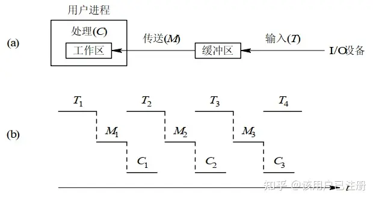
单缓冲工作示意图

        - 双缓冲区

            > 在设备输入时，先将数据送入第一缓冲区，装满后便转向第二缓冲区。此时操作系统可以从第一缓冲区中移出数据，并送入用户进程

            在双缓冲时，系统处理一块数据的时间可以粗略地认为是Max(C，T)。如果 C<T，可使块设备连续输入；如果 C>T，则可使 CPU 不必等待设备输入。对于字符设备，若采用行输入方式，则采用双缓冲通常能消除用户的等待时间，即用户在输入完第一行之后，在 CPU 执行第一行中的命令时，用户可继续向第二缓冲区输入下一行数据。可把系统对**每一块数据的处理时间表示为Max(M+C，T)**。

            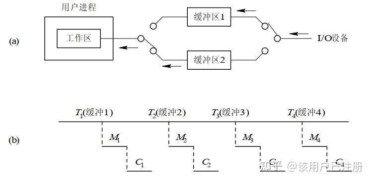
双缓冲工作示意图

            

    #### 5.3.2 环形缓冲区

        > 当输入与输出或生产者与消费者的速度基本相匹配时，采用双缓冲能获得较好的效果，可使生产者和消费者基本上能并行操作。但若两者的速度相差甚远，双缓冲的效果则不够理想，不过可以随着缓冲区数量的增加，使情况有所改善。因此，又引入了多缓冲机制。

        R：用于装输入数据的空缓冲区

        G：已装满数据的缓冲区

        C：计算进程正在使用的现行工作缓冲区

        Nextg：指示计算进程下一个可用缓冲区G的指针

        Nexti：指示输入进程下次可用的空缓冲区R的指针

        Current：指示进程正在使用的缓冲区C的指针

        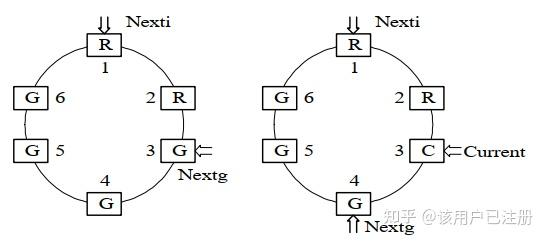

        - 当Nexti指针追上Nextg指针时，输入进程输入数据的速度大于计算进程处理数据的速度，已把全部可用的空缓冲区全部装满。输入进程应阻塞，直到计算进程把某个缓冲区的数据全部提取完。**系统受计算限制**

        - 当Nextg指针追上Nexti指针时，输入进程输入数据的速度低于计算进程处理数据的速度，使全部装有数据的缓冲区都被抽空。计算进程应阻塞，直至输入进程又装满某个缓冲区。**系统受I/O限制**

    #### 5.3.3 缓冲池

        > 区别：缓冲区仅仅是一组内存块的链表，而缓冲池包含了一个管理的数据结构及一组操作函数的管理机制，用于管理多个缓冲区。
缓冲池管理多个缓冲区
每个缓冲区由用于标识和管理的**缓冲首部**以及用于存放数据的**缓冲体**两部分组成

        缓冲池中相同类型的缓冲区链接成一个队列，可以形成**3个队列**：

        - emq空缓冲队列：空缓冲区组成。用于取出空缓冲区来进行读写等操作。

        - inq输入队列：装满输入数据的缓冲区组成。用来记录输入设备输入的数据，以便用户程序读取。

        - outq输出队列：装满输出数据的缓冲区组成。用来记录用户程序输出到设备(显示屏或是文件等)的数据，以便用户程序读取。

        除了上述三个队列以外，还有**4种工作缓冲区**：

        - 收容输入数据的缓冲区

        - 提取输入数据的缓冲区

        - 收容输出数据的缓冲区

        - 提取输出数据的缓冲区

        缓冲区的**工作方式**：

        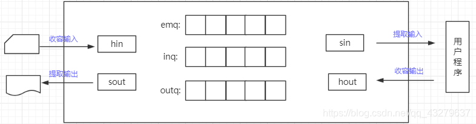
缓冲区的工作方式

        - 收容输入：把设备输入的数据放在缓冲区中。

        - 提取输入：把缓冲区的数据交给用户程序处理。

        - 收容输出：把用户程序处理完的数据放在缓冲区中。

        - 提取输出：
①先把要输出到设备的缓冲区中的数据放在sout工作缓冲区中。
②提取完sout的数据之后，把sout缓冲区放到空缓冲队列emq中。

### 5.4 设备分配及假脱机技术

    #### 设备分配中的数据结构

        数据结构有：设备控制表、控制器控制表、通道控制表和系统设备表等。

        1. 设备控制表（DCT）

            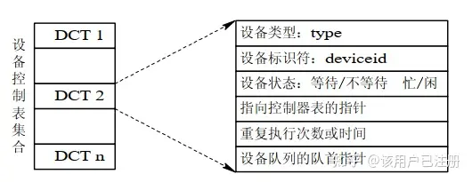

            - **设备队列队首指针**。凡因请求本设备而未得到满足的进程，其 PCB 都应按照一定的策略排成一个队列，称该队列为设备请求队列或简称设备队列。其队首指针指向队首PCB。在有的系统中还设置了队尾指针。

            - **设备状态**。当设备自身正处于使用状态时，应将设备的忙/闲标志置“1”。若与该设备相连接的控制器或通道正忙，也不能启动该设备，此时则应将设备的等待标志置“1”。

            - **与设备连接的控制器表指针**。该指针指向该设备所连接的控制器的控制表。在设备到主机之间具有多条通路的情况下，一个设备将与多个控制器相连接。此时，在 DCT 中还应设置多个控制器表指针。

            - **重复执行次数**。由于外部设备在传送数据时，较易发生数据传送错误，因而在许多系统中，如果发生传送错误，并不立即认为传送失败，而是令它重新传送，并由系统规定设备在工作中发生错误时应重复执行的次数。在重复执行时，若能恢复正常传送，则仍认为传送成功。仅当屡次失败，致使重复执行次数达到规定值而传送仍不成功时，才认为传送失败。

        1. 控制器控制表、通道控制表和系统设备表

            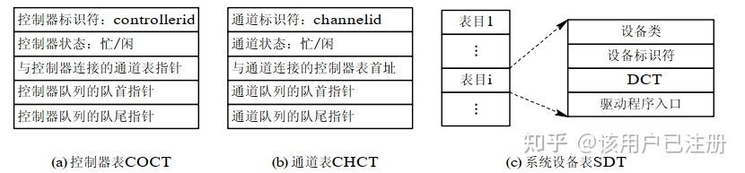

            - 控制器控制表(COCT)。系统为每一个控制器都设置了一张用于记录本控制器情况的控制器控制表

            - 通道控制表(CHCT)。每个通道都配有一张通道控制表

            - 系统设备表(SDT)。这是系统范围的数据结构，其中记录了系统中全部设备的情况。每个设备占一个表目，其中包括有设备类型、设备标识符、设备控制表及设备驱动程序的入口等项

    #### 设备分配时应考虑的因素

        1. 设备的固有属性

            - 独占设备

            - 共享设备

            - 虚拟设备

        1. 设备分配算法

            - 先来先服务

            - 优先级高者优先

        1. 设备分配中的安全性

            - 安全分配方式
在这种分配方式中，每当进程发出 I/O 请求后，便进入阻塞状态，直到其 I/O 操作完成时才被唤醒。
**优点**：摒弃了造成死锁的四个必要条件之一的“请求和保持”条件，从而使设备分配是安全的
**缺点**：进程进展缓慢，即 CPU 与 I/O 设备是串行工作的

            - 不安全分配方式
进程在发出 I/O 请求后仍继续运行，需要时又发出第二个 I/O 请求、第三个 I/O 请求等。仅当进程所请求的设备已被另一进程占用时，请求进程才进入阻塞状态。
**优点**：一个进程可同时操作多个设备，使进程推进迅速
**缺点**：分配不安全，因为它可能具备“请求和保持”条件，从而可能造成死锁

    #### 独占设备的分配程序

        独占设备分为3个步骤：分配设备、分配控制器、分配通道

        物理设备名→系统设备表SDT→设备控制表DCT→控制器控制表COCT→通道控制表CHCT

        存在问题：

        - 进程是以物理设备名来提出 I/O 请求的，如果设备分配给其他进程，则分配失败，即不具有**设备独立性**；

            **【2011】名词解释：设备独立性**
设备独立性即应用程序独立于具体的物理设备，在应用程序中使用逻辑设备名称来请求使用某类设备。系统在执行中，是使用物理设备名。
实现设备独立性必须由设备独立性软件完成，包括为所有设备的公有操作软件提供统一的接口，其中逻辑设备到物理设备的映射是由逻辑设备表LUT完成的

            **【2020】名词解释：设备独立性**

        - 采用的是单通路的 I/O 系统结构，容易产生**“瓶颈”现象**。

            由于通道价格昂贵，致使机器中设置的通道数量势必较少，造成整个系统的吞吐量下降。
假设设备1至4是4个磁盘，为了启动磁盘4，必须用通道1和控制器2，但若已被其他设备占用，必然无法启动磁盘4。

            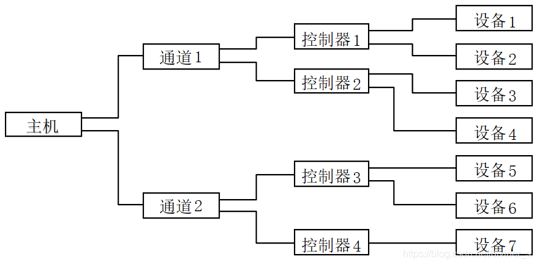
单通路I/O系统

        解决办法：

        - 应当使用逻辑设备名，但系统只识别物理设备名，需要配置一张**逻辑设备表（**LUT）
逻辑设备表每个表目中包含了3项：逻辑设备名，物理设备名、设备驱动程序的入口地址
采用两种方式设置逻辑设备表：
整个系统只设置一张LUT；
每个用户设置一张LUT。

        - 为了防止在 I/O 系统中出现“瓶颈”现象，通常都采用**多通路**的 I/O 系统结构。
此时对控制器和通道的分配同样要经过几次反复，即若设备(控制器)所连接的第一个控制器(通道)忙时，应查看其所连接的第二个控制器(通道)，仅当所有的控制器(通道)都忙时，此次的控制器(通道)分配才算失败，才把进程挂在控制器(通道)的等待队列上。而只要有一个控制器(通道)可用，系统便可将它分配给进程。

        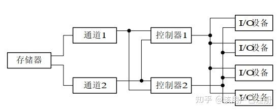
多通路I/O系统

    #### 假脱机系统（Spooling）

        > 虚拟性是 OS 的四大特征之一。如果说可以通过多道程序技术将一台物理CPU 虚拟为多台逻辑 CPU，从而允许多个用户共享一台主机，那么，通过 SPOOLing 技术便可**将一台物理 I/O 设备虚拟为多台逻辑 I/O 设备**，同样允许多个用户共享一台物理 I/O设备。

        1. 概念

            为了缓和 CPU 的高速性与 I/O 设备低速性间的矛盾而引入了脱机输入、脱机输出技术。

            该技术是利用**专门的外围控制机**，将低速 I/O 设备上的数据传送到高速磁盘上；或者相反。

            事实上，当系统中引入了多道程序技术后，

            - 完全可以利用其中的一道程序，来模拟脱机输入时的外围控制机功能，把低速 I/O 设备上的数据传送到高速磁盘上；

            - 再用另一道程序来模拟脱机输出时外围控制机的功能，把数据从磁盘传送到低速输出设备上。

            这样，便可在主机的直接控制下，实现脱机输入、输出功能。

            此时的**外围操作**与 **CPU 对数据的处理同时进行**，我们把这种在联机情况下实现的同时外围操作称为 SPOOLing(Simultaneaus PeriphernalOperating On Line)，或称为假脱机操作。

            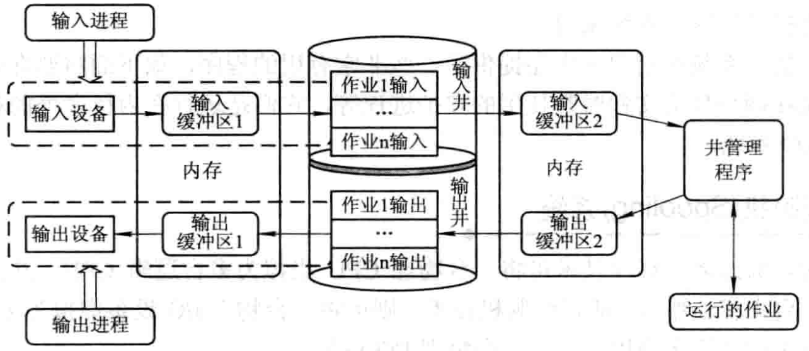
SPOOLing系统的工作原理

        1. 组成

            **【2020】名词解释：输入井**

            - 输入井和输出井。这是在磁盘上开辟的两个大存储空间。**输入井**是模拟脱机输入时的磁盘设备，用于暂存 I/O 设备输入的数据；**输出井**是模拟脱机输出时的磁盘，用于暂存用户程序的输出数据。

            - 输入缓冲区和输出缓冲区。为了缓和 CPU 和磁盘之间速度不匹配的矛盾，在内存中要开辟两个缓冲区：输入缓冲区和输出缓冲区。输入缓冲区用于暂存由输入设备送来的数据，以后再传送到输入井。输出缓冲区用于暂存从输出井送来的数据，以后再传送给输出设备。

            - 输入进程 SPi和输出进程 SPo。这里利用两个进程来模拟脱机 I/O 时的外围控制机。其中，进程 SPi模拟脱机输入时的外围控制机，将用户要求的数据从输入机通过输入缓冲区再送到输入井，当 CPU 需要输入数据时，直接从输入井读入内存；进程 SPo模拟脱机输出时的外围控制机，把用户要求输出的数据先从内存送到输出井，待输出设备空闲时，再将输出井中的数据经过输出缓冲区送到输出设备上。

            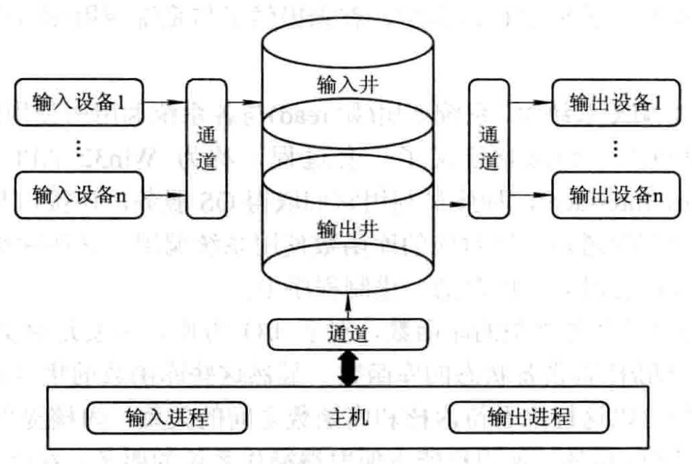
SPOOLing系统的组成

        1. 特点

            **【2009】为什么要引入SPOOLING系统，可带来哪些好处？**

            - 提高了 I/O 的速度。

            - 将独占设备改造为共享设备。实际上**并没为任何进程分配设备**，而只是在输入井或输出井中为进程分配一个存储区和建立一张 I/O 请求表。这样，便把独占设备改造为共享设备。

            - 实现了虚拟设备功能。宏观上，虽然是多个进程在同时使用一台独占设备，而对于每一个进程而言，他们都会认为自己是独占了一个设备。当然，该设备只是逻辑上的设备。SPOOLing 系统实现了**将独占设备变换为若干台对应的逻辑设备**的功能。

        1. 假脱机打印系统

            打印机是经常要用到的输出设备，属于独占设备。利用 SPOOLing 技术，可将之改造为一台可供多个用户共享的设备，从而提高设备的利用率，也方便了用户。

            **【2013】使用假脱机技术实现打印机共享的过程**

            **【2020】假脱机技术实现打印机共享方案（基本系统组成及打印请求处理过程）**

            共享打印机技术已被广泛地用于多用户系统和局域网络中。当用户进程请求打印输出时，SPOOLing 系统同意为它打印输出，但并不真正立即把打印机分配给该用户进程，而只为它做两件事：

            - 由输出进程在**磁盘缓冲区**中为之申请一个空闲磁盘块区，并将要打印的数据送入其中；

            - 输出进程再为用户进程申请一张**空白的用户请求打印表**，并将用户的打印要求填入其中，再将该表**挂到请求打印队列**上。如果还有进程要求打印输出，系统仍可接受该请求，也同样为该进程做上述两件事。

            真正的打印输出是由**假脱机打印进程**负责的，如果打印机空闲，输出进程将从请求打印队列的队首取出一张请求打印表，根据表中的要求将要打印的数据，从输出井传送到内存缓冲区，再由打印机进行打印。

            打印完后，输出进程再查看请求打印队列中是否还有等待打印的请求表。若有，又取出队列中的第一张表，并根据其中的要求进行打印，如此下去，直至请求打印队列为空，输出进程才将自己阻塞起来。仅当下次再有打印请求时，输出进程才被唤醒。

            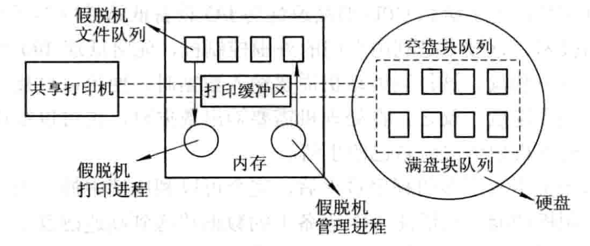
假脱机打印系统的组成

### 5.5 设备驱动及中断技术

    #### 设备驱动程序概述 

        **【2016】关于设备驱动程序：
（1）请简要阐明什么是设备驱动程序。
（2）设备驱动程序的编写在很多方面和普通应用程序的编写没什么不同，但在某些方面也有显著差异。
例如：
a.设备驱动程序比普通应用程序更难调试。
b.设备驱动程序如果有缺陷，则可能导致灾难性后果，甚至整个系统崩溃；而应用程序不会。
c.设备驱动程序只能使用极为有限的栈空间；而应用程序员几乎不会感受到栈空间的限制。
d.设备驱动程序不能使用某些运行时的库函数，如prinf等，而应用程序可以。
请简要说明设备驱动程序和普通的应用程序为什么会有这些不同。**
（1）设备驱动程序是I/O系统的高层与设备控制器之间的通信程序，其主要任务是接收上层软件发来的抽象I/O请求，再把它转为具体请求后发从给设备控制器，启动设备执行；或将设备控制器发来的信号传给上层软件。
（2）
a.设备驱动程序与硬件紧密相关，因此其中的一部分必须用汇编语言编写；
b.设备驱动程序工作在内核态，应用程序工作在用户态。
c.设备驱动程序的基本部分已经固化在ROM中。
d.设备驱动程序是实现在于设备无关的软件和设备控制器之间通信和转换的程序。

        1. 功能

            - 接收由与设备无关的软件发来的命令和参数，并将命令中的抽象要求转换为与设备相关的低层操作序列

            - 检查用户I/O请求的合法性，了解I/O设备的工作状态，传递I/O设备操作有关的参数，设置设备工作方式

            - 发出I/O命令，如果空闲，立即启动I/O设备；如果忙碌，则挂在设备队列上等待

            - 及时响应由设备控制器发来的中断请求，并根据其中断类型，调用相应的中断处理程序进行处理

            - 对于设置有通道的计算机系统，驱动程序还应能够根据用户的I/O请求，自动地构成通道程序

        1. 特点

            驱动程序主要是指在请求I/O的进程与设备控制器之间的一个通信和转换程序。

            - 它将进程的I/O请求经过转换后，传送给控制器；又把控制器中所记录的设备状态和I/O操作完成情况及时的反应给请求I/O的进程。

            - 驱动程序与设备控制器和I/O设备的硬件特性紧密相关，因而对不同类型的设备应配置不同的驱动程序。

            - 驱动程序与I/O设备所采用的I/O控制方式紧密相关。常用的I/O控制方式是中断驱动和DMA方式，这两种方式的驱动程序明显不同，后者是按数组方式启动设备及进行中断处理。

            - 由于驱动程序与硬件紧密相关，因而其中的一部分必须用汇编语言编写。目前有很多驱动程序的基本部分，已经固化在ROM中。

            - 驱动程序应允许可重入。一个正在运行的驱动程序常会在一次调用完成前被再次调用。例如，网络驱动程序正在处理一个到来的数据包时，另一个数据包可能已经到达。

            - 驱动程序不允许系统调用。但是为了满足其与内核其它部分的交互，可以允许对某些内核过程的调用。如通过调用内核过程来分配和释放内存页面作为缓冲区。

        1. 处理方式

            - 为每一类设备设置一个进程，专门用于执行这类设备的I/O操作。比如，为所有的交互式终端设置一个交互式终端进程；为同一类型的打印机设置一个打印进程。

            - 在整个系统中设置一个I/O进程，专门用于执行系统中所有各类设备的I/O操作。也可以设置一个输入进程和一个输出进程，分别处理系统中所有各类设备的输入和输出操作。

            - 不设置专门的设备处理进程，而只为各类设备设置相应的设备处理程序（模块），供用户进程或系统进程调用

        1. 处理过程

            设备驱动程序的**主要任务**是**启动指定设备**。但在启动之前，还必须完成必要的准备工作，如**检测设备状态**是否为“忙”等。在完成所有的准备工作后，才向设备控制器发送一条启动命令。以下是**设备驱动程序的处理过程**：

            - 将抽象要求转换为具体要求

            - 检查I/O请求的合法性

            - 读出和检查设备的状态

            - 传送必要的参数

            - 工作方式的设置

            - 启动I/O设备

    #### 对I/O设备的控制方式

        1. 使用轮询的可编程I/O控制方式

        2. 使用中断的可编程I/O控制方式

        3. 直接存储器访问方式（DMA)

            - 特点
数据传输的基本单位是数据块
所传送的数据是从设备直接送入内存的，或者相反
仅在传送一个或多个数据块的开始和结束时，才需CPU干预，整块数据的传送是在控制器的控制下完成的

            - DMA控制器的组成

                主机与DMA控制器的接口；DMA控制器与块设备的接口；I/O控制逻辑

                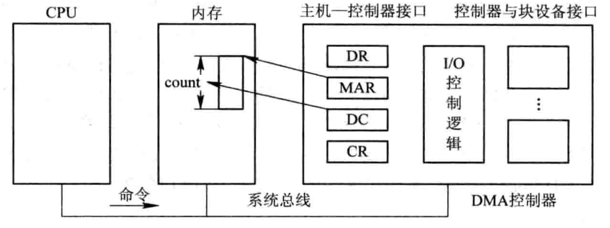
DMA控制器的组成

                主机与控制器之间的直接交换，需要设置4类寄存器：

                - 命令/状态寄存器CR：用于接收从CPU发来的I/O命令，或有关控制信息，或设备的状态

                - 内存地址寄存器MAR：在输入时，它存放把数据从设备传送到内存的起始目标地址；在输出时，它存放由内存到设备的内存源地址

                - 数据寄存器DR：用于暂存从设备到内存，或从内存到设备的数据

                - 数据计数器DC：存放本次CPU要读或写的字（节）数

        1. I/O通道控制方式

            > 虽然DMA方式比起中断方式来已经显著减少了CPU的干预，但当我们需要一次去读多个数据块且将他们分别传送到不同的内存区域或者相仿时，则须由CPU分别发出多条I/O指令及进行多次中断处理才能完成。
I/O通道方式是DMA方式的发展，可以进一步减少CPU的干预，即把对一个数据块的读（或写）为单位的干预，减少为对一组数据块的读（或写）及有关的控制和管理为单位的干预。同时，又可实现CPU、通道和I/O设备三者的并行操作，从而更有效地提高整个系统的资源利用率。

            **通道是通过执行通道程序并与设备控制器共同实现I/O设备的控制的，通道程序是由一系列通道指令（或称为通道命令）所构成的。**

            通道指令包含以下信息：

            - 操作码

            - 内存地址

            - 计数

            - 通道程序技术位P

            - 记录结束R：R=0，本条与下条指令所处理的数据属于同一个记录；R=1，处理某记录的最后一条指令

    #### 中断机构和中断处理程序

        1. 中断和陷入

            **中断**：中断是指CPU对I/O设备发来的中断信号的一种响应。CPU暂停正在执行的程序，保留CPU环境后，自动地转去执行该I/O设备的中断处理程序。执行完后，再回到断点，继续执行原来的程序。I/O设备可以是字符设备、块设备、通信设备等。由于中断是由外部设备引起的，故又称**外中断**。

            **陷入：**CPU内部事件引起的中断。例如进程在运算中发生了上溢或下溢，又如程序出错，如非法指令、地址越界，以及电源故障等。通常把这类中断称为内中断或者陷入。
相同点：
若系统发现了有陷入事件，CPU也将暂停正在执行的程序，转去执行该陷入事件的处理程序。

            不同点：

            信号的来源是来自CPU外部或者内部

        1. 中断向量表和中断优先级

            **中断向量表**

            - 为每种设备配以相应的中断处理程序，并把该程序的***入口地址***放在中断向量表的一个表项中。

            - 为每一个设备的中断请求规定一个***中断号***，它直接对应于中断向量表的一个表项。

            当I/O设备发出中断请求信号时，由中断控制器确定该请求的中断号，根据该设备的中断号去查找中断向量表，从中取得该设备中断处理程序的入口地址，就可以转入中断处理程序执行。
**中断优先级**
经常会有多个中断信号源，每个中断源对服务要求的紧急程度不同，分别设置不同的优先级。

        1. 对多中断源的处理方式

            - 屏蔽中断：当处理机正在处理一个中断时，将屏蔽掉所有中断。在该方法中，所有中断都按顺序处理，简单，但不能用于对实时性要求高的中断请求。

            - 嵌套中断：当同时有多个不同优先级的中断请求时，CPU优先响应最高优先级的中断请求。高优先级的中断请求可以抢占正在运行的低优先级中断的处理机。

        1. 中断处理程序

            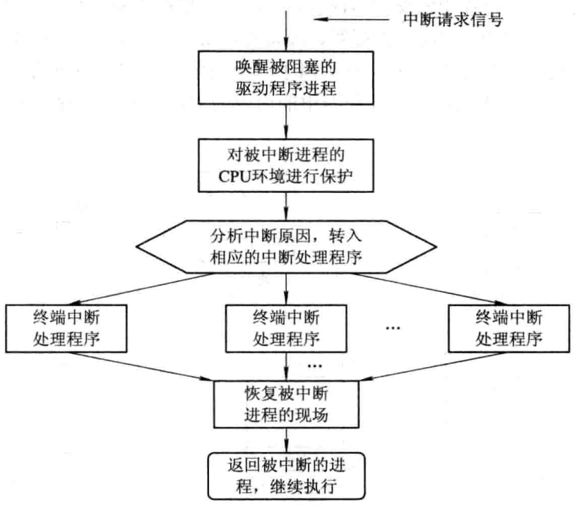
中断处理流程

        

### 5.6 磁盘存储器管理方法与技术

    > 改善磁盘系统的性能：

        - 选择好的磁盘调度算法，以减少寻道时间

        - 提高磁盘I/O速度，以提高对文件的访问速度

        - 采取冗余技术，提高磁盘系统的可靠性，建立高度可靠的文件系统

    【2012】磁盘长期使用后，读写磁盘中数据的速度就会变慢，而执行磁盘碎片整理程序后，速度就提高了，为什么？
①文件磁盘存储不连续。计算机系统经过一段时间的使用后，由于文件修改、删除、新建等混合在一起产生的积累效应，许多文件在磁盘上的存储变得不连续。导致读写磁盘中的数据的速度变慢。
②有效提高文件系统性能。整理磁盘碎片，可以有效提高文件系统的性能。
③磁盘是一个靠盘片的高速旋转进行读写的设备，当系统需要读写的数据连续存储在同一个磁道时，效率高；当数据的存储不连续时，由于寻道开销，效率会有较大下降。用户在读写文件时，经常是顺序进行的。另外，在随机存取的情况下，文件连续存储也有利于磁盘缓存系统工作。

    #### 磁盘性能简述

        1. 数据的组织和格式

            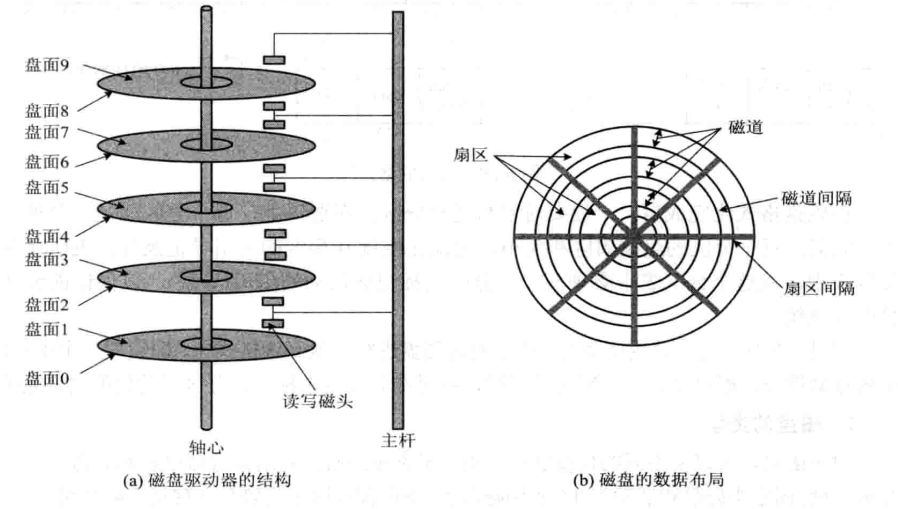
磁盘的结构和布局

        1. 磁盘的类型

            - 硬盘、软盘

            - 单片盘、多片盘

            - 固定头磁盘、活动头磁盘。
固定：每个磁道上都有一个读/写磁头，所有的磁头都被装在一刚性磁臂中。
移动：每个盘面仅配有一个磁头，也被装入磁臂中。为能访问该盘面上的所有磁道，该磁头必须能移动以进行寻道。

        1. 磁盘访问时间

            - 寻道时间T_s：把磁臂移动到指定磁道上所经历的时间。该时间是启动磁臂的时间s与磁头移动n条磁道所花费的时间之和

                $T_s=m\times n+s$

            - 旋转延迟时间T_t：指定扇区移动到磁头下面所经历的时间。

                $T_t=b/(r\times N)$

            - 传输时间：把数据从磁盘读出或向磁盘写入数据所经历的时间。

                $T_a=T_s+1/2r+b/rN$

    #### 早期的磁盘调度算法

        |**算法名称**|**英文名称**|**说明**|**优缺点**|
|-|-|-|-|
|先来先服务|FCFS|根据进程请求访问磁盘的先后次序进行调度||
|最短寻道时间优先|SSTF|要求其访问的磁道与当前磁头所在的磁道距离最近，以使每次寻道时间最短|可能导致优先级低的进程发生“饥饿”现象|

    #### 基于扫描的磁盘调度算法

        |算法名称|英文名称|说明|
|-|-|-|
|扫描算法（电梯调度算法）|SCAN|优先考虑磁头的移动方向。例如，磁头正在自里向外移动时，每次自里向外访问，直至再无更外的磁道需要访问，才将磁臂换为自外向里访问。|
|循环扫描算法|CSCAN|规定磁头单向移动。例如，磁头正在自里向外移动时，当磁头移到最外的磁道并访问后，磁头立即返回到最里的欲访问磁道，进行循环扫描。|
|在SSTF、SCAN、CSCAN都有可能出现磁臂停留在某处不动的情况。例如，有一个或几个进程对某一磁道有较高的访问频率，即这个进程反复请求对某一磁道的I/O操作，从而垄断了整个设备，这个现象叫做“磁臂粘着”。|||
|N步SCAN|NStepSCAN|将磁盘请求算法队列分为若干个长度为N的子序列，当正在处理某子队列时，如果又出现新的磁盘I/O请求，便将新的请求进程放入其他队列，这样可以避免出现粘着现象|
|N步SCAN的简化|FSCAN|只将磁盘请求队列分为2个子队列。一个是当前，另一个是扫描期间出现的所有新的队列|

