（1）要求理解的内容包括：文件及典型存取操作逻辑流程，文件系统层次模型，文件的逻辑结构和物理结构，外存空间管理方法，文件目录结构及管理，文件共享与保护，磁盘容错技术，文件系统性能改善策略及数据一致性控制；
（2）要求掌握的内容包括：目录检索过程，文件数据访问基本过程，FAT 文件系统设计实现。

### 6.1 文件及典型存取操作逻辑流程

    数据组分为数据项、记录和文件三级

    - 数据项：**最低级**的数据组织形式。可以分为基本数据项、组合数据项

    - 记录：**一组相关数据项**的集合，用于描述一个对象在某方面的**属性**

    - 文件：指由创建者所定义的、具有文件名的一组相关元素的集合，分为有结构文件和无结构文件

    文件控制块FCB通常应含有三类信息，即基本信息、存取控制信息及使用信息。
1.基本信息包括文件名、文件物理位置、文件逻辑结构、文件的物理结构。
2.存取控制信息包括文件主的存取权限、核准用户的存取权限以及一般用户的存取权限。
3.使用信息包括文件的建立日期和时间、文件上一次修改的日期和时间，以及当前使用信息。

### 6.2 文件系统层次模型

    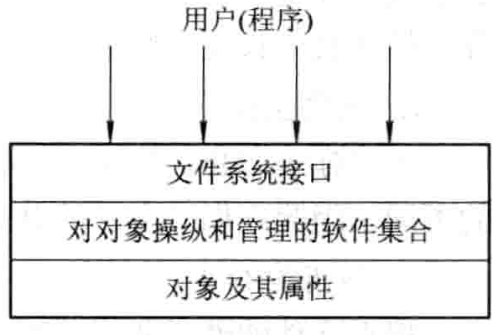
文件系统模型

    1. 对象及其属性

        - 文件

        - 目录

        - 磁盘存储空间

    1. 对对象操纵和管理的软件集合

        - I/O控制层

        - 基本系统层

        - 基本文件系统层

        - 基本I/O管理程序

        - 逻辑文件系统

    1. 文件系统的接口

        命令接口：作为用户和文件系统**直接交互**的接口，用户可以通过键盘终端键入命令取得文件系统的服务

        程序接口：作为用户程序和文件系统的接口，用户程序可通过**系统调用**取得文件系统的服务。例如，用于创建文件的系统调用Creat，用于打开一个文件的系统调用Open

### 6.4 文件的逻辑结构和物理结构

    > **逻辑结构**：从用户观点出发所观察到的文件组织形式，即文件是由一系列的逻辑记录组成的，是用户可以直接处理的数据及其结构，它独立于文件的物理特性，又称为文件组织。
**物理结构（存储结构）**：指系统将文件存储在外存上所形成的一种存储组织形式，是用户不能看见的。物理结构不仅与存储介质的存储性能有关，而且与外存分配方式有关。

    #### 文件的逻辑结构

        |**分类标准**|**类别**|**说明**|**优点**|**缺点**|**系统检索开销比较**|
|-|-|-|-|-|-|
|是否有结构分类|有结构文件（定长记录）|文件中所有记录的长度都是相同的，所有记录的数据项都储在记录中相同的位置，具有相同的顺序和长度||||
||有结构文件（不定长记录）|文件中各记录的长度不相同||||
||无结构文件**（流式文件）**|文件长度以字节为单位。利用读写指针指出下一个要访问的字符||||
|文件的组织方式分类（有结构文件）|顺序文件|一系列记录按某种顺序排列形成的文件|批量存取时存取效率最高。此外，也只有顺序文件才能被存储并有效工作|想要增加或者删除一个记录比较困难|$（N+1）/2$|
||索引文件|指为可变记录文件建立一张索引表，为每个记录设立一个表项，以加速对记录的检索速度|将一个需要顺序查找的文件改造成一个可随机查找的文件，提高了对文件的查找速度||$（N+1）/2$|
||索引顺序文件|为一组记录中的第一个记录建立一个表项|||$\sqrt{N}+1$|
||记录式文件|||||
||直接文件（散列文件）|||||

        1. 顺序文件

            > 文件的内容存放在一系列**连续编号的**外存物理块中，一旦知道了文件在文件存储设备上的起址和文件长度，就能很快进行存取，因为文件的逻辑块号到物理块号的变换可以非常简单的完成。

            访问顺序文件的记录，需要找到该记录的地址，记录寻址方式有2种：

            

            

            - **隐式寻址方式**

                设置一个读/写指针Rptr/Wptr，令他指向下一个记录的首地址，每读完一个记录时，便执行Rptr+Rptr+L操作。

                - 定长记录，L为记录长度；

                - 变长记录，L从当前正在读写的文件种读出该记录的长度

                

            

            - **显式寻址方式**

                该方式可以用于对定长记录的文件实现直接或随机访问
对于可变长记录的文件，不能利用显式寻址方式

                - 通过文件在记录中的位置

                - 利用关键字

            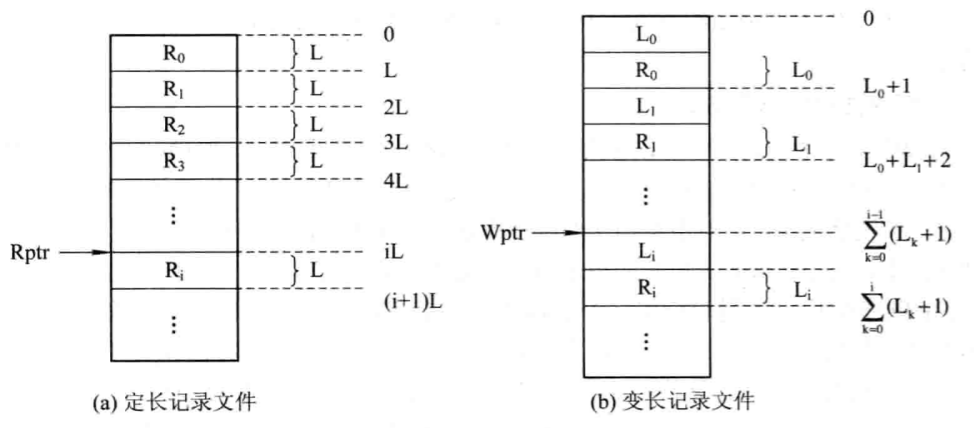

        1. 索引文件

            - 按关键字建立索引

                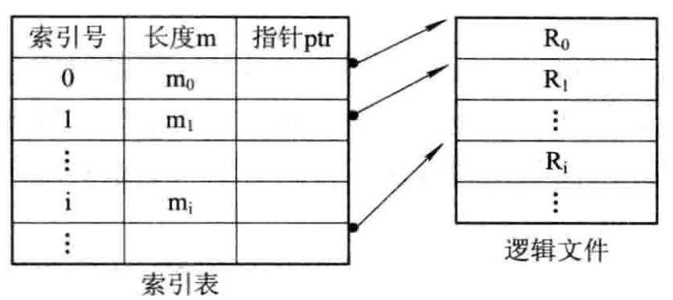
具有单个索引表的索引文件

            - 具有多个索引表的索引

                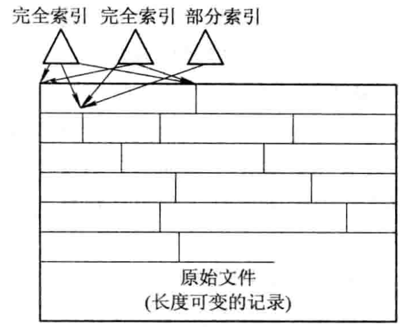
具有多个索引表的索引文件

        1. 索引顺序文件

            > 索引顺序文件增加了两个新的特征：
一个是引入了文件索引表，通过该表实现对索引顺序文件的随机访问；
另一个是增加了溢出文件，用它来记录新增加的、删除的和修改的记录。

            - 一级索引顺序文件

                首先将变长记录顺序文件中的所有记录**分为若干个组**，然后为顺序文件建立一张索引表，并为每组中的第一个记录在索引表中建立一个索引项，其中含有该记录的关键字和指向该记录的指针。

                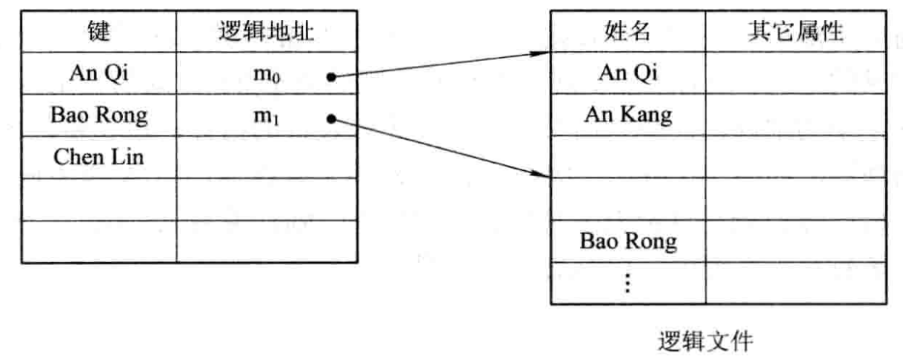
索引顺序文件

                一个顺序文件所含有记录数为N，则为检索到具有指定关键字的记录，平均须查找N/2个记录。

                但对于索引顺序文件，平均查找$\sqrt{N}$个记录数，索引效率提高$\sqrt{N}/2$倍

            - 两级索引顺序文件

                为了进一步提高检索效率，可以为顺序文件建立多级索引结构，即为索引文件再建立一张索引表，从而形成两级索引表。

        1. 直接文件

            > 对于直接文件，可根据**给定的关键字**直接获得指定记录的物理地址。
由关键字到记录物理地址的转换被称为键值转换。

            - 哈希文件

                利用Hash函数可将关键字转换为相应记录的地址，而是指向某一目录表相应表目的指针。

                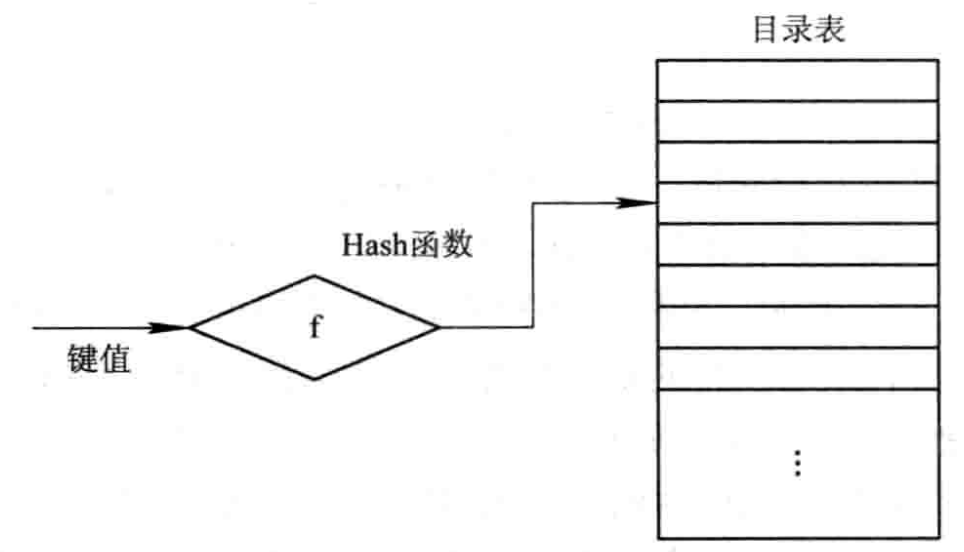
Hash文件的逻辑结构

        **【2017】操作系统在为文件分配外存空间时所需要考虑的主要问题是：怎样才能有效利用外存空间和如何提高对文件的访问速度。请简述Unix System V文件系统的混合索引方式是如何达到上述目的的，并比较表混合索引方式对于连续分配、链接分配和索引分配的优势。**

        ||**访问第n个记录**|**优点**|**缺点**|
|-|-|-|-|
|**顺序分配**|需要访问磁盘1次|顺序存取时速度快，当文件是定长时可以根据文件起始地址及记录长度进行随机访问|文件存储要求连续的存储空间，会产生碎片，也不利于文件的动态扩充|
|**连续分配**|需要访问磁盘m次|可以解决外部碎片问题，提高了外存空间的利用率，动态增长比较方便|只能按照文件的指针链顺序访问，查找效率低，指针信息存放消耗外存空间|
|**索引分配**|m级需要访问磁盘m+1次|可以随机访问，易于文件的增删|索引表增加存储空间的开销，索引表的查找策略对文件系统效率影响较大|
|**混合索引**|混合索引可以结合实际需求，选择以上多种索引方式相结合，优势互补，以达到高效快捷的目的。|||

    #### 文件的物理结构（对应P268.外存的组织方式）

        > 文件的物理结构直接与外存的组织方式有关。
对于不同的外存组织方式，将形成不同的文件物理结构

        [03.操作系统P3-文件系统示意图.pdf](第六章+文件管理+5752d772-cb1f-49d8-906a-7466f4bc76f8/03.操作系统P3-文件系统示意图.pdf)

        [外存的组织方式](%E7%AC%AC%E5%85%AD%E7%AB%A0+%E6%96%87%E4%BB%B6%E7%AE%A1%E7%90%86+5752d772-cb1f-49d8-906a-7466f4bc76f8/%E5%A4%96%E5%AD%98%E7%9A%84%E7%BB%84%E7%BB%87%E6%96%B9%E5%BC%8F+dbbe96f4-c89c-4e15-9e0f-77430ec2f468.csv)

### 6.5 外存空间管理办法

    > 为了实现前面的文件组织方式，需要为文件分配盘块，因此需要知道磁盘上哪些盘块是可用于分配的。
故在为文件分配磁盘时，除了需要文件分配表以外，还需要设置一个磁盘分配表，用于记录可供分配的存储空间情况。

    #### 空闲表法和空闲链表法

        1. 空闲表法

            空闲表法属于连续分配方式，为每个文件分配一块连续的存储空间。

            即操作系统为磁盘外存上所有空闲区建立一张空闲表，每个表项对应一个空闲区，空闲表中包含序号、空闲区的第一块号、空闲块的块数等信息。

            再将所有空闲区按其起始盘块号递增的次序排列。

            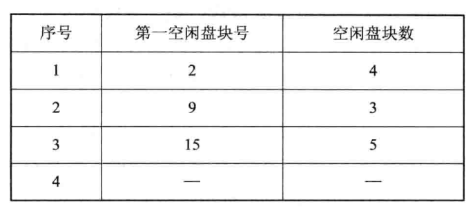
空闲盘块表

            **分配**：空闲盘区的分配与内存的动态分配类似，同样是采用首次适应算法、循环首次适应算法等。例如，在系统为某新创建的文件分配空闲盘块时，先顺序地检索空闲表的各表项，直至找到第一个其大小能满足要求的空闲区，再将该盘区分配给用户(进程)，同时修改空闲表。

            **回收**：对用户所释放的存储空间进行回收时，也采取类似于内存回收的方法，即要考虑回收区是否与空闲表中插入点的前区和后区相邻接，对相邻接者应予以合并。

        1. 空闲链表法

            空闲链表法将所有空闲盘区拉成一条空闲链，把链表分为两种形式：空闲盘块链和空闲盘区链

            - 空闲盘块链

                系统从链首开始，依次摘下适当数目的空闲盘块分配给用户

                优点：分配和回收一个盘块的过程非常简单

                缺点：为一个文件分配盘块时可能要重复多次，效率低。盘块链会很长

            - 空闲盘区链（一个盘区可以包含多个盘块）

                在每个盘区上除含有用于指示下一个空闲盘区的指针外，还应有能指明本盘区大小(盘块数)的信息。

                优点：在采用首次适应算法时，为了提高对空闲盘区的检索速度，可以采用显式链接方法，亦即，在内存中为空闲盘区建立一张链表

    #### 位示图法

        位示图是利用二进制的一位来表示磁盘中一个盘块的使用情况。

        当其值为“0”时，表示对应的盘块空闲；为“1”时，表示已分配。

        由所有盘块所对应的位构成一个集合，称为位示图。通常可用 m × n 个位数来构成位示图，并使 m × n 等于磁盘的总块数。

        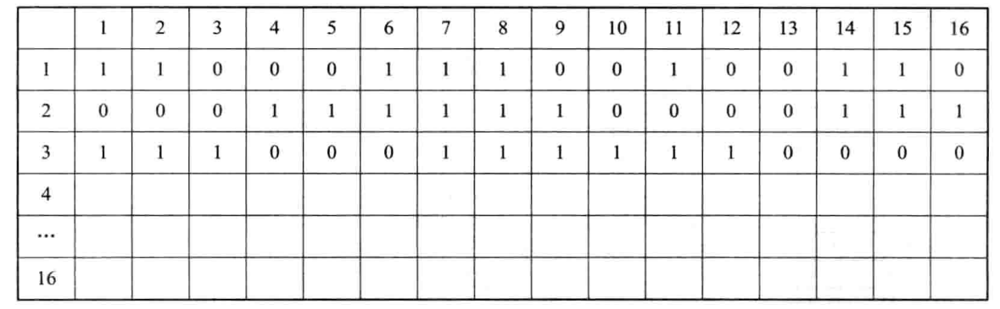
位示图

        **分配：**

        - 顺序扫描位示图，从中找出一个或一组其值为“0”的二进制位(“0”表示空闲时)。

        - 将所找到的一个或一组二进制位转换成与之相应的盘块号。假定找到的其值为“0”的二进制位位于位示图的第 i 行、第 j 列，则其相应的盘块号应按下式计算，n表示每行位数：

            $b=n(i-1)+j$

        - 修改位示图，令 map[i,j]=1

        **回收：**

        - 将回收盘块的盘块号转换成位示图中的行号和列号。转换公式为：

            $i=(b-1) DIV n+1$

            $j=(b-1) MOD n+1$

        - 修改位示图。令 map[i,j] =0

        **优点：**

        - 很容易找到一个或一组相邻接的空闲盘块

        - 由于位示图很小，占用空间少，因而可将它保存在内存中，进而使在每次进行盘区分配时，无需首先把盘区分配表读入内存，从而节省了许多磁盘的启动操作

    #### 成组链接法

        > **空闲表法和空闲链表法都不适用于大型文件系统**，因为这会使空闲表或空闲链表太长。在 UNIX 系统中采用的是成组链接法，这是将上述两种方法相结合而形成的一种空闲盘块管理方法，它兼备了上述两种方法的优点而克服了两种方法均有的表太长的缺点。

        - 空闲盘块号栈用来存放当前可用的一组空闲盘块的盘块号(最多含 100 个号)，以及栈中尚有的d'x空闲盘块号数 N。顺便指出，N 还兼作栈顶指针用。例如，当 N=100 时，它指向 S.free(99)。由于栈是临界资源，每次只允许一个进程去访问，故系统为栈设置了一把锁。下图左部为空闲盘块号栈的结构。其中，**S.free(0)是栈底**，栈满时的**栈顶为S.free(99)**。

            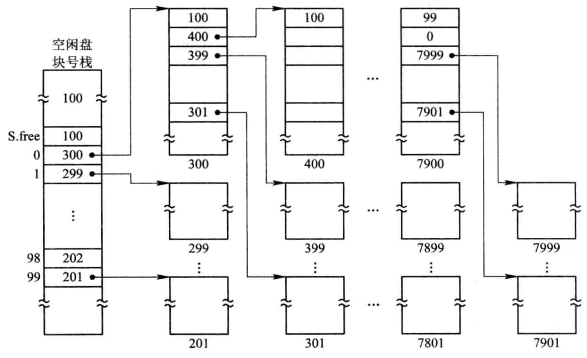

        - 文件区中的所有空闲盘块被分成若干个组，比如，将每 100 个盘块作为一组。假定盘上共有 10 000 个盘块，每块大小为 1 KB，其中第 201～7999 号盘块用于存放文件，即作为**文件区**，这样，该区的最末一组盘块号应为 7901～7999；次末组为 7801～7900……；第二组的盘块号为 301～400；第一组为 201～300，如图右部所示。

        - 将每一组含有的盘块总数 N 和该组所有的盘块号记入其前一组的第一个盘块的S.free(0)～S.free(99)中。这样，由各组的第一个盘块可链成一条链。

        - 将第一组的盘块总数和所有的盘块号记入空闲盘块号栈中，作为当前可供分配的空闲盘块号。

        - 最末一组只有 99 个盘块，其盘块号分别记入其前一组的 S.free(1) ～S.free(99)中，而在 S.free(0)中则存放“0”，作为空闲盘块链的结束标志。(注：最后一组的盘块数应为 99，不应是 100，因为这是指可供使用的空闲盘块，其编号应为(1～99)，0 号中放空闲盘块链的结尾标志。)

        **分配：**

        为用户分配文件所需的盘块时，须调用盘块分配过程来完成。

        - 该过程首先检查空闲盘块号栈是否上锁，如未上锁，便从栈顶取出一空闲盘块号，将与之对应的盘块分配给用户，然后将栈顶指针下移一格。

        - 若该盘块号已是栈底，即 S.free(0)，这是当前栈中最后一个可分配的盘块号。

        - 由于在该盘块号所对应的盘块中记有下一组可用的盘块号，因此，须调用磁盘读过程，将栈底盘块号所对应盘块的内容读入栈中，作为新的盘块号栈的内容，并把原栈底对应的盘块分配出去(其中的有用数据已读入栈中)。

        - 然后，再分配一相应的缓冲区(作为该盘块的缓冲区)。

        - 最后，把栈中的空闲盘块数减 1 并返回。

        **回收：**

        系统回收空闲盘块时，须调用盘块回收过程进行回收。

        它是将回收盘块的盘块号记入空闲盘块号栈的顶部，并执行空闲盘块数加 1 操作。

        当栈中空闲盘块号数目已达 100 时，表示栈已满，便将现有栈中的 100 个盘块号记入新回收的盘块中，再将其盘块号作为新栈底。

### 6.6 文件目录结构及管理

    一个文件的文件名和对该文件实施控制管理的说明信息称为文件的说明信息，又称为该文件的目录。

    文件目录中包含文件名、与文件名相对应文件内部标识以及文件信息在文件设备上的始址等信息。另外还包含关于文件逻辑结构、物理结构、存取控制和管理等信息。

    > 文件目录是一种数据结构，用于标识系统中的文件及其物理地址，供检索时使用。
对目录管理的要求如下：

        - 实现“按名存取”（**最基本目标，最主要功能，实现了文件名到物理地址的转换**）

        - 提高对目录的检索速度（**最重要目标**）

        - 文件共享

        - 允许文件重名

    #### 文件控制块和索引结点

        1. 文件控制块FCB

            **基本信息类：**

            - 文件名：指用于标识一个文件的符号名。在每个系统中，每一个文件都必须有惟一的名字，用户利用该名字进行存取。

            - 文件物理地址：指文件**在外存**上的存储位置，它包括存放文件的设备名、文件在外存上的起始盘块号、指示文件所占用的盘块数或字节数的文件长度。

            - 文件逻辑结构：指示文件是流式文件还是记录式文件、记录数；文件是定长记录还是变长记录等

            - 文件的物理结构：指示文件是顺序文件，还是链接式文件或索引文件

            **存取控制信息类：**

            文件主的存取权限、核准用户的存取权限以及一般用户的存取权限

            **使用信息类：**

            文件的建立日期和时间、文件上一次修改的日期和时间及当前使用信息(这项信息包括当前已打开该文件的进程数、是否被其它进程锁住、文件在内存中是否已被修改但尚未拷贝到盘上)。

        1. 索引结点

            > 在检索目录文件的过程中，只用到了文件名，仅当找到一个目录项(即其中的文件名与指定要查找的文件名相匹配)时，才需从该目录项中读出该文件的物地址。而其它一些对该文件进行描述的信息，在检索目录时一概不用。显然，这些信息在检索目录时不需调入内存。
UNIX 系统，便采用了把文件名与文件描述信息分开的办法，亦即，使文件描述信息单独形成一个称为索引结点的数据结构。

            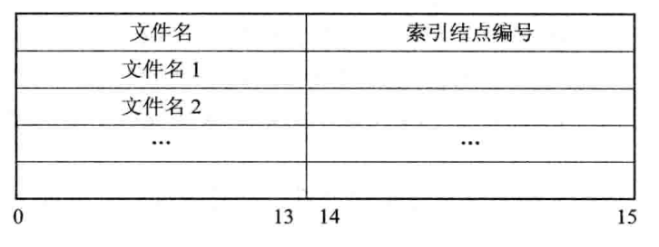
UNIX系统的文件目录

            1. 磁盘索引结点

                这是存放在磁盘上的索引结点。每个文件有唯一的一个磁盘索引结点，它主要包括以下内容：

                - 文件主标识符：即拥有该文件的个人或小组的标识符。

                - 文件类型：包括正规文件、目录文件或特别文件。

                - 文件存取权限：指各类用户对该文件的存取权限。

                - 文件物理地址：每一个索引结点中含有 13 个地址项，即 iaddr(0)～iaddr(12)，它们以直接或间接方式给出数据文件所在盘块的编号。

                - 文件长度：指以字节为单位的文件长度。

                - 文件连接计数：表明在本文件系统中所有指向该(文件的)文件名的指针计数。

                - 文件存取时间：指本文件最近被进程存取的时间、最近被修改的时间及索引结点最近被修改的时间。

            1. 内存索引结点

                这是存放在内存中的索引结点。当文件被打开时，要将磁盘索引结点拷贝到内存的索引结点中，便于以后使用。在内存索引结点中又增加了以下内容：

                - 索引结点编号：用于标识内存索引结点。

                - 状态：指示 i 结点是否上锁或被修改。

                - 访问计数：每当有一进程要访问此 i 结点时，将该访问计数加 1，访问完再减 1。

                - 文件所属文件系统的逻辑设备号。

                - 链接指针：设置有分别指向空闲链表和散列队列的指针。

    #### 简单的文件目录

        [简单的文件目录](%E7%AC%AC%E5%85%AD%E7%AB%A0+%E6%96%87%E4%BB%B6%E7%AE%A1%E7%90%86+5752d772-cb1f-49d8-906a-7466f4bc76f8/%E7%AE%80%E5%8D%95%E7%9A%84%E6%96%87%E4%BB%B6%E7%9B%AE%E5%BD%95+79e8f969-d4ad-42c6-bf22-901850f9cc65.csv)

### 6.7 文件共享与保护

    #### 文件共享

        **【2011】一张普通的光盘容量不超过70MB，可对于某些多合一的Windows安装光盘，查看其属性只有几百MB，但在Windows操作系统的资源管理器中，选中所有文件并查看其大小，通常有几个GB。请解释这种现象。**
查看光盘属性时，查看的是光盘的实际容量。在Windows操作系统中，由于存在文件的共享，每个共享文件都有几个文件名，换言之，每增加一条链接，就增加一个文件名，当我们试图去遍历整个系统文件时，将会多次遍历到该共享文件，故选中文件查看大小通常有几个GB。

        1. 基于有向无循环图实现文件共享

            - 有向无循环图DAG

                > 在树型结构中，每个文件只有一个父目录，想要访问一个文件必须经过主目录，对文件的共享是不对称的。
如果允许一个文件可以有多个父目录，即有多个属于不同用户的多个目录，同时指向同一个文件。
这样虽然会破坏树的特性，但这些用户可以用对称的方式实现文件共享，而不必再通过其主目录来访问。

                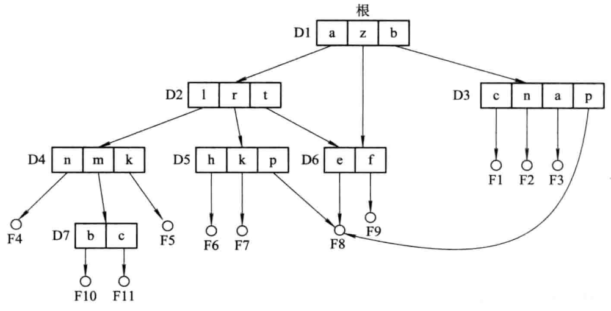
有向无循环图目录层次

                > 如何建立父目录D5和共享文件F8之间的链接呢？
如果在文件目录中包含了文件的物理地址，即文件所在盘块的盘块号，则在链接时，必须将文件的物理地址拷贝到 D5目录中去。但如果以后 D5或 D6还要继续向该文件中添加新内容，也必然要相应地再增加新的盘块，这须由附加操作 Append 来完成。而这些新增加的盘块，也只会出现在执行了操作的目录中。可见，这种变化对其他用户而言是不可见的，因而新增加的这部分内容已不能被共享。

                为了解决这个问题，可以用索引结点。

            - 利用索引结点

                > 诸如文件的物理地址及其文件属性等，不再是放在目录项中，而是放在索引结点中。
文件目录中只设置文件名及指向相应索引结点指针。

                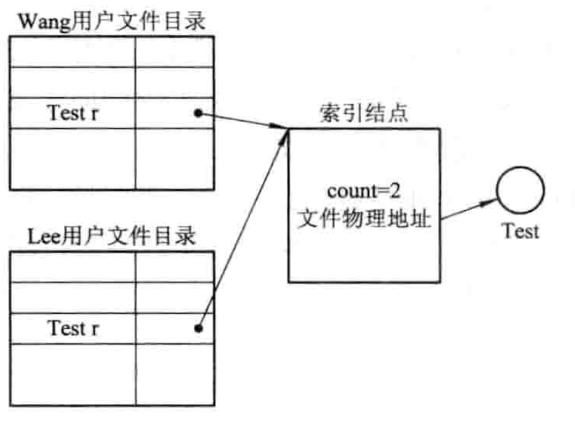
基于索引结点的共享方式

                在索引结点中还应有一个链接计数 count，用于表示链接到本索引结点(亦即文件)上的用户目录项的数目。当 count=3 时，表示有三个用户目录项连接到本文件上，或者说是有三个用户共享此文件。

                - **创建目录**

                    当用户 C 创建一个新文件时，他便是该文件的所有者，此时将 count 置 1。

                    当有用户 B要共享此文件时，在用户 B 的目录中增加一目录项，并设置一指针指向该文件的索引结点，此时，文件主仍然是 C，count=2。

                - **删除目录**

                    如果用户 C 不再需要此文件，是否能将此文件删除呢？**回答是否定的。**因为，若删除了该文件，也必然删除了该文件的索引结点，这样便会使 B的**指针悬空**，而 B 则可能正在此文件上执行写操作，此时将因此半途而废。

                    但如果 C 不删除此文件而等待 B 继续使用，这样，由于文件主是 C，如果系统要记账收费，则 C 必须为B 使用此共享文件而付账，直至 B 不再需要。下图为B链接到文件上的前、后情况。

                    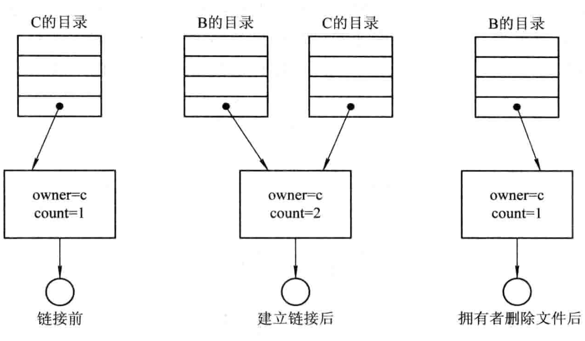
进程B链接前后的情况

        1. 利用符号链实现文件共享（软链接）

            > 允许一个文件或子目录有多个父目录，但其中仅有一个作为主（属主）父目录，其他的几个父目录都是通过符号链接方式与之相链接的（简称链接父目录）。

            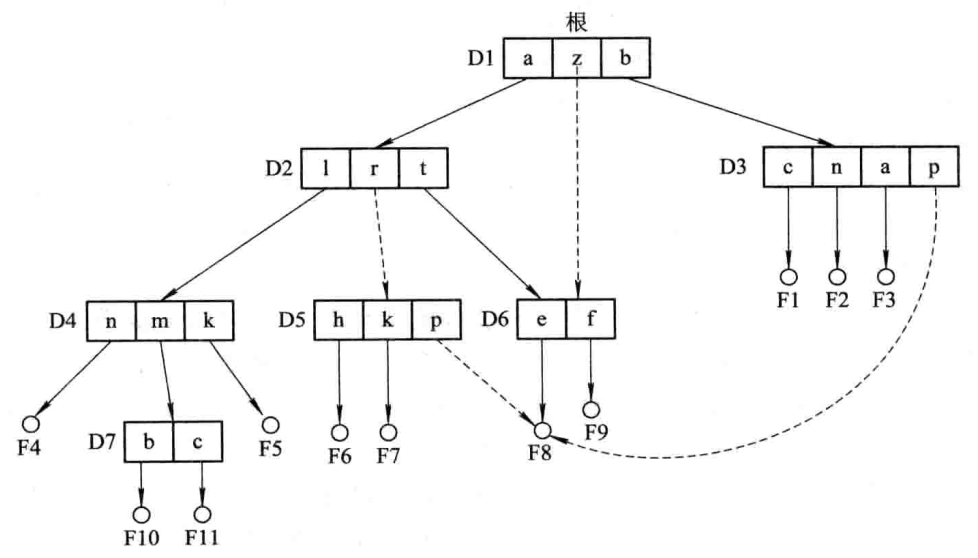
使用符号链的目录层次

            为使链接父目录D5 能共享文件 F8，可以由系统创建一个 LINK 类型的新文件，也取名为 F8，并将 F8写入链接父目录D5中，以实现D5与与文件F8的链接。在新文件F8中只包含被链接文件F8的路径名。

            **优点：**

            在利用符号链方式实现文件共享时，只是文件主才拥有指向其索引结点的指针；而共享该文件的其他用户则只有该文件的路径名，并不拥有指向其索引结点的指针。这样，也就**不会发生**在文件主删除一共享文件后留下一悬空指针的情况。

            当文件的拥有者把一个共享文件删除后，其他用户试图通过符号链去访问一个已被删除的共享文件时，会因系统找不到该文件而使访问失败，于是再将符号链删除，此时不会产生任何影响。

            **缺点：**

            - 当其他用户去读共享文件时，系统是根据给定的文件路径名，逐个分量(名)地去查找目录，直至找到该文件的索引结点。因此，在每次访问共享文件时，都可能要多次地读盘。这使每次访问文件的开销甚大，且**增加了启动磁盘的频率**。

            - 此外，要为每个共享用户建立一条符号链，而由于该链实际上是一个文件，尽管该文件非常简单，却仍要为它配置一个索引结点，这也要**耗费一定的磁盘空间**。

            > 建立硬链接时，不改变文件的Inode,也就是与原文件共用Inode，文件的引用计数器➕1。
建立软链接时，产生新的Inode，引用计数器的值直接复制，不发生改变。 

            **【2014】现代文件系统通常支持通过不同的路径访问同一文件，请阐述实现此功能的主要途径有哪些，各自有什么优缺点？**
软链接（符号链接）和硬链接
软链接优点：没有文件系统的限制，有更大的灵活性；
软链接缺点：会创建新的文件，浪费外存空间；将文件移动到新的位置后，被链接到的文件就不能正常访问了。
硬链接优点：不需要额外创建文件，节省硬盘空间；将文件移动到新的位置后，被链接到的文件依然能正常访问。
硬链接缺点：只能链接到同一个文件系统中的文件；硬链接会在原有的目录树中引入环路。

            **【2018】现在常用的文件共享方式主要有两种，基于索引结点的文件共享方式和基于符号链的文件共享方式。**
①在基于索引结点的文件共享方式（硬链接）中，引用索引结点，即诸如文件的物理地址及其他的文件属性等信息，不再是放在目录项中，而是放在索引结点中。在文件目录中只设置文件名及指向相应索引结点的指针。在索引结点中还设有一个链接计数count，用于表示链接到本索引结点（即文件）上的用户目录项的数目。当count=2时，表示有两个用户目录链接到本文件上，或者说有两个用户共享此文件。
②在利用符号链方式实现文件共享（软链接）时，只有文件拥有者才拥有指向其索引结点的指针，而共享该文件的其他用户只有该文件的路径名，并不拥有指向其索引结点的指针。
③硬链接就是多个指针指向一个索引结点，保证只要有一个指针指向索引结点，索引结点就不能删除，否则就会出现指针悬空的错误。
④软连接就是将到达共享文件的路径记录下来，当要访问文件时，根据路径寻找文件。软链接不会产生指针悬空的现象，但是它的查找速度比硬链接低。

    #### 文件保护

        > 影响文件安全性的**主要因素**：

            - 人为因素，即由于人们有意或无意的行为，而使文件系统中的数据遭到破坏或丢失。

            - 系统因素，即由于系统的某部分出现异常情况，而造成对数据的破坏或丢失。特别是作为数据存储介质的磁盘，在出现故障或损坏时，会对文件系统的安全性造成影响；

            - 自然因素，即存放在磁盘上的数据，随着时间的推移将可能发生溢出或逐渐消失。

            为了确保文件系统的安全性，可针对上述原因而**采取以下措施**：

            - 通过存取控制机制来防止由人为因素所造成的文件不安全性。

            - 通过**磁盘容错技术**来防止由磁盘部分的故障所造成的文件不安全性。

            - 通过“后备系统”来防止由自然因素所造成的不安全性。
磁带机、硬盘、光盘驱动机

        |方法|特点|
|-|-|
|口令保护|对文件不能控制存取权限，所有知道口令的用户都具有文件主相同的权限|
|加密保护|适用于数量少，比较重要的文件保护，但会增加系统开销，降低文件读写速度，知道密码的用户都具有文件主相同的权限|
|为文件设置使用权限|可对用户设置不同文件使用权限，使文件的保护级别更灵活|

        #### 保护域

            在现代OS中，几乎配置了用于对系统中资源进行保护的保护机制，并引入了“保护域”和“访问权”的概念。规定每个进程仅能在保护域内执行操作，而且只允许进程访问他们具有“访问权”的对象。

            1. 访问权

                把一个进程能对某对象执行操作的权力，称为访问权。

                每个访问权用一个有序对（对象名，权集）来表示。

                例如，某进程对文件$F_1$执行读和写操作的权力，可表示成（$F_1$，{R/W}）。

            1. 保护域

                对系统中资源进行保护而引入了保护域的概念，保护域简称“域”。是进程对一组对象访问权的集合，进程只能在指定域内执行操作。

            1. 进程和域间的静态联系

                进程和域之间可以一一对应，即一个进程只联系一个域。

            1. 进程和域间的动态联系

                进程和域可以是一对多的关系，即一个进程可以联系多个域

            

        #### 访问矩阵

            可以用一个矩阵来描述系统的访问控制，并把该矩阵称为访问矩阵。

            矩阵中的行代表域，列代表对象，矩阵中的每一项是由一组访问权组成的。

            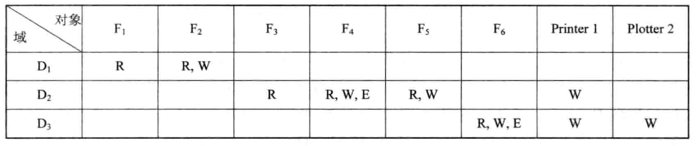
一个访问矩阵

            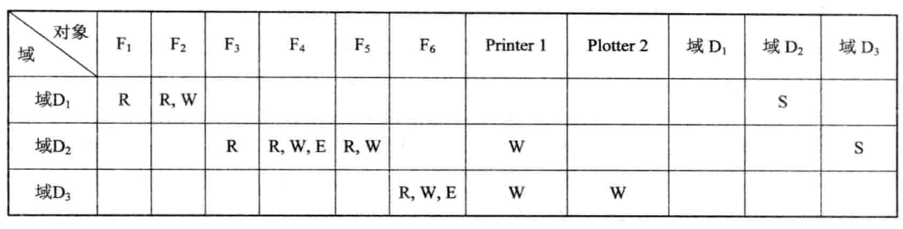
具有切换权的访问控制矩阵

### 6.8 磁盘容错技术

    > 容错技术是通过在系统中设置冗余部件的办法，来提高系统可靠性的一种技术。
磁盘容错技术则是通过增加冗余的磁盘驱动器，磁盘控制器等方法来提高磁盘系统可靠性的一种技术。
即当磁盘系统中某部分出现缺陷或故障时，磁盘仍能正常工作，且不致造成数据的丢失和错误。

    磁盘容错技术也称**系统容错技术SFT**。

    可以分为三个级别：

    - 低级磁盘容错技术

    - 中级磁盘容错技术

    - 系统容错技术

    #### 第一级容错技术SFT-I

        > 防止因磁盘表面缺陷所造成的数据丢失。

        1. 双份目录和双份文件分配表

            在磁盘上存放的文件目录和文件分配表 FAT，是文件管理所用的重要数据结构。为了防止这些表格被破坏，可在不同的磁盘上或在磁盘的不同区域中，分别建立(双份)目录表和FAT。

        1. 热修复重定向和写后读校验

            - 热修复重定向：系统将磁盘容量的一部分(例如 2%～3%)作为热修复重定向区，用于存放当发现磁盘有缺陷时的待写数据，并对写入该区的所有数据进行登记，以便于以后对数据进行访问。

            - 写后读校验方式。为了保证所有写入磁盘的数据都能写入到完好的盘块中，应该在每次从内存缓冲区向磁盘中写入一个数据块后，又立即从磁盘上读出该数据块，并送至另一缓冲区中，再将该缓冲区内容与内存缓冲区中在写后仍保留的数据进行比较。若两者一致，便认为此次写入成功，可继续写下一个盘块；否则，再重写。若重写后两者仍不一致，则认为该盘块有缺陷，此时，便将应写入该盘块的数据，写入到热修复重定向区中

            

    #### 第二级容错技术SFT-II

        > 防止由磁盘驱动器和磁盘控制器故障所导致的系统不能正常工作

        1. 磁盘镜像（Disk Mirroring)

            在同一磁盘控制器下再增设一个完全相同的磁盘驱动器。

            当采用磁盘镜像方式时，在每次向主磁盘写入数据后，都需要将数据再写到备份磁盘上，使两个磁盘上具有完全相同的位像图。把备份磁盘看作是主磁盘的一面镜子，当主磁盘驱动器发生故障时，由于有备份磁盘的存在，在进行切换后，使主机仍能正常工作。

            磁盘镜像虽然实现了容错功能，但未能使服务器的磁盘 I/O 速度得到提高，却使磁盘的利用率降至仅为 50%。

            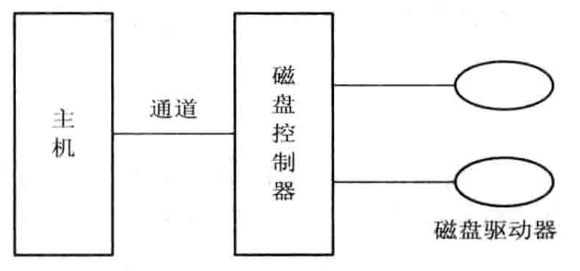
磁盘镜像示意图

            

        1. 磁盘双工（Disk Duplexing)

            如果控制这两台磁盘驱动器的磁盘控制器发生故障，或主机到磁盘控制器之间的通道发生了故障，磁盘镜像功能便起不到数据保护的作用。

            因此，在第二级容错技术中，又增加了磁盘双工功能，即将两台磁盘驱动器分别接到两个磁盘控制器上，同样使这两台磁盘机镜像成对。

            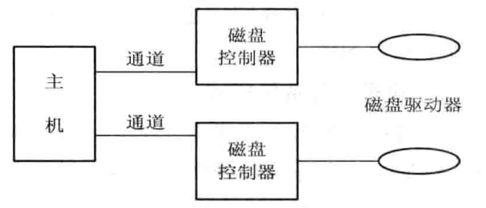
磁盘双工示意图

            

            

        

    #### 基于集群技术的容错技术

        为了进一步增强服务器的并行处理能力和可用性，采用了多台 SMP 服务器来实现集群系统服务器。所谓集群，是指由一组互连的自主计算机组成统一的计算机系统，给人们的感觉是，它们是一台机器。利用集群系统不仅可提高系统的并行处理能力，还可用于提高系统的可用性，它们是当前使用最广泛的一类具有容错功能的集群系统。

        其主要工作模式有三种：① 热备份模式；② 互为备份模式；③ 公用磁盘模式

### 6.9 文件系统性能改善策略

    

### 6.10 数据一致性控制

    > 保存在多个文件中的同一数据，在任何情况下都必需能保证相同

    #### 事务

        事务是用于访问和修改各种数据项的一个程序单位。事务也可以被看做是一系列相关读和写操作。被访问的数据可以分散地存放在同一文件的不同记录中，也可放在多个文件中。

        只有对分布在不同位置的同一数据所进行的读和写(含修改)操作全部完成时，才能再以托付操作(Commit Operation)来终止事务。

        只要有一个读、写或修改操作失败，便须执行夭折操作(Abort Operation)。读或写操作的失败可能是由于逻辑错误，也可能是系统故障所导致的。

        事务必须满足**4个属性**：

        - 原子性Atomic：一个事务在对一批数据执行修改操作时，要么全部完成，并用修改后的数据去代替原来的数据，要么一个也不修改。事务操作所具有的这种特性

        - 一致性Consistent：事务在完成时，必须使所有的数据都保持一致状态。

        - 隔离性Isolated：对一个事务对数据所作的修改，必须与任何其他与之并发事务相隔离

        - 持久性Durable：事务完成之后，对于系统的影响是永久的。

    #### 检查点

        > 由于在系统中可能存在着许多并发执行的事务，因而在事务记录表中就会有许多事务执行操作的记录。随着时间的推移，记录的数据也会愈来愈多。因此，一旦系统发生故障，在事务记录表中的记录清理起来就非常费时。

        引入检查点的主要目的，是使对事务记录表中事务记录的清理工作经常化，即每隔一定时间便做一次下述工作：首先是将驻留在易失性存储器(内存)中的当前事务记录表中的所有记录输出到稳定存储器中；其次是将驻留在易失性存储器中的所有已修改数据输出到稳定存储器中；然后是将事务记录表中的〈检查点〉记录输出到稳定存储器中；最后是每当出现一个〈检查点〉记录时，系统便执行上小节所介绍的恢复操作，利用 redo 和 undo 过程实现恢复功能。

        

    #### 并发控制

        1. 利用互斥锁实现顺序性

            把每一个共享对象设置为一把互斥锁，一事务 Ti 要去访问某对象时，应先获得该对象的互斥锁。

            若成功，便用该锁将该对象锁住，于是事务 Ti 便可对该对象执行读或写操作；而其它事务由于未能获得该锁而不能访问该对象。

            如果 Ti 需要对一批对象进行访问，则为了保证事务操作的原子性，Ti 应先获得这一批对象的互斥锁，以将这些对象全部锁住。

            如果成功，便可对这一批对象执行读或写操作；操作完成后又将所有这些锁释放。但如果在这一批对象中的某一个对象已被其它事物锁住，则此时 Ti 应对此前已被 Ti 锁住的其它对象进行开锁，宣布此次事务运行失败，但不致引起数据的变化。

            **缺点：**

            目前有不少系统都是采用这种方法来保证事务操作的顺序性，但这却存在着效率不高的问题。因为一个共享文件虽然只允许一个事务去写，但却允许多个事务同时去读；而在利用互斥锁来锁住文件后，则只允许一个事务去读。

        1. 利用互斥锁和共享锁实现顺序性

            为了提高运行效率而又引入了另一种形式的锁——共享锁(Shared Lock)。

            共享锁与互斥锁的区别在于: 互斥锁仅允许一个事务对相应对象执行读或写操作，而共享锁则允许多个事务对相应对象执行读操作，不允许其中任何一个事务对对象执行写操作。

            在为一个对象设置了互斥锁和共享锁的情况下，

            - 如果事务 Ti 要对 Q 执行读操作，则只需去获得对象 Q 的共享锁。如果对象 Q 已被互斥锁锁住，则 Ti 必须等待；否则，便可获得共享锁而对 Q 执行读操作。

            - 如果 Ti 要对 Q 执行写操作，则 Ti 还须去获得 Q 的互斥锁。若失败，须等待；否则，可获得互斥锁而对 Q 执行写操作。利用共享锁和互斥锁来实现顺序性的方法，非常类似于我们在第二章中所介绍的读者—写者问题的解法。

    #### 重复文件的一致性

        > 为了保证数据的安全性，最常用的做法是把关键文件或数据结构复制多份，分别存储在不同的地方，当主文件(数据结构)失效时，还有备份文件(数据结构)可以使用，不会造成数据丢失，也不会影响系统工作。
显然，主文件(数据结构)中的数据应与各备份文件中的对应数据相一致。
此外，还有些数据结构(如空闲盘块表)在系统运行过程中，总是不断地对它进行修改，因此，同样应保证不同处的同一数据结构中数据的一致性。

        1. 重复文件的一致性

            在有重复文件时，如果一个文件拷贝被修改，则必须也同时修改其它几个文件拷贝，以保证各相应文件中数据的一致性。这可采用两种方法来实现：

            - 第一种方法是当一个文件被修改后，可查找文件目录，以得到其它几个拷贝的索引结点号，再从这些索引结点中找到各拷贝的物理位置，然后对这些拷贝做同样的修改；

            - 第二种方法是为新修改的文件建立几个拷贝，并用新拷贝去取代原来的文件拷贝。

        1. 链接数的一致性检查

            对于一个共享文件，其索引结点号会在目录中出现多次。例如，当有 5 个用户(进程)共享某文件时，其索引结点号会在目录中出现 5 次；另一方面，在该共享文件的索引结点中有一个链接计数 count，用来指出共享本文件的用户(进程)数。在正常情况下这两个数据应该一致，否则就会出现数据不一致性差错。

            为了检查这种数据不一致性差错，同样要配置一张**计数器表，**此时应是为每个文件建立一个表项，其中含有该索引结点号的计数值。在进行检查时，从根目录开始查找，每当在目录中遇到该索引结点号时，便在该计数器表中相应文件的表项上加 1。当把所有目录都检查完后，便可将该计数器表中每个表项中的索引结点号计数值与该文件索引结点中的链接计数 count 值加以比较，如果两者一致，表示是正确的；否则，便是产生了链接数据不一致的错误。

            - 如果索引结点中的链接计数 count 值**大于**计数器表中相应索引结点号的计数值，则即使在所有共享此文件的用户都不再使用此文件时，其 count 值仍不为 0，因而该文件不会被删除。这种错误的后果是使一些已无用户需要的文件仍驻留在磁盘上，浪费了存储空间。当然这种错误的性质并不严重。解决的方法是用计数器表中的正确的计数值去为 count 重新赋值。

            - 反之，如果出现 count 值**小于**计数器表中索引结点号计数值的情况时，就有潜在的危险。假如有两个用户共享一个文件，但是 count 值仍为 1，这样，只要其中有一个用户不再需要此文件时，count 值就会减为 0，从而使系统将此文件删除，并释放其索引结点及文件所占用的盘块，导致另一共享此文件的用户所对应的目录项指向了一个空索引结点，最终是使该用户再无法访问此文件。如果该索引结点很快又被分配给其它文件，则又会带来潜在的危险。解决的方法是将 count 值置为正确值。

## 6.11 目录检索过程（目录查询技术）

    > 当用户要访问一个已存在文件时，系统首先利用用户提供的文件名对目录进行查询，找出该文件的文件控制块或对应索引结点；
然后，根据 FCB 或索引结点中所记录的文件物理地址(盘块号)，换算出文件在磁盘上的物理位置；
最后，再通过磁盘驱动程序，将所需文件读入内存。
目前对目录进行查询的方式有两种: 线性检索法和 Hash 方法。

    #### 线性检索法

        在单级目录中，利用用户提供的文件名，用顺序查找法直接从文件目录中找到指名文件的目录项。

        在树型目录中，用户提供的文件名是由多个文件分量名组成的路径名，此时须对多级目录进行查找。

        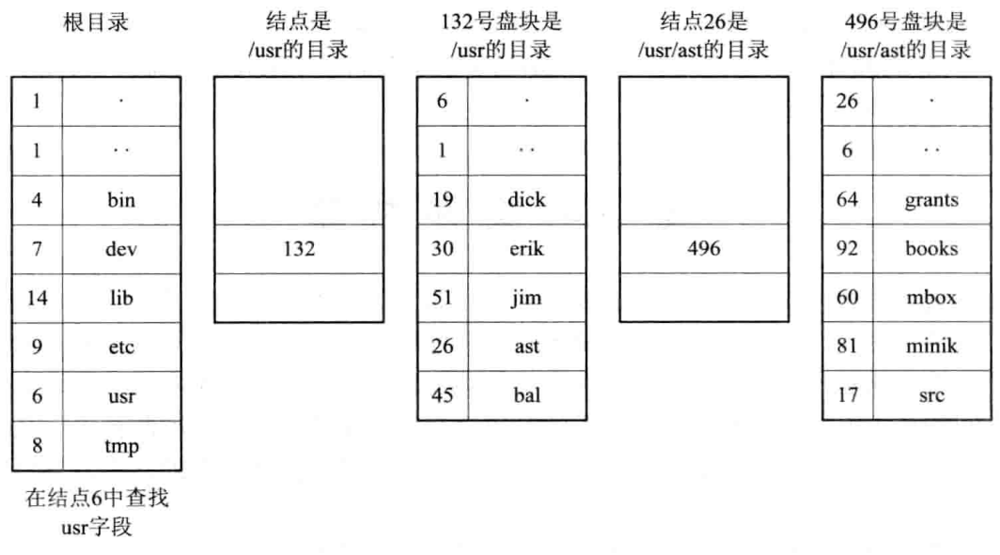
查找/user/ast/mbox的步骤

    #### Hash法

        如果我们建立了一张 Hash 索引文件目录，便可利用Hash 方法进行查询，即系统利用用户提供的文件名并将它变换为文件目录的索引值，再利用该索引值到目录中去查找，**这将显著地提高检索速度。**

        处理冲突：

        - 在利用 Hash 法索引查找目录时，如果目录表中相应的目录项是空的，则表示系统中并无指定文件。

        - 如果目录项中的文件名与指定文件名相匹配，则表示该目录项正是所要寻找的文件所对应的目录项，故而可从中找到该文件所在的物理地址。

        - 如果在目录表的相应目录项中的文件名与指定文件名并不匹配，则表示发生了“冲突”，此时须将其 Hash 值再加上一个常数(该常数应与目录的长度值互质)，形成新的索引值，再返回到第一步重新开始查找。

## 6.12 文件数据访问基本过程

    /

## 6.13 FAT文件系统设计实现

    > 在FAT中引入了“卷”的概念，支持将一个物理磁盘分为四个逻辑磁盘，每个逻辑磁盘就是一个卷（也称为分区），也就是说每个卷都是一个能够被单独格式化和使用的逻辑单元，供文件系统分配空间使用。

    一个卷中包含了文件系统信息、一组文件以及空闲空间。

    每个卷都专门划分出一个单独区域来存放自己的目录和FAT表，以及自己的逻辑驱动器字母。

    #### FAT12

        1. 早期的FAT12

            以盘块为基本分配单位，在每个分区中有两张相同的文件分配表FAT1和FAT2。

            在FAT的每个表项中存放下一个盘块号，实际上是用于盘块之间的链接的指针。

            每个文件的第一个盘块号放在自己的FCB中。

            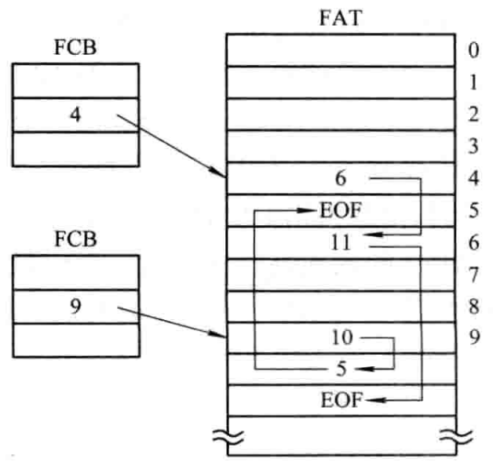
MS-DOS的文件物理结构

            对于1.2MB的软盘，每个盘块大小为512B，在每个FAT中供含有2.4K个表项，由于每个FAT表项占12位，故FAT表占用3.6KB的存储空间。

        1. 以簇为单位的FAT12文件系统

            如果把每个盘块（扇区）的容量增大n倍，则磁盘的最大容量可以增加n倍，为此引入**“簇”**的概念。

            簇是一组相邻的扇区，在FAT表中作为一个虚拟扇区。进行盘块分配时，以簇作为分配的基本单位

            **好处：**

            能适应磁盘容量不断增加的情况，还可以减少FAT表中的表项数，使FAT表占用更少的存储空间，减少存取开销。

            **缺点：**

            随着支持硬盘的容量的增加，相应的簇内碎片也随之增加，限制了磁盘的最大容量。

    #### FAT16

        要想增加FAT表的表项数，必须增加FAT表位数，增加至16位，对FAT12的局限性有所改善，但簇内碎片的浪费也随之增加。

    #### FAT32

        由于FAT16长度只有65535项，随着磁盘容量增加，簇的大小也会随之增加。为了减少簇内零头，也就应当增加FAT表长度，为此需要再增加FAT表宽度。

        缺点：

        - 运行速度较慢

        - 由最小管理空间限制，不支持容量小于512B的分区，对于小分区仍需使用FAT16或FAT12

        - 单个文件的长度也不能大于4GB

        - 最大的限制再兼容性方面，不能向下兼容

