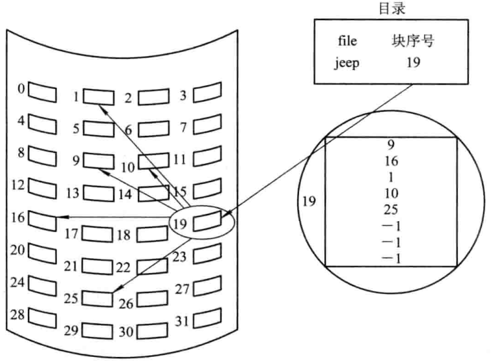
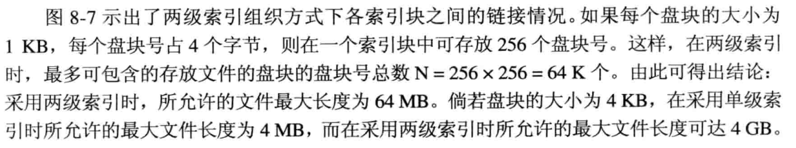
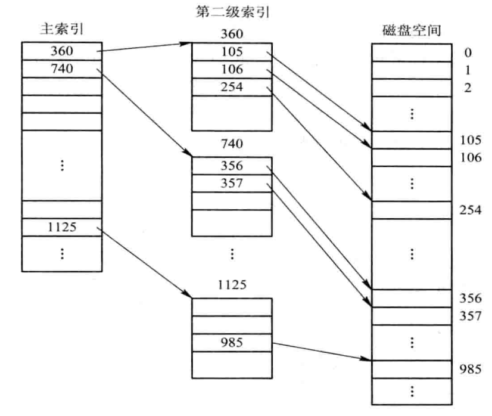
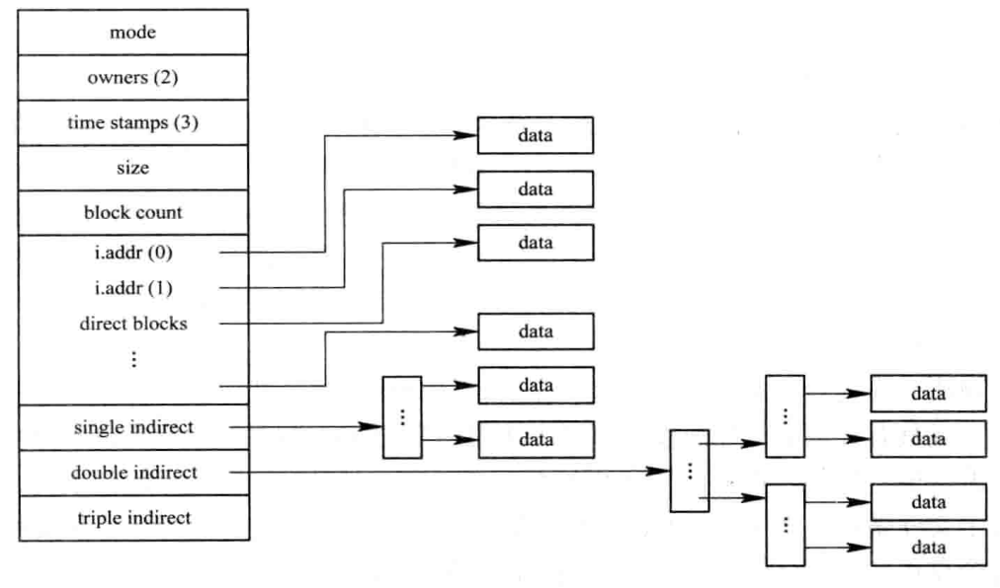

1. 单级索引组织方式

    每当建立一个索引文件时，为该文件分配一个索引块，将分配给该文件的所有盘块号记录于其中。每个索引块可以存放数百个盘块号。

    
单级索引组织方式

    对于中小型文件，其本身只占有数个到数十个盘块，甚至更少。可见，小文件采用索引分配方式时，其索引块利用率是极低的。

    对于大文件，所分配出去的盘块号已经装满一个索引块时，需要再为该文件分配一个索引块。当文件太大，索引块太多时，这种方式是低效的，因此形成两级索引分配方式。

1. 多级索引组织方式

    

    
两级索引分配

    优点：大大加快了对**大型文件**的查找速度；

    缺点：访问一个盘块时，所需启动的磁盘次数随着**索引级数的增加而增**多，即使是对于小文件也是如此

1. 增量式索引组织方式

    直接寻址：对于小型文件，将每个盘块地址直接放入文件控制块FCB（或索引节点）中，这样可以直接从FCB中获得该文件的盘块地址。

    一次间址：对于中等文件，采用单级索引组织方式，此时只需先从FCB中找到该文件的索引表。

    二次或三次间址：对于大型和特大型文件，采用两级和三级组织方式。

    
混合索引方式

