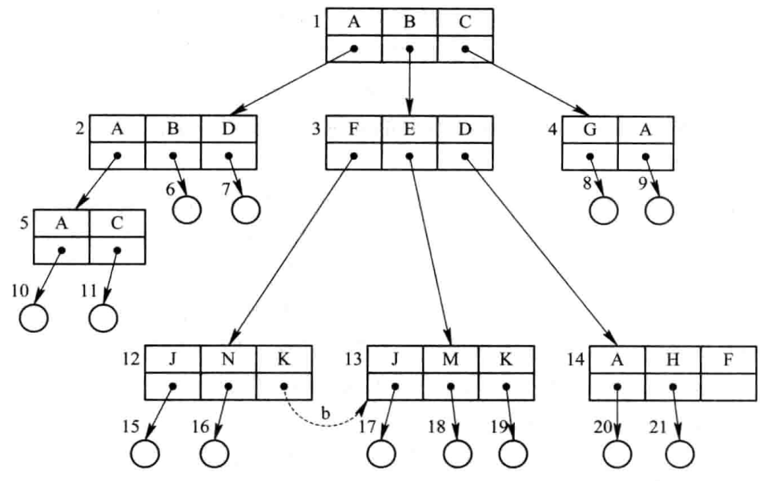

1. 路径名和当前目录

    从根目录到任何数据文件，都只有一条惟一的通路。

    进程对各文件的访问都相对于“当前目录”而进行。此时各文件所使用的路径名，只需从当前目录开始，逐级经过中间的目录文件，最后到达要访问的数据文件。把这一路径上的全部目录文件名与数据文件名用“/”连接形成路径名。

1. 目录操作

    - 创建目录

        在用户要创建一个新文件时，只需查看在自己的 UFD 及其子目录中有无与新建文件相同的文件名。若无，便可在 UFD 或其某个子目录中增加一个新目录项。

    - 删除目录

        如果所要删除的目录是空的，即在该目录中已不再有任何文件，就可简单地将该目录项删除，使它在其上一级目录中对应的目录项为空；如果要删除的目录不空，即其中尚有几个文件或子目录，则可采用下述两种方法处理：

        - 不删除非空目录。当目录(文件)不空时，不能将其删除，而为了删除一个非空目录，必须先删除目录中的所有文件，使之先成为空目录，然后再予以删除。如果目录中还包含有子目录，还必须采取递归调用方式来将其删除，在 MS-DOS 中就是采用这种删除方式。

        - 可删除非空目录。当要删除一个目录时，如果在该目录中还包含有文件，则目录中的所有文件和子目录也同时被删除

    - 改变目录

    - 移动目录

    - 链接操作

    - 查找

